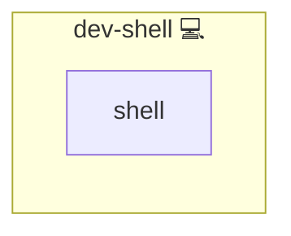

# Shell

## Description

This Ansible role ensures that [.profile](https://en.wikipedia.org/wiki/Bourne_shell#Startup_scripts) is sourced in both [Bash](https://www.gnu.org/software/bash/) and [Zsh](https://www.zsh.org/) environments. It enables consistent environment variable loading across different login shells by linking shell-specific profile files (`.bash_profile`, `.zprofile`) to a centralized `.profile`.

## Overview

By standardizing `.profile` as the central source for environment configuration, this role ensures consistent shell behavior. It does **not** manage the contents of `.profile` itself; it only guarantees that it is sourced by supported shells.

## Cosmos

The diagram places Shell in the Infinito.Nexus cosmos: the components it deploys (capabilities), the central services it consumes (dependencies), and its outward reach (federation and bridged external networks).

Solid `1:1` edges are fixed relationships; dashed `0..1` edges are conditional (enabled only in matching deployments). Node markers show the role's deploy modes (💻 host, 🐳 compose, 🐝 swarm); ❌ marks a service that is explicitly turned off, and ⚙️ an Ansible role dependency declared in `meta/main.yml`.

## Purpose

The purpose of this role is to unify shell environment setup across Bash and Zsh. It minimizes duplication and confusion by encouraging the use of `.profile` for shared configuration such as environment variables and agent settings.

## Features

- **Centralized Configuration:** Promotes `.profile` as the single source for shared shell settings.
- **Cross-Shell Compatibility:** Ensures both Bash and Zsh source `.profile` properly.
- **Non-Invasive:** Does not alter the content of `.profile`.

## Credits

Implemented by **[Kevin Veen-Birkenbach](https://www.veen.world)**.
Part of the [Infinito.Nexus Project](https://s.infinito.nexus/code) and maintained by [Kevin Veen-Birkenbach](https://www.veen.world).
Licensed under the [Infinito.Nexus Community License (Non-Commercial)](https://s.infinito.nexus/license).
