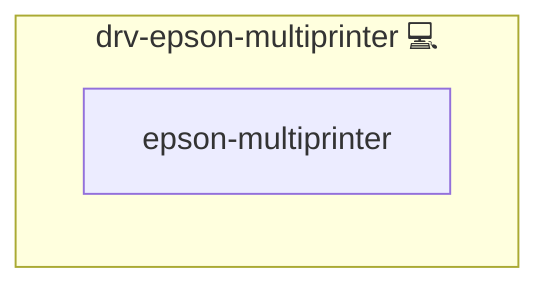

# Epson Multiprinter Driver

## Description

Installs Epson multifunction printer drivers and scanning utilities (escpr, imagescan) via Pacman and AUR on Arch Linux.

## Overview

This role installs Epson multifunction printer drivers and scanning utilities (escpr, imagescan) via Pacman and AUR on Arch Linux.

## Cosmos

The diagram places Epson Multiprinter Driver in the Infinito.Nexus cosmos: the components it deploys (capabilities), the central services it consumes (dependencies), and its outward reach (federation and bridged external networks).



Solid `1:1` edges are fixed relationships; dashed `0..1` edges are conditional (enabled only in matching deployments). Node markers show the role's deploy modes (💻 host, 🐳 compose, 🐝 swarm); ❌ marks a service that is explicitly turned off.

## Features

- **Automated provisioning:** Configured by Ansible without manual steps.

## Quick Setup

### Development

Clone, set up the workstation, and deploy Epson Multiprinter Driver onto the local stack:

```bash
git clone https://github.com/infinito-nexus/core.git
cd core
make onboard
make compose-deploy mode=reinstall apps=drv-epson-multiprinter full_cycle=false
```

### Production

Run the published image to provision the inventory and deploy Epson Multiprinter Driver to a managed server (the mounted volume persists the inventory between the two runs):

```bash
docker run --rm -it \
  -v "$PWD/inventories:/etc/infinito.nexus/inventories" \
  ghcr.io/infinito-nexus/core/debian \
  infinito administration inventory provision /etc/infinito.nexus/inventories/prod \
  --inventory-file /etc/infinito.nexus/inventories/prod/devices.yml \
  --host <your-server> \
  --vars-file inventories/<env>/default.yml \
  --include 'drv-epson-multiprinter'

docker run --rm -it \
  -v "$PWD/inventories:/etc/infinito.nexus/inventories" \
  ghcr.io/infinito-nexus/core/debian \
  infinito administration deploy dedicated /etc/infinito.nexus/inventories/prod/devices.yml \
  --password-file /etc/infinito.nexus/inventories/prod/.password \
  --id drv-epson-multiprinter \
  --diff \
  -vv
```

## Other Resources

- <https://bernhardsteindl.at/epson-ecotank-et-3600-unter-arch-linux-einrichten/>
- <http://download.ebz.epson.net/dsc/search/01/search/searchModule>
- <https://aur.archlinux.org/packages/epson-inkjet-printer-escpr>
- <https://forum.manjaro.org/t/probleme-mit-epson-et-2820/109777>
- <https://www.ordinatechnic.com/distribution-specific-guides/Arch/installing-an-epson-multifunction-printer-on-arch-linux-and-derivatives>
- <http://localhost:631/admin>
- <https://wiki.archlinux.org/title/SANE/Scanner-specific_problems>
- <https://wiki.archlinux.org/title/SANE>

## Credits

Implemented by **[Kevin Veen-Birkenbach](https://www.veen.world)**.
Part of the [Infinito.Nexus Project](https://s.infinito.nexus/code) and maintained by [Kevin Veen-Birkenbach](https://www.veen.world).
Licensed under the [Infinito.Nexus Community License (Non-Commercial)](https://s.infinito.nexus/license).
