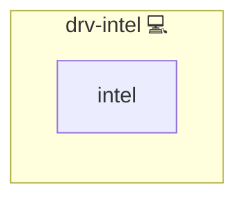

# Intel Driver

## Description

This Ansible role installs the Intel VA-API media driver for the current Linux distribution.

## Overview

Package name differs across distributions:

- Arch Linux: `intel-media-driver`
- Debian/Ubuntu: `intel-media-va-driver`
- Fedora: `libva-intel-media-driver`
- CentOS Stream 9: `libva-intel-hybrid-driver` (via EPEL)

## Cosmos

The diagram places Intel Driver in the Infinito.Nexus cosmos: the components it deploys (capabilities), the central services it consumes (dependencies), and its outward reach (federation and bridged external networks).



Solid `1:1` edges are fixed relationships; dashed `0..1` edges are conditional (enabled only in matching deployments). Node markers show the role's deploy modes (💻 host, 🐳 compose, 🐝 swarm); ❌ marks a service that is explicitly turned off.

## Features

- Idempotent installation of Intel media drivers  
- Supports Arch, Debian, Ubuntu, Fedora, CentOS Stream  

## Quick Setup

### Development

Clone, set up the workstation, and deploy Intel Driver onto the local stack:

```bash
git clone https://github.com/infinito-nexus/core.git
cd core
make onboard
make compose-deploy mode=reinstall apps=drv-intel full_cycle=false
```

### Production

Run the published image to provision the inventory and deploy Intel Driver to a managed server (the mounted volume persists the inventory between the two runs):

```bash
docker run --rm -it \
  -v "$PWD/inventories:/etc/infinito.nexus/inventories" \
  ghcr.io/infinito-nexus/core/debian \
  infinito administration inventory provision /etc/infinito.nexus/inventories/prod \
  --inventory-file /etc/infinito.nexus/inventories/prod/devices.yml \
  --host <your-server> \
  --vars-file inventories/<env>/default.yml \
  --include 'drv-intel'

docker run --rm -it \
  -v "$PWD/inventories:/etc/infinito.nexus/inventories" \
  ghcr.io/infinito-nexus/core/debian \
  infinito administration deploy dedicated /etc/infinito.nexus/inventories/prod/devices.yml \
  --password-file /etc/infinito.nexus/inventories/prod/.password \
  --id drv-intel \
  --diff \
  -vv
```

## Further Resources

- [Intel Media Driver upstream documentation](https://01.org/intel-media-sdk)

## Credits

Implemented by **[Kevin Veen-Birkenbach](https://www.veen.world)**.
Part of the [Infinito.Nexus Project](https://s.infinito.nexus/code) and maintained by [Kevin Veen-Birkenbach](https://www.veen.world).
Licensed under the [Infinito.Nexus Community License (Non-Commercial)](https://s.infinito.nexus/license).
