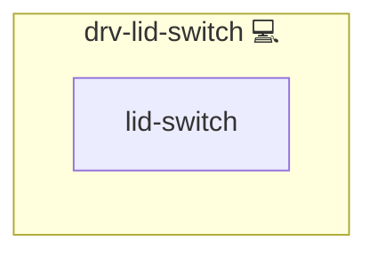

# LID Switch Driver

## Description

The lid switch is a hardware component on laptops that triggers power state changes (sleep, hibernate, lock) when the lid is closed. On Linux, systemd's `logind` daemon manages lid switch events via `/etc/systemd/logind.conf`. The [`setup-hibernate`](https://github.com/kevinveenbirkenbach/setup-hibernate) tool provides hibernation support configuration.

## Overview

This role addresses a common issue on Linux laptops: closing the lid while docked or plugged in leads to unintended sleep or hibernation. It installs the necessary hibernation tools and updates `/etc/systemd/logind.conf` to:

- Hibernate on lid close when on battery
- Lock the session when on AC power or docked

## Cosmos

The diagram places LID Switch Driver in the Infinito.Nexus cosmos: the components it deploys (capabilities), the central services it consumes (dependencies), and its outward reach (federation and bridged external networks).



Solid `1:1` edges are fixed relationships; dashed `0..1` edges are conditional (enabled only in matching deployments). Node markers show the role's deploy modes (💻 host, 🐳 compose, 🐝 swarm); ❌ marks a service that is explicitly turned off, and ⚙️ an Ansible role dependency declared in `meta/main.yml`.

## Purpose

The purpose of this role is to enforce a consistent and predictable lid switch behavior across power states, improving usability on laptops that otherwise behave unpredictably when the lid is closed.

## Features

- **Installs `setup-hibernate`:** Uses `pkgmgr` to install and initialize hibernation support.
- **Systemd Integration:** Applies proper `logind.conf` settings for lid switch handling.
- **Power-aware Configuration:** Differentiates between battery, AC power, and docked state.
- **Idempotent Design:** Ensures safe re-runs and minimal unnecessary restarts.

## Quick Setup

### Development

Clone, set up the workstation, and deploy LID Switch Driver onto the local stack:

```bash
git clone https://github.com/infinito-nexus/core.git
cd core
make onboard
make compose-deploy mode=reinstall apps=drv-lid-switch full_cycle=false
```

### Production

Install LID Switch Driver directly onto the target machine — clone the repository, install the OS prerequisites and the repository toolchain, then deploy against localhost over a local connection (no SSH, no container):

```bash
git clone https://github.com/infinito-nexus/core.git
cd core
bash scripts/install/package.sh
make install
source scripts/meta/env/load.sh

APP=drv-lid-switch
TLS_MODE=self_signed
SSH_PUBLIC_KEY="<your-ssh-public-key>"
INVENTORY=inventories/production
infinito administration inventory provision "$INVENTORY" \
  --inventory-file "$INVENTORY/devices.yml" \
  --host localhost \
  --include "$APP" \
  --vars "{\"TLS_MODE\": \"$TLS_MODE\", \"users\": {\"administrator\": {\"authorized_keys\": [\"$SSH_PUBLIC_KEY\"]}}}"
infinito administration deploy dedicated "$INVENTORY/devices.yml" \
  --password-file "$INVENTORY/.password" \
  --diff -vv
```

## Credits

Implemented by **[Kevin Veen-Birkenbach](https://www.veen.world)**.
Part of the [Infinito.Nexus Project](https://s.infinito.nexus/code) and maintained by [Kevin Veen-Birkenbach](https://www.veen.world).
Licensed under the [Infinito.Nexus Community License (Non-Commercial)](https://s.infinito.nexus/license).
