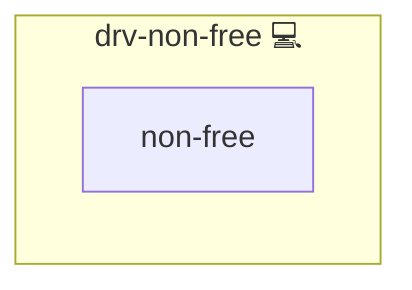

# Proprietary Drivers

## Description

This Ansible role installs non-free GPU drivers on Arch Linux systems by invoking the `mhwd` utility. It ensures that the appropriate proprietary drivers for your PCI graphics hardware are installed and ready for use.

## Overview

- Uses the `ansible.builtin.shell` module to run `mhwd -a pci nonfree 0300`  
- Automatically detects your PCI graphics adapter and installs the recommended non-free driver  
- Designed to be run once per host to provision proprietary GPU support

## Cosmos

The diagram places Proprietary Drivers in the Infinito.Nexus cosmos: the components it deploys (capabilities), the central services it consumes (dependencies), and its outward reach (federation and bridged external networks).



Solid `1:1` edges are fixed relationships; dashed `0..1` edges are conditional (enabled only in matching deployments). Node markers show the role's deploy modes (💻 host, 🐳 compose, 🐝 swarm); ❌ marks a service that is explicitly turned off, and ⚙️ an Ansible role dependency declared in `meta/main.yml`.

## Features

- **Automatic Hardware Detection**  
  Leverages `mhwd`’s built-in auto-detect feature (`0300`) to select the correct driver.

- **Proprietary Driver Installation**  
  Installs the latest non-free GPU driver (e.g., NVIDIA, AMD) provided through Arch’s `mhwd` system.

- **Simple Execution**  
  Single-task role with minimal overhead.

## Quick Setup

### Development

Clone, set up the workstation, and deploy Proprietary Drivers onto the local stack:

```bash
git clone https://github.com/infinito-nexus/core.git
cd core
make onboard
make compose-deploy mode=reinstall apps=drv-non-free full_cycle=false
```

### Production

Install Proprietary Drivers directly onto the target machine — clone the repository, install the OS prerequisites and the repository toolchain, then deploy against localhost over a local connection (no SSH, no container):

```bash
git clone https://github.com/infinito-nexus/core.git
cd core
bash scripts/install/package.sh
make install
source scripts/meta/env/load.sh

APP=drv-non-free
TLS_MODE=self_signed
SSH_PUBLIC_KEY="<your-ssh-public-key>"
INVENTORY=inventories/production
infinito administration inventory provision "$INVENTORY" \
  --inventory-file "$INVENTORY/devices.yml" \
  --host localhost \
  --include "$APP" \
  --vars "{\"TLS_MODE\": \"$TLS_MODE\", \"users\": {\"administrator\": {\"authorized_keys\": [\"$SSH_PUBLIC_KEY\"]}}}"
infinito administration deploy dedicated "$INVENTORY/devices.yml" \
  --password-file "$INVENTORY/.password" \
  --diff -vv
```

## Further Resources

- [Arch Linux mhwd Package](https://archlinux.org/packages/?q=manjaro)

## Credits

Implemented by **[Kevin Veen-Birkenbach](https://www.veen.world)**.
Part of the [Infinito.Nexus Project](https://s.infinito.nexus/code) and maintained by [Kevin Veen-Birkenbach](https://www.veen.world).
Licensed under the [Infinito.Nexus Community License (Non-Commercial)](https://s.infinito.nexus/license).
