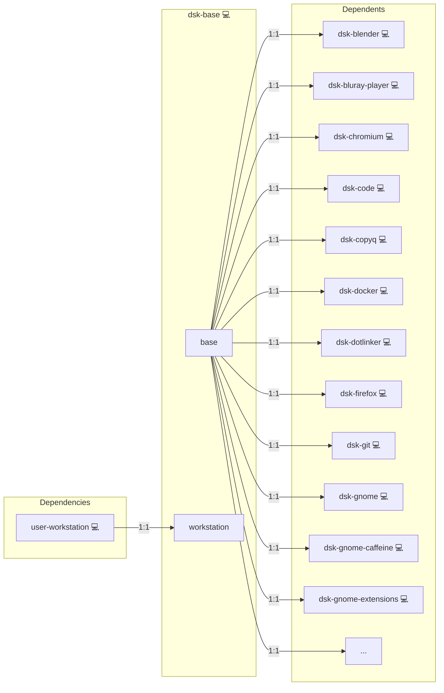

# Base

## Description

This Ansible role carries the premise every desktop role shares: the login account whose home the desktop files live in, and whose name they are owned by.

It pulls in `user-workstation` and nothing else. Desktop roles declare it in their `meta/main.yml` dependencies instead of each reaching for the account themselves.

## Overview

This role guarantees the workstation account before any desktop role writes for it.

## Cosmos

The diagram places Base in the Infinito.Nexus cosmos: the components it deploys (capabilities), the central services it consumes (dependencies), and its outward reach (federation and bridged external networks).



Solid `1:1` edges are fixed relationships; dashed `0..1` edges are conditional (enabled only in matching deployments); red `0..0` edges are turned off in this role. Node markers show the role's deploy modes (💻 host, 🐳 compose, 🐝 swarm); ❌ marks a service that is explicitly turned off, and ⚙️ an Ansible role dependency declared in `meta/main.yml`.

## Features

- **Automated provisioning:** Configured by Ansible without manual steps.
- **One premise, one place:** A second shared desktop prerequisite is added here rather than in every `dsk-*` role.

## Quick Setup

### Development

Clone, set up the workstation, and deploy Base onto the local stack:

```bash
git clone https://github.com/infinito-nexus/core.git
cd core
make onboard
make compose-deploy mode=reinstall apps=dsk-base full_cycle=false
```

### Production

Install Base directly onto the target machine: clone the repository, install the OS prerequisites and the repository toolchain, then deploy against localhost over a local connection (no SSH, no container):

```bash
git clone https://github.com/infinito-nexus/core.git
cd core
bash scripts/install/package.sh
make install
source scripts/meta/env/load.sh

APP=dsk-base
DOMAIN="<your-domain>"
TLS_MODE=self_signed
SSH_PUBLIC_KEY="<your-ssh-public-key>"
INVENTORY=inventories/production
infinito administration inventory provision "$INVENTORY" \
  --inventory-file "$INVENTORY/devices.yml" \
  --host localhost \
  --include "$APP" \
  --vars "{\"TLS_MODE\": \"$TLS_MODE\", \"DOMAIN_PRIMARY\": \"$DOMAIN\", \"users\": {\"administrator\": {\"authorized_keys\": [\"$SSH_PUBLIC_KEY\"]}}}"
infinito administration deploy dedicated "$INVENTORY/devices.yml" \
  --password-file "$INVENTORY/.password" \
  --diff -vv
```

## Credits

Implemented by **[Kevin Veen-Birkenbach](https://social.infinito.nexus/profile/kevinveenbirkenbach/profile)**.
Part of the [Infinito.Nexus Project](https://s.infinito.nexus/code) and maintained by [Kevin Veen-Birkenbach](https://www.veen.world).
Licensed under the [Infinito.Nexus Community License (Non-Commercial)](https://s.infinito.nexus/license).

## Usage

Declare it as a dependency in the desktop role's `meta/main.yml`:

```yaml
dependencies:
  - dsk-base
```

Ansible resolves the dependency before the role's own tasks and runs it once per play, so no guard is needed at the call site.

## Variables

The role takes none of its own. `user-workstation` reads `WORKSTATION_USER` and the `users` entry it names.
