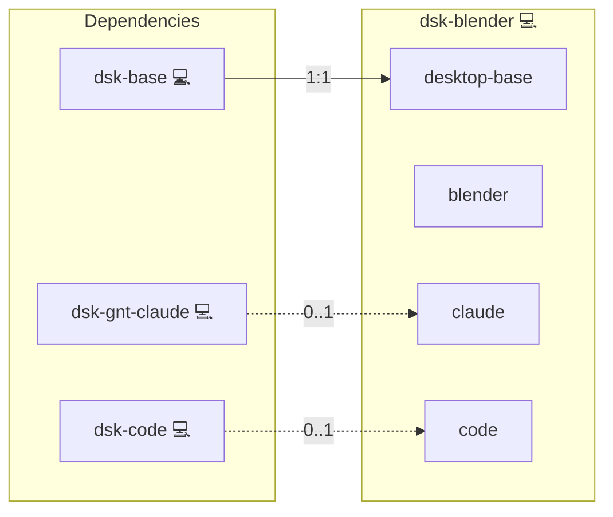

# Blender

## Description

[Blender](https://www.blender.org) is a free and open source 3D creation suite covering modelling, sculpting, animation, simulation, rendering and compositing.

## Overview

This role installs Blender on a workstation and connects it to the coding agents the same host deploys, so a model can drive the scene instead of only describing it.

The bridge has two halves. Inside Blender an add-on opens a local socket; outside it the `mcp-for-blender` server speaks the Model Context Protocol over stdio and relays to that socket. Both halves come from the same pinned upstream distribution, which also carries the `install-addon` subcommand this role uses to place the Blender side.

Registration follows the host: the role declares `claude` and `code` as services gated on whether `dsk-gnt-claude` and `dsk-code` are deployed, and registers the server only with the clients that are present. A workstation without either installs Blender and the bridge, and nothing tries to configure an absent editor.

The agents keep their own model wiring. `dsk-gnt-claude` already points at the LiteLLM gateway, so a prompt reaches the local gateway and the resulting tool calls reach Blender.

## Cosmos

The diagram places Blender in the Infinito.Nexus cosmos: the components it deploys (capabilities), the central services it consumes (dependencies), and its outward reach (federation and bridged external networks).



Solid `1:1` edges are fixed relationships; dashed `0..1` edges are conditional (enabled only in matching deployments); red `0..0` edges are turned off in this role. Node markers show the role's deploy modes (💻 host, 🐳 compose, 🐝 swarm); ❌ marks a service that is explicitly turned off, and ⚙️ an Ansible role dependency declared in `meta/main.yml`.

## Features

- **Agent-driven modelling:** An MCP client creates, edits and renders scenes through Blender's own Python API.
- **Follows the host:** The MCP server is registered with each agent the workstation actually deploys.
- **Pinned bridge:** Add-on and server ship from one version-pinned distribution, so the two halves cannot drift apart.
- **No remote installer:** The server arrives through pipx and the add-on through its own subcommand.

## Quick Setup

### Development

Clone, set up the workstation, and deploy Blender onto the local stack:

```bash
git clone https://github.com/infinito-nexus/core.git
cd core
make onboard
make compose-deploy mode=reinstall apps=dsk-blender full_cycle=false
```

### Production

Install Blender directly onto the target machine: clone the repository, install the OS prerequisites and the repository toolchain, then deploy against localhost over a local connection (no SSH, no container):

```bash
git clone https://github.com/infinito-nexus/core.git
cd core
bash scripts/install/package.sh
make install
source scripts/meta/env/load.sh

APP=dsk-blender
DOMAIN="<your-domain>"
TLS_MODE=self_signed
SSH_PUBLIC_KEY="<your-ssh-public-key>"
INVENTORY=inventories/production
infinito administration inventory provision "$INVENTORY" \
  --inventory-file "$INVENTORY/devices.yml" \
  --host localhost \
  --include "$APP" \
  --vars "{\"TLS_MODE\": \"$TLS_MODE\", \"DOMAIN_PRIMARY\": \"$DOMAIN\", \"users\": {\"administrator\": {\"authorized_keys\": [\"$SSH_PUBLIC_KEY\"]}}}"
infinito administration deploy dedicated "$INVENTORY/devices.yml" \
  --password-file "$INVENTORY/.password" \
  --diff -vv
```

## Further Resources

- [MCP for Blender](https://github.com/ahujasid/mcp-for-blender)
- [Model Context Protocol](https://modelcontextprotocol.io)
- [Blender Python API](https://docs.blender.org/api/current/)

## Credits

Implemented by **[Kevin Veen-Birkenbach](https://social.infinito.nexus/profile/kevinveenbirkenbach/profile)**.
Part of the [Infinito.Nexus Project](https://s.infinito.nexus/code) and maintained by [Kevin Veen-Birkenbach](https://www.veen.world).
Licensed under the [Infinito.Nexus Community License (Non-Commercial)](https://s.infinito.nexus/license).
