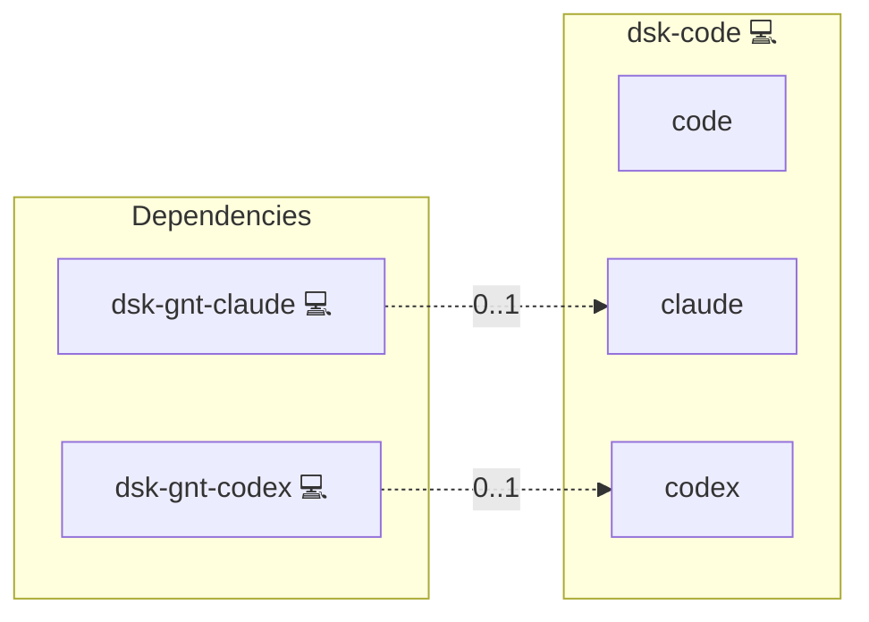

# Code

## Description

[Visual Studio Code](https://github.com/microsoft/vscode) in a selectable flavor: the distribution's Code - OSS build, VSCodium, or Microsoft's own binary.

## Overview

`services.code.flavor` picks one of `code-oss`, `vscodium` or `vscode`. The three builds conflict at package level, so the role removes the other two before installing the chosen one.

The role also carries the editor extensions of the agents the same host deploys: when `dsk-gnt-claude` is in the host's groups, the Claude Code extension is installed into the chosen flavor. Code - OSS and VSCodium resolve extensions through Open VSX, which carries that extension as well.

`dsk-gnt-cursor` and `dsk-gnt-pi` carry no entry in that map. Cursor is a full editor rather than an extension, and neither vendor publishes an extension on Open VSX, so there is nothing to install into Code for them. Both agents are used from their own binary.

## Cosmos

The diagram places Code in the Infinito.Nexus cosmos: the components it deploys (capabilities), the central services it consumes (dependencies), and its outward reach (federation and bridged external networks).



Solid `1:1` edges are fixed relationships; dashed `0..1` edges are conditional (enabled only in matching deployments); red `0..0` edges are turned off in this role. Node markers show the role's deploy modes (💻 host, 🐳 compose, 🐝 swarm); ❌ marks a service that is explicitly turned off, and ⚙️ an Ansible role dependency declared in `meta/main.yml`.

## Features

- **Flavor selectable:** one setting switches between Code - OSS, VSCodium and the Microsoft build.
- **Conflict-free switch:** the other flavors are removed first, because they claim the same binary.
- **Agent-aware:** an agent role on the same host brings its editor extension along.
- **Refused early:** an unknown flavor aborts the deploy with the list of carried flavors.

## Quick Setup

### Development

Clone, set up the workstation, and deploy Code onto the local stack:

```bash
git clone https://github.com/infinito-nexus/core.git
cd core
make onboard
make compose-deploy mode=reinstall apps=dsk-code full_cycle=false
```

### Production

Install Code directly onto the target machine: clone the repository, install the OS prerequisites and the repository toolchain, then deploy against localhost over a local connection (no SSH, no container):

```bash
git clone https://github.com/infinito-nexus/core.git
cd core
bash scripts/install/package.sh
make install
source scripts/meta/env/load.sh

APP=dsk-code
DOMAIN=<your-domain>
TLS_MODE=self_signed
SSH_PUBLIC_KEY="<your-ssh-public-key>"
INVENTORY=inventories/production
infinito administration inventory provision "$INVENTORY" \
  --inventory-file "$INVENTORY/devices.yml" \
  --host localhost \
  --include "$APP" \
  --vars "{\"TLS_MODE\": \"$TLS_MODE\", \"DOMAIN_PRIMARY\": \"$DOMAIN\", \"users\": {\"administrator\": {\"authorized_keys\": [\"$SSH_PUBLIC_KEY\"]}}}"
infinito administration deploy dedicated "$INVENTORY/devices.yml" \
  --password-file "$INVENTORY/.password" \
  --diff -vv
```

## Credits

Implemented by **[Kevin Veen-Birkenbach](https://www.veen.world)**.
Part of the [Infinito.Nexus Project](https://s.infinito.nexus/code) and maintained by [Kevin Veen-Birkenbach](https://www.veen.world).
Licensed under the [Infinito.Nexus Community License (Non-Commercial)](https://s.infinito.nexus/license).
