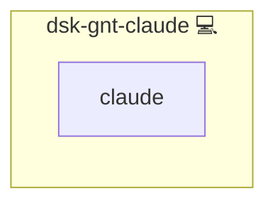

# Claude Code

## Description

[Claude Code](https://code.claude.com/) is Anthropic's terminal coding agent. This role installs it on a workstation and points it at the platform's own model gateway instead of the vendor API.

## Overview

The agent speaks the Anthropic Messages API, which the LiteLLM gateway serves alongside its OpenAI routes. The role writes `~/.claude/settings.json` with an `env` block carrying the gateway URL, the workstation's key and the model aliases to use, so every request leaves the machine through the gateway and is accounted there.

The gateway mints its virtual keys from the inventory it is deployed from, and a workstation is deployed from a different one. The key is therefore an operator-supplied credential on the workstation side: mint it on the server, then put it into the workstation inventory.

## Cosmos

The diagram places Claude Code in the Infinito.Nexus cosmos: the components it deploys (capabilities), the central services it consumes (dependencies), and its outward reach (federation and bridged external networks).



Solid `1:1` edges are fixed relationships; dashed `0..1` edges are conditional (enabled only in matching deployments); red `0..0` edges are turned off in this role. Node markers show the role's deploy modes (💻 host, 🐳 compose, 🐝 swarm); ❌ marks a service that is explicitly turned off, and ⚙️ an Ansible role dependency declared in `meta/main.yml`.

## Features

- **Gateway-backed:** `ANTHROPIC_BASE_URL` and `ANTHROPIC_AUTH_TOKEN` point the agent at the platform gateway.
- **Explicit models:** `ANTHROPIC_MODEL` and `ANTHROPIC_DEFAULT_HAIKU_MODEL` name gateway aliases, because the vendor's own model ids do not exist there.
- **No configuration without a key:** the settings file is written only once both the gateway URL and the key are set.
- **User-owned:** the file belongs to the workstation user and is readable only by them.

## Quick Setup

### Development

Clone, set up the workstation, and deploy Claude Code onto the local stack:

```bash
git clone https://github.com/infinito-nexus/core.git
cd core
make onboard
make compose-deploy mode=reinstall apps=dsk-gnt-claude full_cycle=false
```

### Production

Install Claude Code directly onto the target machine: clone the repository, install the OS prerequisites and the repository toolchain, then deploy against localhost over a local connection (no SSH, no container):

```bash
git clone https://github.com/infinito-nexus/core.git
cd core
bash scripts/install/package.sh
make install
source scripts/meta/env/load.sh

APP=dsk-gnt-claude
DOMAIN=<your-domain>
TLS_MODE=self_signed
SSH_PUBLIC_KEY="<your-ssh-public-key>"
INVENTORY=inventories/production
infinito administration inventory provision "$INVENTORY" \
  --inventory-file "$INVENTORY/devices.yml" \
  --host localhost \
  --include "$APP" \
  --vars "{\"TLS_MODE\": \"$TLS_MODE\", \"DOMAIN_PRIMARY\": \"$DOMAIN\", \"users\": {\"administrator\": {\"authorized_keys\": [\"$SSH_PUBLIC_KEY\"]}}}"
infinito administration deploy dedicated "$INVENTORY/devices.yml" \
  --password-file "$INVENTORY/.password" \
  --diff -vv
```

## Credits

Implemented by **[Kevin Veen-Birkenbach](https://www.veen.world)**.
Part of the [Infinito.Nexus Project](https://s.infinito.nexus/code) and maintained by [Kevin Veen-Birkenbach](https://www.veen.world).
Licensed under the [Infinito.Nexus Community License (Non-Commercial)](https://s.infinito.nexus/license).
