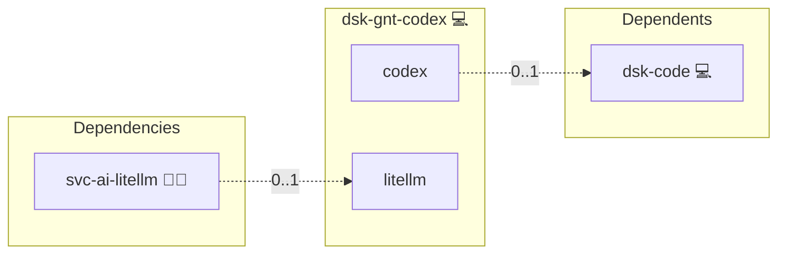

# Codex

## Description

[Codex](https://github.com/openai/codex) is OpenAI's terminal coding agent, installed on a workstation and pointed at this deployment's own model gateway instead of the vendor API.

## Overview

The role installs the `@openai/codex` npm package and, when the workstation also runs [`svc-ai-litellm`](../svc-ai-litellm/), writes a provider profile that sends every completion to the gateway over the loopback address the engine publishes it on. Nothing leaves the machine: the gateway answers on `127.0.0.1`, so the workstation's virtual key never crosses a network.

Codex reads its key from an environment variable rather than from its config file, so the role writes the key to a `0600` file under `~/.config/environment.d/` and names that variable in `config.toml`. A workstation whose gateway lives in another inventory leaves `services.codex.gateway_url` and `credentials.gateway_key` set by hand instead, and the loopback wiring stays out of the way.

## Cosmos

The diagram places Codex in the Infinito.Nexus cosmos: the components it deploys (capabilities), the central services it consumes (dependencies), and its outward reach (federation and bridged external networks).



Solid `1:1` edges are fixed relationships; dashed `0..1` edges are conditional (enabled only in matching deployments); red `0..0` edges are turned off in this role. Node markers show the role's deploy modes (💻 host, 🐳 compose, 🐝 swarm); ❌ marks a service that is explicitly turned off, and ⚙️ an Ansible role dependency declared in `meta/main.yml`.

## Features

- **Feature:** Describe a capability.

## Quick Setup

### Development

Clone, set up the workstation, and deploy Codex onto the local stack:

```bash
git clone https://github.com/infinito-nexus/core.git
cd core
make onboard
make compose-deploy mode=reinstall apps=dsk-gnt-codex full_cycle=false
```

### Production

Install Codex directly onto the target machine: clone the repository, install the OS prerequisites and the repository toolchain, then deploy against localhost over a local connection (no SSH, no container):

```bash
git clone https://github.com/infinito-nexus/core.git
cd core
bash scripts/install/package.sh
make install
source scripts/meta/env/load.sh

APP=dsk-gnt-codex
DOMAIN=<your-domain>
TLS_MODE=self_signed
SSH_PUBLIC_KEY="<your-ssh-public-key>"
INVENTORY=inventories/production
infinito administration inventory provision "$INVENTORY" \
  --inventory-file "$INVENTORY/devices.yml" \
  --host localhost \
  --include "$APP" \
  --vars "{\"TLS_MODE\": \"$TLS_MODE\", \"DOMAIN_PRIMARY\": \"$DOMAIN\", \"users\": {\"administrator\": {\"authorized_keys\": [\"$SSH_PUBLIC_KEY\"]}}}"
infinito administration deploy dedicated "$INVENTORY/devices.yml" \
  --password-file "$INVENTORY/.password" \
  --diff -vv
```

## Credits

Implemented by **[Kevin Veen-Birkenbach](https://www.veen.world)**.
Part of the [Infinito.Nexus Project](https://s.infinito.nexus/code) and maintained by [Kevin Veen-Birkenbach](https://www.veen.world).
Licensed under the [Infinito.Nexus Community License (Non-Commercial)](https://s.infinito.nexus/license).
