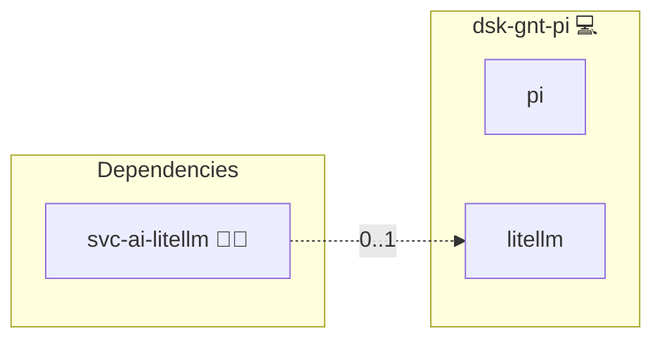

# Pi Coding Agent

## Description

[Pi](https://github.com/earendil-works/pi) is a minimal terminal coding agent with a lazy-loading skill system. This role installs it on a workstation and registers the platform's model gateway as its provider.

## Overview

Pi reads its providers from `~/.pi/agent/models.json`. The role renders that file with one provider of type `openai-completions` pointing at the gateway's `/v1` base, the workstation's key, and the model aliases the operator listed.

As with every workstation agent here, the key is operator-supplied: the gateway mints it from the server inventory, and the workstation inventory carries it.

## Cosmos

The diagram places Pi Coding Agent in the Infinito.Nexus cosmos: the components it deploys (capabilities), the central services it consumes (dependencies), and its outward reach (federation and bridged external networks).



Solid `1:1` edges are fixed relationships; dashed `0..1` edges are conditional (enabled only in matching deployments); red `0..0` edges are turned off in this role. Node markers show the role's deploy modes (💻 host, 🐳 compose, 🐝 swarm); ❌ marks a service that is explicitly turned off, and ⚙️ an Ansible role dependency declared in `meta/main.yml`.

## Features

- **Gateway-backed:** one provider entry, no vendor credentials on the machine.
- **Explicit model list:** the aliases come from the inventory, so the agent offers exactly what the gateway serves.
- **No configuration without a key:** the file is written only once URL, key and model list are set.
- **User-owned:** the file belongs to the workstation user and is readable only by them.

## Quick Setup

### Development

Clone, set up the workstation, and deploy Pi Coding Agent onto the local stack:

```bash
git clone https://github.com/infinito-nexus/core.git
cd core
make onboard
make compose-deploy mode=reinstall apps=dsk-gnt-pi full_cycle=false
```

### Production

Install Pi Coding Agent directly onto the target machine: clone the repository, install the OS prerequisites and the repository toolchain, then deploy against localhost over a local connection (no SSH, no container):

```bash
git clone https://github.com/infinito-nexus/core.git
cd core
bash scripts/install/package.sh
make install
source scripts/meta/env/load.sh

APP=dsk-gnt-pi
DOMAIN=<your-domain>
TLS_MODE=self_signed
SSH_PUBLIC_KEY="<your-ssh-public-key>"
INVENTORY=inventories/production
infinito administration inventory provision "$INVENTORY" \
  --inventory-file "$INVENTORY/devices.yml" \
  --host localhost \
  --include "$APP" \
  --vars "{\"TLS_MODE\": \"$TLS_MODE\", \"DOMAIN_PRIMARY\": \"$DOMAIN\", \"users\": {\"administrator\": {\"authorized_keys\": [\"$SSH_PUBLIC_KEY\"]}}}"
infinito administration deploy dedicated "$INVENTORY/devices.yml" \
  --password-file "$INVENTORY/.password" \
  --diff -vv
```

## Credits

Implemented by **[Kevin Veen-Birkenbach](https://www.veen.world)**.
Part of the [Infinito.Nexus Project](https://s.infinito.nexus/code) and maintained by [Kevin Veen-Birkenbach](https://www.veen.world).
Licensed under the [Infinito.Nexus Community License (Non-Commercial)](https://s.infinito.nexus/license).
