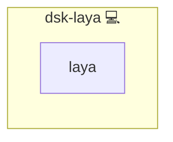

# Laya

## Description

[Laya](https://laya.aay.sh/) is a local-first notification command center that aggregates Slack, mail, issue trackers and calendars into approvable action cards.

## Overview

The role installs the pinned upstream AppImage and puts it on `PATH`. Upstream signs its assets with the Tauri updater key and publishes no digest, so the role pins a sha256 taken from the released build itself and the download is verified against it. A rebuilt or replaced asset fails the deploy instead of being installed.

The pinned build is the amd64 AppImage, and the role refuses a host of another architecture rather than linking a binary that cannot run there.

Laya keeps its own settings in `~/.laya/`, including the model providers it talks to. This role does not render that file: upstream documents the provider types but not the on-disk schema, so the provider is an operator step in the application's own settings. Pointing it at the platform gateway means adding a provider of type `openai_compatible`.

## Cosmos

The diagram places Laya in the Infinito.Nexus cosmos: the components it deploys (capabilities), the central services it consumes (dependencies), and its outward reach (federation and bridged external networks).



Solid `1:1` edges are fixed relationships; dashed `0..1` edges are conditional (enabled only in matching deployments); red `0..0` edges are turned off in this role. Node markers show the role's deploy modes (💻 host, 🐳 compose, 🐝 swarm); ❌ marks a service that is explicitly turned off, and ⚙️ an Ansible role dependency declared in `meta/main.yml`.

## Features

- **Pinned and verified:** the AppImage version and its sha256 live in the role, and a mismatch aborts the deploy.
- **Architecture-guarded:** a host that is not amd64 aborts before the download.
- **Distribution-independent:** the AppImage runs on every supported family, so no vendor repository is needed.
- **No invented configuration:** the provider setup stays in the application, because its file schema is not documented upstream.

## Quick Setup

### Development

Clone, set up the workstation, and deploy Laya onto the local stack:

```bash
git clone https://github.com/infinito-nexus/core.git
cd core
make onboard
make compose-deploy mode=reinstall apps=dsk-laya full_cycle=false
```

### Production

Install Laya directly onto the target machine: clone the repository, install the OS prerequisites and the repository toolchain, then deploy against localhost over a local connection (no SSH, no container):

```bash
git clone https://github.com/infinito-nexus/core.git
cd core
bash scripts/install/package.sh
make install
source scripts/meta/env/load.sh

APP=dsk-laya
DOMAIN=<your-domain>
TLS_MODE=self_signed
SSH_PUBLIC_KEY="<your-ssh-public-key>"
INVENTORY=inventories/production
infinito administration inventory provision "$INVENTORY" \
  --inventory-file "$INVENTORY/devices.yml" \
  --host localhost \
  --include "$APP" \
  --vars "{\"TLS_MODE\": \"$TLS_MODE\", \"DOMAIN_PRIMARY\": \"$DOMAIN\", \"users\": {\"administrator\": {\"authorized_keys\": [\"$SSH_PUBLIC_KEY\"]}}}"
infinito administration deploy dedicated "$INVENTORY/devices.yml" \
  --password-file "$INVENTORY/.password" \
  --diff -vv
```

## Credits

Implemented by **[Kevin Veen-Birkenbach](https://www.veen.world)**.
Part of the [Infinito.Nexus Project](https://s.infinito.nexus/code) and maintained by [Kevin Veen-Birkenbach](https://www.veen.world).
Licensed under the [Infinito.Nexus Community License (Non-Commercial)](https://s.infinito.nexus/license).
