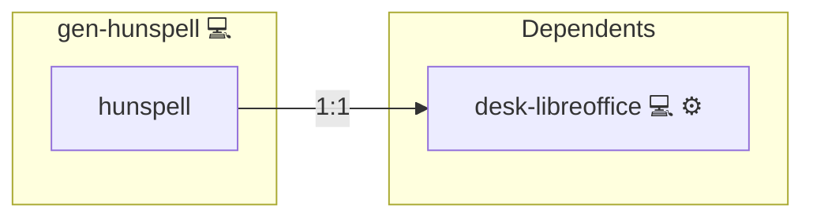

# Hunspell

## Description

Installs Hunspell and configured language packs on Pacman-based systems for spell checking in multiple languages.

## Overview

This README accompanies the Hunspell Playbook, located within the `infinito` repository. The playbook is focused on installing Hunspell, a widely-used spell checker, along with various language packages to enhance its functionality.

## Cosmos

The diagram places Hunspell in the Infinito.Nexus cosmos: the components it deploys (capabilities), the central services it consumes (dependencies), and its outward reach (federation and bridged external networks).



Solid `1:1` edges are fixed relationships; dashed `0..1` edges are conditional (enabled only in matching deployments). Node markers show the role's deploy modes (💻 host, 🐳 compose, 🐝 swarm); ❌ marks a service that is explicitly turned off, and ⚙️ an Ansible role dependency declared in `meta/main.yml`.

## Features

- **Automated provisioning:** Configured by Ansible without manual steps.

## Quick Setup

### Development

Clone, set up the workstation, and deploy Hunspell onto the local stack:

```bash
git clone https://github.com/infinito-nexus/core.git
cd core
make onboard
make compose-deploy mode=reinstall apps=gen-hunspell full_cycle=false
```

### Production

Install Hunspell directly onto the target machine — clone the repository, install the OS prerequisites and the repository toolchain, then deploy against localhost over a local connection (no SSH, no container):

```bash
git clone https://github.com/infinito-nexus/core.git
cd core
bash scripts/install/package.sh
make install
source scripts/meta/env/load.sh

APP=gen-hunspell
TLS_MODE=self_signed
SSH_PUBLIC_KEY="<your-ssh-public-key>"
INVENTORY=inventories/production
infinito administration inventory provision "$INVENTORY" \
  --inventory-file "$INVENTORY/devices.yml" \
  --host localhost \
  --include "$APP" \
  --vars "{\"TLS_MODE\": \"$TLS_MODE\", \"users\": {\"administrator\": {\"authorized_keys\": [\"$SSH_PUBLIC_KEY\"]}}}"
infinito administration deploy dedicated "$INVENTORY/devices.yml" \
  --password-file "$INVENTORY/.password" \
  --diff -vv
```

## Playbook Contents

The `main.yml` file in the `hunspell` role includes two primary tasks:

1. **Install Hunspell**: Utilizes the `community.general.pacman` module to ensure that the `hunspell` package is installed on the system.

2. **Install Hunspell Language Packages**: Again using the `community.general.pacman` module, this task installs multiple Hunspell language packages. The specific languages to be installed are determined by the `{{hunspell_languages}}` variable, which should be defined as a list of language codes.

## Purpose and Usage

This playbook is tailored for users who need a powerful and flexible spell-checking tool on their systems. Hunspell is particularly popular among writers, editors, and developers who work with text in various languages. By automating the installation of Hunspell and its language-specific packages, this playbook simplifies the setup process, allowing users to quickly get up and running with an advanced spell-checking tool.

## Prerequisites

- **Ansible**: This playbook requires Ansible to be installed on your system.
- **Arch Linux or Similar**: Given the use of the `pacman` package manager, this playbook is designed for systems based on Arch Linux or similar distributions.

## How to Run the Playbook

To utilize this playbook:

1. Ensure you have cloned the `infinito` repository.
2. Navigate to the `roles/hunspell` directory within the repository.
3. Execute the playbook using Ansible, ensuring you provide a list of language codes to the `{{hunspell_languages}}` variable.

## Customization

Users are encouraged to customize the `{{hunspell_languages}}` variable based on their specific language requirements. This variable accepts a list of language codes (e.g., 'en_US', 'de_DE').

## Support and Contributions

For any support requests, suggestions, or contributions, please open an issue or a pull request in the `infinito` repository. Contributions, especially those that enhance the playbook's functionality or extend its language support, are highly welcomed.

## Credits

Implemented by **[Kevin Veen-Birkenbach](https://www.veen.world)**.
Part of the [Infinito.Nexus Project](https://s.infinito.nexus/code) and maintained by [Kevin Veen-Birkenbach](https://www.veen.world).
Licensed under the [Infinito.Nexus Community License (Non-Commercial)](https://s.infinito.nexus/license).
