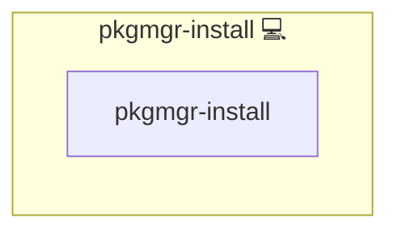

# Package Manager Installation

## Description

This Ansible role installs [Kevin's Package Manager](https://github.com/kevinveenbirkenbach/package-manager) and updates packages using `pkgmgr` on Arch Linux systems. It provides a unified interface for package installation and update management, ensuring consistent deployment across environments.

## Overview

The role abstracts package management operations using `pkgmgr`. It ensures the package manager itself is updated once per run and provides idempotent installation and update routines for specified packages.

## Cosmos

The diagram places Package Manager Installation in the Infinito.Nexus cosmos: the components it deploys (capabilities), the central services it consumes (dependencies), and its outward reach (federation and bridged external networks).

Solid `1:1` edges are fixed relationships; dashed `0..1` edges are conditional (enabled only in matching deployments). Node markers show the role's deploy modes (💻 host, 🐳 compose, 🐝 swarm); ❌ marks a service that is explicitly turned off, and ⚙️ an Ansible role dependency declared in `meta/main.yml`.

## Purpose

The purpose of this role is to automate the installation and update process for Infinito.Nexus-related applications or other managed packages using `pkgmgr`. It simplifies package handling and enforces best practices for package deployment in automated environments.

## Features

- **Automatic pkgmgr Update:** Ensures the package manager is always up-to-date.
- **Idempotent Package Installation:** Only installs packages when necessary.
- **Flexible Notification:** Supports handler notification for post-install actions (e.g., Docker Compose builds).
- **Optional Privilege Escalation:** Controlled via the `pkgmgr_become` variable (default: `true`).

## Role Variables

| Name            | Description                                                     | Default |
|-----------------|-----------------------------------------------------------------|---------|
| `package_name`   | Name of the package to install/update                          | (required) |
| `package_notify` | Handler to notify on package installation/update              | "" |

## Credits

Implemented by **[Kevin Veen-Birkenbach](https://www.veen.world)**.
Part of the [Infinito.Nexus Project](https://s.infinito.nexus/code) and maintained by [Kevin Veen-Birkenbach](https://www.veen.world).
Licensed under the [Infinito.Nexus Community License (Non-Commercial)](https://s.infinito.nexus/license).
