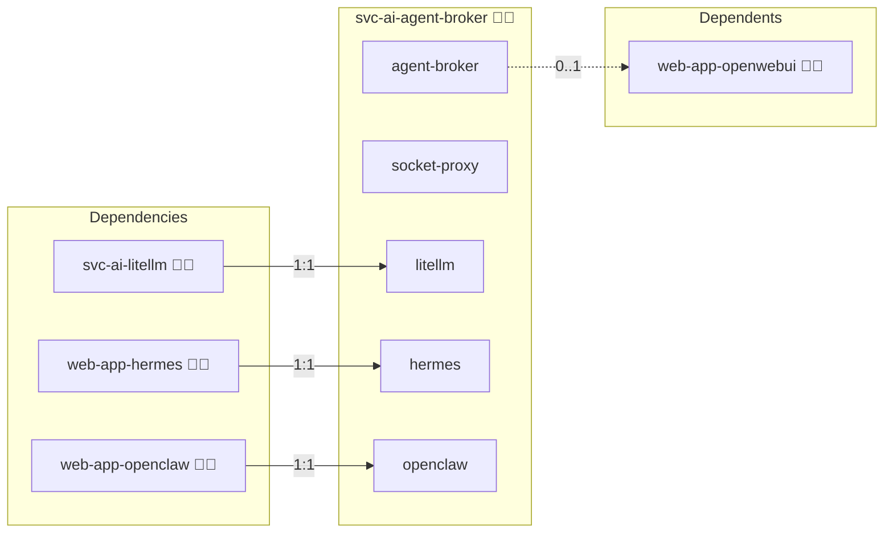

# Agent Broker

## Description

Agent Broker is an OpenAI-compatible endpoint that gives every entitled user a personal Hermes or OpenClaw agent, started on the first request and addressed by the model name `hermes` or `openclaw`.

## Overview

This role deploys the broker together with a container-API socket proxy in Compose and Swarm deployments. Open WebUI reaches the broker as a second OpenAI connection and forwards the caller's identity. The broker checks the caller's Keycloak group, creates or starts that caller's agent under the isolating runtime, forwards the request to it and streams the answer back. Agents reach their model only through the broker, which relays each call to the shared LiteLLM gateway with its own key and tags it with the owner.

## Cosmos

The diagram places Agent Broker in the Infinito.Nexus cosmos: the components it deploys (capabilities), the central services it consumes (dependencies), and its outward reach (federation and bridged external networks).



Solid `1:1` edges are fixed relationships; dashed `0..1` edges are conditional (enabled only in matching deployments); red `0..0` edges are turned off in this role. Node markers show the role's deploy modes (💻 host, 🐳 compose, 🐝 swarm); ❌ marks a service that is explicitly turned off, and ⚙️ an Ansible role dependency declared in `meta/main.yml`.

## Features

- **Agents on demand:** The first completion of a user for `hermes` or `openclaw` creates that user's agent; later requests reuse it, and a stopped agent is started again with its state volume re-attached.
- **RBAC gate:** A user needs the `agent-user` role of `web-app-hermes` or `web-app-openclaw`. Open WebUI lists each agent model only to that group, and the broker refuses any other caller with HTTP 403 and stops a running agent of a user who lost the role.
- **Isolation:** Every agent runs in its own container or single-replica service under the isolating runtime, with its own volume, its own network whose only other member is the broker, and its own bearer key; an agent that would start under `runc` is stopped and refused.
- **Restricted engine access:** The broker reaches the container engine only through a filtered unix socket in a volume shared with the socket proxy, which publishes no port and runs with `network_mode: none` in compose. The proxy admits only the container, service, task, network, volume and image calls the broker makes, and refuses every other method and path, including exec and delete. It filters methods and paths, not request bodies: `volumes/create` stays open for the per-agent volume, so the isolation holds against a compromised agent, which reaches no socket at all, not against a compromised broker.
- **Lifecycle settings:** `agents.idle_stop`, `agents.idle_minutes`, `agents.max_running`, `agents.start_timeout` and `agents.access_cache_seconds` in `meta/services.yml` control idle stops, the running-agent bound, the start wait and the membership cache; an inventory overrides them under `applications.svc-ai-agent-broker.services.agent-broker.agents`. An agent serving a request is never swept.
- **Model and context:** `agents.model` names the gateway alias every agent runs on and defaults to the gateway's chat model, so agents can run on a larger model than Open WebUI's default. The context window of that alias comes from the model's `context` in the inventory and is written into the agent config as Hermes `model.context_length` and OpenClaw `contextWindow`. An agent prompt runs to tens of thousands of tokens, so a CPU-only local model spends minutes per turn on it; point `agents.model` at a remote model for interactive use. Hermes refuses a window below 64000 tokens and answers HTTP 500 on every prompt, so the deploy stops when the selected alias declares less. An alias that declares no window is reported instead, because an agent that does not know its window runs.
- **Model relay:** Agents call `http://agent-broker:<port>/llm/v1` with their own key; the broker forwards the call to LiteLLM with the broker's virtual key, sets the OpenAI `user` field to the owner and logs a JSON `relay` event with owner, platform, path and upstream status.

## Quick Setup

### Development

Clone, set up the workstation, and deploy Agent Broker onto the local stack:

```bash
git clone https://github.com/infinito-nexus/core.git
cd core
make onboard
make compose-deploy mode=reinstall apps=svc-ai-agent-broker full_cycle=false
```

### Production

Run the published image to provision the inventory and deploy Agent Broker to a managed server (the mounted volume persists the inventory):

```bash
APP=svc-ai-agent-broker
HOST=<your-server>
DOMAIN=<your-domain>
TLS_MODE=self_signed
SSH_PUBLIC_KEY="<your-ssh-public-key>"

docker run --rm -it \
  -v "$PWD/inventories:/etc/infinito.nexus/inventories" \
  -e APP="$APP" -e HOST="$HOST" -e DOMAIN="$DOMAIN" -e TLS_MODE="$TLS_MODE" -e SSH_PUBLIC_KEY="$SSH_PUBLIC_KEY" \
  ghcr.io/infinito-nexus/core/debian bash -c '
    INVENTORY=/etc/infinito.nexus/inventories/production
    infinito administration inventory provision "$INVENTORY" \
      --inventory-file "$INVENTORY/devices.yml" \
      --host "$HOST" \
      --include "$APP" \
      --vars "{\"TLS_MODE\": \"$TLS_MODE\", \"DOMAIN_PRIMARY\": \"$DOMAIN\", \"users\": {\"administrator\": {\"authorized_keys\": [\"$SSH_PUBLIC_KEY\"]}}}" &&
    infinito administration deploy dedicated "$INVENTORY/devices.yml" \
      --password-file "$INVENTORY/.password" \
      --diff -vv'
```

## Credits

Implemented by **[Kevin Veen-Birkenbach](https://www.veen.world)**.
Part of the [Infinito.Nexus Project](https://s.infinito.nexus/code) and maintained by [Kevin Veen-Birkenbach](https://www.veen.world).
Licensed under the [Infinito.Nexus Community License (Non-Commercial)](https://s.infinito.nexus/license).
