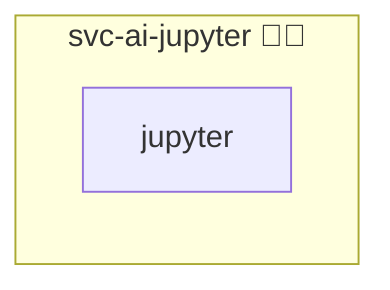

# Jupyter

## Description

[Jupyter](https://jupyter.org/) runs code in a managed kernel and returns its output. This role provides that kernel as a backend for other services rather than as a notebook UI for people.

## Overview

The server starts with a token from the deployment's credential store, binds to the container network and publishes no port. Cross-site request checking is off and any origin is accepted, because the caller is a service on the same network that presents the token rather than a browser carrying a cookie.

The role declares no volume: a kernel that executes code a chat wrote gets a fresh filesystem on every restart. A consumer reaches it as `http://jupyter:8888` once it declares `jupyter` in its own `meta/services.yml` with `enabled` and `shared` set. `web-app-openwebui` ships that flag and sends `CODE_EXECUTION_ENGINE=jupyter` with it.

## Cosmos

The diagram places Jupyter in the Infinito.Nexus cosmos: the components it deploys (capabilities), the central services it consumes (dependencies), and its outward reach (federation and bridged external networks).



Solid `1:1` edges are fixed relationships; dashed `0..1` edges are conditional (enabled only in matching deployments); red `0..0` edges are turned off in this role. Node markers show the role's deploy modes (💻 host, 🐳 compose, 🐝 swarm); ❌ marks a service that is explicitly turned off, and ⚙️ an Ansible role dependency declared in `meta/main.yml`.

## Features

- **Token protected:** every request carries a token from the credential store; the token is never handed to a browser user.
- **Ephemeral:** no volume is mounted, so each restart discards whatever the executed code wrote.
- **Internal only:** no published port and no proxy entry, so the kernel is reachable from the container network alone.

## Quick Setup

### Development

Clone, set up the workstation, and deploy Jupyter onto the local stack:

```bash
git clone https://github.com/infinito-nexus/core.git
cd core
make onboard
make compose-deploy mode=reinstall apps=svc-ai-jupyter full_cycle=false
```

### Production

Run the published image to provision the inventory and deploy Jupyter to a managed server (the mounted volume persists the inventory):

```bash
APP=svc-ai-jupyter
HOST=<your-server>
DOMAIN=<your-domain>
TLS_MODE=self_signed
SSH_PUBLIC_KEY="<your-ssh-public-key>"

docker run --rm -it \
  -v "$PWD/inventories:/etc/infinito.nexus/inventories" \
  -e APP="$APP" -e HOST="$HOST" -e DOMAIN="$DOMAIN" -e TLS_MODE="$TLS_MODE" -e SSH_PUBLIC_KEY="$SSH_PUBLIC_KEY" \
  ghcr.io/infinito-nexus/core/debian bash -c '
    INVENTORY=/etc/infinito.nexus/inventories/production
    infinito administration inventory provision "$INVENTORY" \
      --inventory-file "$INVENTORY/devices.yml" \
      --host "$HOST" \
      --include "$APP" \
      --vars "{\"TLS_MODE\": \"$TLS_MODE\", \"DOMAIN_PRIMARY\": \"$DOMAIN\", \"users\": {\"administrator\": {\"authorized_keys\": [\"$SSH_PUBLIC_KEY\"]}}}" &&
    infinito administration deploy dedicated "$INVENTORY/devices.yml" \
      --password-file "$INVENTORY/.password" \
      --diff -vv'
```

## Credits

Implemented by **[Kevin Veen-Birkenbach](https://www.veen.world)**.
Part of the [Infinito.Nexus Project](https://s.infinito.nexus/code) and maintained by [Kevin Veen-Birkenbach](https://www.veen.world).
Licensed under the [Infinito.Nexus Community License (Non-Commercial)](https://s.infinito.nexus/license).
