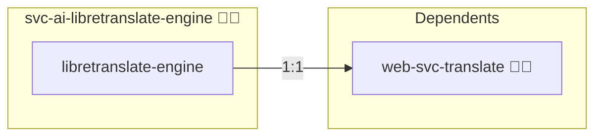

# LibreTranslate Engine

This role deploys **LibreTranslate** as a plain translation engine, without a
public vhost, reverse proxy, MCP adapter or analytics. Callers reach it over
the container network and talk to its HTTP API directly.

Use `web-svc-libretranslate` instead when the deployment needs a public
domain, single sign-on, CSP handling or the MCP adapter.

## Description

LibreTranslate is an open-source machine translation API that can be
self-hosted. This role provides it as a backend other roles and build
pipelines call directly, such as the gettext catalog translation the `i18n`
make targets drive. Everything that exists only to serve a browser is left
out, so the image carries the engine and its models and nothing else.

## Overview

- Deployment via Docker Compose or Swarm
- No domain, no reverse proxy, no browser surface
- Host-bound port for local callers, container alias for in-stack callers
- Models arrive lazily, at build time or by a post-deploy task, selected per
  deployment

## Cosmos

The diagram places LibreTranslate Engine in the Infinito.Nexus cosmos: the components it deploys (capabilities), the central services it consumes (dependencies), and its outward reach (federation and bridged external networks).



Solid `1:1` edges are fixed relationships; dashed `0..1` edges are conditional (enabled only in matching deployments); red `0..0` edges are turned off in this role. Node markers show the role's deploy modes (💻 host, 🐳 compose, 🐝 swarm); ❌ marks a service that is explicitly turned off, and ⚙️ an Ansible role dependency declared in `meta/main.yml`.

## Features

- Configurable container image and version
- Language selection via `services.libretranslate-engine.load_only`
- Direction selection via `services.libretranslate-engine.directions`, which keeps
  either every language pair or only those translating out of English
- Optional GPU execution, asserted after the deploy
- Package-cache CA installed into the build context
- Health check over the bundled interpreter

## Quick Setup

### Development

Clone, set up the workstation, and deploy LibreTranslate Engine onto the local stack:

```bash
git clone https://github.com/infinito-nexus/core.git
cd core
make onboard
make compose-deploy mode=reinstall apps=svc-ai-libretranslate-engine full_cycle=false
```

### Production

Run the published image to provision the inventory and deploy LibreTranslate Engine to a managed server (the mounted volume persists the inventory):

```bash
APP=svc-ai-libretranslate-engine
HOST="<your-server>"
DOMAIN="<your-domain>"
TLS_MODE=self_signed
SSH_PUBLIC_KEY="<your-ssh-public-key>"

docker run --rm -it \
  -v "$PWD/inventories:/etc/infinito.nexus/inventories" \
  -e APP="$APP" -e HOST="$HOST" -e DOMAIN="$DOMAIN" -e TLS_MODE="$TLS_MODE" -e SSH_PUBLIC_KEY="$SSH_PUBLIC_KEY" \
  ghcr.io/infinito-nexus/core/debian:latest bash -c '
    INVENTORY=/etc/infinito.nexus/inventories/production
    infinito administration inventory provision "$INVENTORY" \
      --inventory-file "$INVENTORY/devices.yml" \
      --host "$HOST" \
      --include "$APP" \
      --vars "{\"TLS_MODE\": \"$TLS_MODE\", \"DOMAIN_PRIMARY\": \"$DOMAIN\", \"users\": {\"administrator\": {\"authorized_keys\": [\"$SSH_PUBLIC_KEY\"]}}}" &&
    infinito administration deploy dedicated "$INVENTORY/devices.yml" \
      --password-file "$INVENTORY/.password" \
      --diff -vv'
```

## Credits

Implemented by **[Kevin Veen-Birkenbach](https://social.infinito.nexus/profile/kevinveenbirkenbach/profile)**.
Part of the [Infinito.Nexus Project](https://s.infinito.nexus/code) and maintained by [Kevin Veen-Birkenbach](https://www.veen.world).
Licensed under the [Infinito.Nexus Community License (Non-Commercial)](https://s.infinito.nexus/license).

## Configuration

`meta/services.yml` carries the knobs:

| Key | Meaning |
| --- | --- |
| `image` / `version` | upstream image, suffixed `-cuda` when `gpu` is set |
| `load_only` | ISO 639-1 codes to load; empty means every package the engine offers |
| `loading_model` | when the models arrive: `lazy`, `build` or `task` |
| `directions` | `both` or `from_source` |
| `gpu` | run on CUDA and assert the device arrived |
| `ports.local.http` | host-bound port |

### loading_model

| value | when models arrive | cost |
| --- | --- | --- |
| `lazy` (default) | the served container fetches one the first time a request needs it | no build and no deploy wait; the first request for a pair pays for it |
| `build` | baked into the image | the build downloads every selected model, 13 GB for the full set; later requests never wait |
| `task` | a post-deploy task installs them into the running container | the deploy waits instead of the build, and an image rebuild does not refetch |

Under `lazy` and `task` the models live on a node-local bind mount, so a
rebuild or a recreate finds what an earlier run already fetched. `build` is
mounted without it, because a bind is never seeded from the image and would
hide what the build baked.

## GPU

With `gpu: true` the role builds the `-cuda` image and, when the host
exposes `/dev/nvidia0`, asserts after the deploy that CTranslate2 counts at
least one CUDA device. A host without the device builds the CPU image and
skips the assertion.
