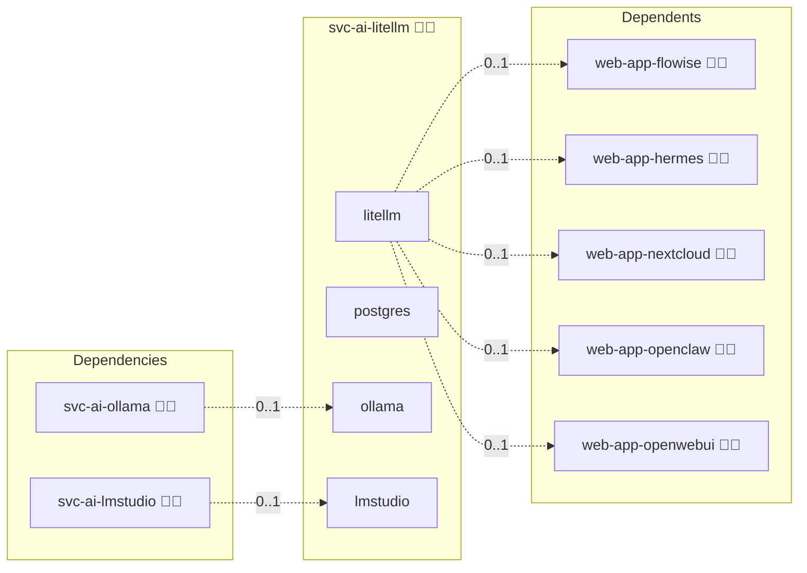

# LiteLLM Gateway

## Description

[LiteLLM](https://docs.litellm.ai/) is an LLM gateway that exposes an OpenAI-compatible HTTP API and forwards each request to a configured model backend, local or hosted. Clients authenticate with virtual API keys that the gateway issues and stores in its own database.

## Overview

This role deploys LiteLLM as a shared gateway container in Compose and Swarm deployments, backed by the central PostgreSQL service. The gateway is headless: it binds its HTTP port on the container host and claims no domain of its own, and the browser-facing surface is published separately by the LiteLLM Admin UI. It renders the model list from the interchangeable local backends available on the host, Ollama and LM Studio, and adds an OpenRouter entry when an OpenRouter API key is configured. Once the gateway is up, it provisions one virtual key per consuming application through the gateway admin API.

## Cosmos

The diagram places LiteLLM Gateway in the Infinito.Nexus cosmos: the components it deploys (capabilities), the central services it consumes (dependencies), and its outward reach (federation and bridged external networks).



Solid `1:1` edges are fixed relationships; dashed `0..1` edges are conditional (enabled only in matching deployments). Node markers show the role's deploy modes (💻 host, 🐳 compose, 🐝 swarm); ❌ marks a service that is explicitly turned off, and ⚙️ an Ansible role dependency declared in `meta/main.yml`.

## Features

- **OpenAI-compatible API:** One HTTP endpoint serves every model listed in the gateway configuration.
- **Backend routing:** Model entries are generated for Ollama and LM Studio when those services run on the host, and for OpenRouter when its API key is set.
- **Per-consumer virtual keys:** Each consuming application receives its own virtual key, created through the gateway admin API under an alias naming that application.
- **File-based model list:** The model list is mounted as a read-only config file, with database-stored model entries turned off.
- **Managed credentials:** The gateway master key and the admin UI password are generated and kept as role credentials, and the admin UI username is the platform administrator name.

## Quick Setup

### Development

Clone, set up the workstation, and deploy LiteLLM Gateway onto the local stack:

```bash
git clone https://github.com/infinito-nexus/core.git
cd core
make onboard
make compose-deploy mode=reinstall apps=svc-ai-litellm full_cycle=false
```

### Production

Run the published image to provision the inventory and deploy LiteLLM Gateway to a managed server (the mounted volume persists the inventory):

```bash
APP=svc-ai-litellm
HOST=<your-server>
TLS_MODE=self_signed
SSH_PUBLIC_KEY="<your-ssh-public-key>"

docker run --rm -it \
  -v "$PWD/inventories:/etc/infinito.nexus/inventories" \
  -e APP="$APP" -e HOST="$HOST" -e TLS_MODE="$TLS_MODE" -e SSH_PUBLIC_KEY="$SSH_PUBLIC_KEY" \
  ghcr.io/infinito-nexus/core/debian bash -c '
    INVENTORY=/etc/infinito.nexus/inventories/production
    infinito administration inventory provision "$INVENTORY" \
      --inventory-file "$INVENTORY/devices.yml" \
      --host "$HOST" \
      --include "$APP" \
      --vars "{\"TLS_MODE\": \"$TLS_MODE\", \"users\": {\"administrator\": {\"authorized_keys\": [\"$SSH_PUBLIC_KEY\"]}}}" &&
    infinito administration deploy dedicated "$INVENTORY/devices.yml" \
      --password-file "$INVENTORY/.password" \
      --diff -vv'
```

## Credits

Implemented by **[Kevin Veen-Birkenbach](https://www.veen.world)**.
Part of the [Infinito.Nexus Project](https://s.infinito.nexus/code) and maintained by [Kevin Veen-Birkenbach](https://www.veen.world).
Licensed under the [Infinito.Nexus Community License (Non-Commercial)](https://s.infinito.nexus/license).
