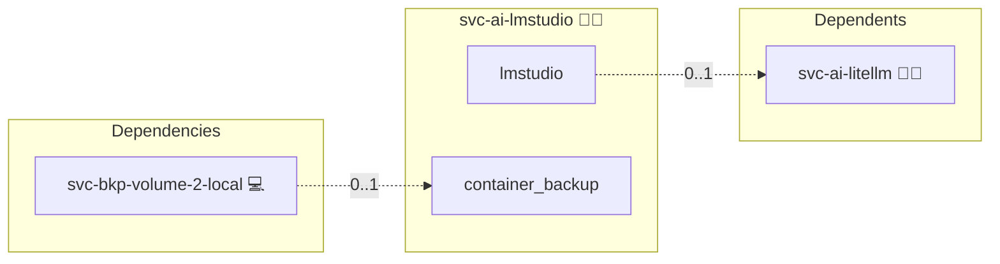

# LM Studio

## Description

[LM Studio](https://lmstudio.ai/) is a runtime for open large language models. Its headless server mode loads models from a local store and answers chat and completion requests over an OpenAI-compatible HTTP API, so prompts and model weights stay on the machine that runs them.

## Overview

This role deploys LM Studio as a headless model server in a single container, in both Docker Compose and Docker Swarm deployments. The server listens on port 1234 on the internal container network and is not published through the reverse proxy, while downloaded models and server settings persist in a dedicated volume. Deployed together with the LiteLLM Gateway, the instance is reachable through the gateway under the model alias `lmstudio/default`, next to or instead of the Ollama backend.

## Cosmos

The diagram places LM Studio in the Infinito.Nexus cosmos: the components it deploys (capabilities), the central services it consumes (dependencies), and its outward reach (federation and bridged external networks).



Solid `1:1` edges are fixed relationships; dashed `0..1` edges are conditional (enabled only in matching deployments); red `0..0` edges are turned off in this role. Node markers show the role's deploy modes (💻 host, 🐳 compose, 🐝 swarm); ❌ marks a service that is explicitly turned off, and ⚙️ an Ansible role dependency declared in `meta/main.yml`.

## Features

- **OpenAI-compatible endpoint:** The headless server answers `/v1` requests on port 1234 inside the container network.
- **CPU inference:** The role pins the CPU build of the upstream image and passes no GPU device into the container.
- **Persistent model store:** A named volume mounted at `/root/.lmstudio` keeps downloaded models and server settings across redeploys.
- **Gateway backend:** The LiteLLM Gateway routes the model alias `lmstudio/default` to this instance when both roles are deployed together, as one of the interchangeable local backends alongside Ollama.
- **Bounded resources:** The container is capped at 4 CPUs, 8 GB of memory and 2048 processes, and the role declares a minimum of 20 GB free storage.
- **Backup integration:** Backup Docker Volumes snapshots the model volume when that role is present, without stopping the container.

## Quick Setup

### Development

Clone, set up the workstation, and deploy LM Studio onto the local stack:

```bash
git clone https://github.com/infinito-nexus/core.git
cd core
make onboard
make compose-deploy mode=reinstall apps=svc-ai-lmstudio full_cycle=false
```

### Production

Run the published image to provision the inventory and deploy LM Studio to a managed server (the mounted volume persists the inventory):

```bash
APP=svc-ai-lmstudio
HOST=<your-server>
TLS_MODE=self_signed
SSH_PUBLIC_KEY="<your-ssh-public-key>"

docker run --rm -it \
  -v "$PWD/inventories:/etc/infinito.nexus/inventories" \
  -e APP="$APP" -e HOST="$HOST" -e TLS_MODE="$TLS_MODE" -e SSH_PUBLIC_KEY="$SSH_PUBLIC_KEY" \
  ghcr.io/infinito-nexus/core/debian bash -c '
    INVENTORY=/etc/infinito.nexus/inventories/production
    infinito administration inventory provision "$INVENTORY" \
      --inventory-file "$INVENTORY/devices.yml" \
      --host "$HOST" \
      --include "$APP" \
      --vars "{\"TLS_MODE\": \"$TLS_MODE\", \"users\": {\"administrator\": {\"authorized_keys\": [\"$SSH_PUBLIC_KEY\"]}}}" &&
    infinito administration deploy dedicated "$INVENTORY/devices.yml" \
      --password-file "$INVENTORY/.password" \
      --diff -vv'
```

## Credits

Implemented by **[Kevin Veen-Birkenbach](https://www.veen.world)**.
Part of the [Infinito.Nexus Project](https://s.infinito.nexus/code) and maintained by [Kevin Veen-Birkenbach](https://www.veen.world).
Licensed under the [Infinito.Nexus Community License (Non-Commercial)](https://s.infinito.nexus/license).
