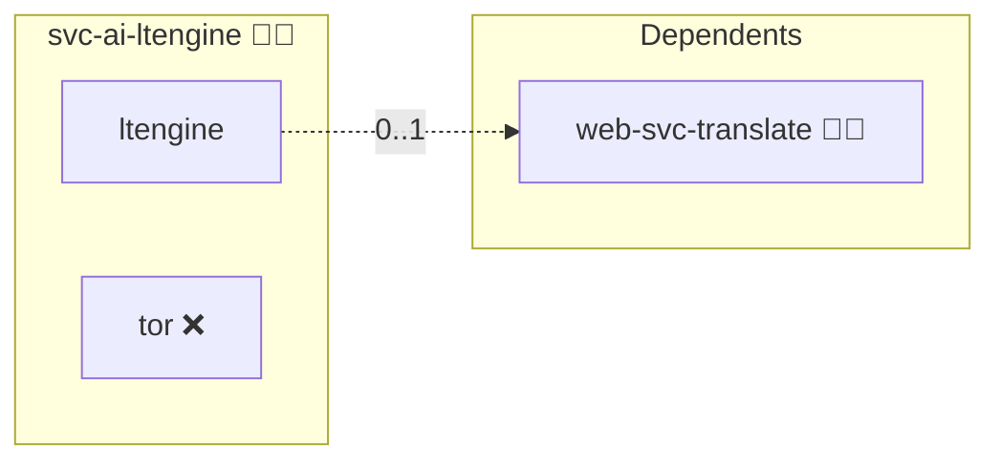

# LTEngine

## Description

[LTEngine](https://github.com/LibreTranslate/LTEngine) is a machine translation server that speaks the LibreTranslate API and answers it with a local large language model through [llama.cpp](https://github.com/ggml-org/llama.cpp). Translation quality for many pairs is higher than a lightweight transformer model reaches, at the cost of memory and latency.

## Overview

This role builds LTEngine from the upstream sources at a pinned commit and runs it as an internal engine without a browser surface. The gateway [`web-svc-translate`](../web-svc-translate/) consumes it over the shared overlay network; nothing publishes it to the internet.

## Cosmos

The diagram places LTEngine in the Infinito.Nexus cosmos: the components it deploys (capabilities), the central services it consumes (dependencies), and its outward reach (federation and bridged external networks).



Solid `1:1` edges are fixed relationships; dashed `0..1` edges are conditional (enabled only in matching deployments); red `0..0` edges are turned off in this role. Node markers show the role's deploy modes (💻 host, 🐳 compose, 🐝 swarm); ❌ marks a service that is explicitly turned off, and ⚙️ an Ansible role dependency declared in `meta/main.yml`.

## Features

- **LibreTranslate API:** `POST /translate`, `POST /detect` and `GET /languages` in the published request and response shapes.
- **Local inference:** the model runs inside the container, no request leaves the deployment.
- **Weights on a volume:** the GGUF file is downloaded once into `ltengine_models` and reused across restarts.
- **Built from source:** upstream ships no release image, so the role compiles the pinned commit against its own base images.

## Quick Setup

### Development

Clone, set up the workstation, and deploy LTEngine onto the local stack:

```bash
git clone https://github.com/infinito-nexus/core.git
cd core
make onboard
make compose-deploy mode=reinstall apps=svc-ai-ltengine full_cycle=false
```

### Production

Run the published image to provision the inventory and deploy LTEngine to a managed server (the mounted volume persists the inventory):

```bash
APP=svc-ai-ltengine
HOST="<your-server>"
DOMAIN="<your-domain>"
TLS_MODE=self_signed
SSH_PUBLIC_KEY="<your-ssh-public-key>"

docker run --rm -it \
  -v "$PWD/inventories:/etc/infinito.nexus/inventories" \
  -e APP="$APP" -e HOST="$HOST" -e DOMAIN="$DOMAIN" -e TLS_MODE="$TLS_MODE" -e SSH_PUBLIC_KEY="$SSH_PUBLIC_KEY" \
  ghcr.io/infinito-nexus/core/debian:latest bash -c '
    INVENTORY=/etc/infinito.nexus/inventories/production
    infinito administration inventory provision "$INVENTORY" \
      --inventory-file "$INVENTORY/devices.yml" \
      --host "$HOST" \
      --include "$APP" \
      --vars "{\"TLS_MODE\": \"$TLS_MODE\", \"DOMAIN_PRIMARY\": \"$DOMAIN\", \"users\": {\"administrator\": {\"authorized_keys\": [\"$SSH_PUBLIC_KEY\"]}}}" &&
    infinito administration deploy dedicated "$INVENTORY/devices.yml" \
      --password-file "$INVENTORY/.password" \
      --diff -vv'
```

## Credits

Implemented by **[Kevin Veen-Birkenbach](https://social.infinito.nexus/profile/kevinveenbirkenbach/profile)**.
Part of the [Infinito.Nexus Project](https://s.infinito.nexus/code) and maintained by [Kevin Veen-Birkenbach](https://www.veen.world).
Licensed under the [Infinito.Nexus Community License (Non-Commercial)](https://s.infinito.nexus/license).

## Further resources

- [LTEngine](https://github.com/LibreTranslate/LTEngine)
- [Supported models](https://github.com/LibreTranslate/LTEngine#models)
