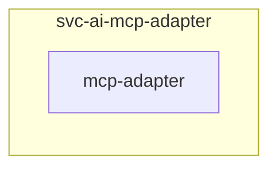

# MCP Adapter

## Description

A reusable [Model Context Protocol](https://modelcontextprotocol.io/) adapter, instantiated once per provider application. Each instance fronts exactly one upstream, holds only that upstream's least-privileged credential, and exposes only the operations its checked-in contract names.

## Overview

Several applications have a useful read API but no MCP server, and several projects ship an MCP server that authenticates *to* the application without authenticating the client calling it. Putting either behind this adapter gives the surface a bearer of its own, an exact tool allowlist, and enforced ceilings. The deployment renders one contract per instance, so the same image serves every provider without any of them sharing a credential or a trust boundary.

## Cosmos

The diagram places MCP Adapter in the Infinito.Nexus cosmos: the components it deploys (capabilities), the central services it consumes (dependencies), and its outward reach (federation and bridged external networks).



Solid `1:1` edges are fixed relationships; dashed `0..1` edges are conditional (enabled only in matching deployments); red `0..0` edges are turned off in this role. Node markers show the role's deploy modes (💻 host, 🐳 compose, 🐝 swarm); ❌ marks a service that is explicitly turned off, and ⚙️ an Ansible role dependency declared in `meta/main.yml`.

## Features

- **Client-facing authentication:** The adapter issues its own bearer. The upstream credential authenticates the adapter to the provider and says nothing about who called the adapter, which is the gap the project-owned MCP sidecars leave open.
- **Allowlist on `tools/call`:** Filtering only `tools/list` would leave every unlisted operation callable by name.
- **Read-only by default:** A non-`GET`/`HEAD` operation is refused unless `mutating_tools_enabled` is explicitly true.
- **Enforced ceilings:** Request size, response size, timeout, concurrency, page size and result count come from the contract and are applied, not merely declared.
- **Bounded ranges:** A tool whose schema declares `start`, `end` and `step` has its point count checked against `result_items` and is refused with the smallest step that fits, so the upstream never scans a range whose result the adapter would discard.
- **Fail-closed on drift:** A tool contract whose hash no longer matches its pinned `schema_sha256` refuses to start.
- **Redacted audit trail:** Every call emits provider, consumer, tool, credential subject, status, duration and correlation id, and never the arguments, the response body or the credential.

## Contract

The deployment renders one `ADAPTER_CONTRACT` JSON document per instance:

```json
{
  "provider": "web-app-checkmk",
  "upstream_url": "http://checkmk:5000",
  "auth_subject": "service_account",
  "mutating_tools_enabled": false,
  "tools": {
    "checkmk_list_hosts": {"method": "GET", "path": "/domain-types/host_config/collections/all"}
  },
  "limits": {
    "request_bytes": 65536,
    "response_bytes": 1048576,
    "timeout_seconds": 15,
    "concurrent_requests": 4,
    "page_size": 100,
    "result_items": 500,
    "stream_seconds": 300
  },
  "schema_sha256": "sha256:…"
}
```

`files/python/policy.py` validates it at startup. A contract missing a limit, carrying an empty allowlist, naming a wildcard path or lacking a pinned schema hash is refused before the process serves anything.

## Endpoints

| Path | Method | Purpose |
|---|---|---|
| `/mcp` | POST | JSON-RPC: `initialize`, `tools/list`, `tools/call` |
| `/health` | GET | liveness, names the provider it fronts |

A tools-only server never has to stream, so every response is a plain JSON body and no SSE session state exists to get wrong.

## Upstream authentication

The adapter presents `ADAPTER_UPSTREAM_KEY` to the provider in the header named by `ADAPTER_UPSTREAM_AUTH_HEADER` (default `Authorization`), formatted by `ADAPTER_UPSTREAM_AUTH_FORMAT` (default `Bearer {key}`, where `{key}` is the credential).

| Provider style | Header | Format |
|---|---|---|
| RFC 6750 bearer | `Authorization` | `Bearer {key}` |
| Pretix | `Authorization` | `Token {key}` |
| Zammad | `Authorization` | `Token token={key}` |
| Jellyfin | `X-Emby-Token` | `{key}` |

An empty `ADAPTER_UPSTREAM_KEY` sends no header at all.

## Image

Self-built and stdlib-only: the served surface is three JSON-RPC methods, and a dependency-free image has no transitive supply chain to audit per release. The container runs as a non-root user with a read-only root filesystem and all Linux capabilities dropped.

## Quick Setup

### Development

Clone, set up the workstation, and deploy MCP Adapter onto the local stack:

```bash
git clone https://github.com/infinito-nexus/core.git
cd core
make onboard
make compose-deploy mode=reinstall apps=svc-ai-mcp-adapter full_cycle=false
```

### Production

Run the published image to provision the inventory and deploy MCP Adapter to a managed server (the mounted volume persists the inventory):

```bash
APP=svc-ai-mcp-adapter
HOST=<your-server>
DOMAIN=<your-domain>
TLS_MODE=self_signed
SSH_PUBLIC_KEY="<your-ssh-public-key>"

docker run --rm -it \
  -v "$PWD/inventories:/etc/infinito.nexus/inventories" \
  -e APP="$APP" -e HOST="$HOST" -e DOMAIN="$DOMAIN" -e TLS_MODE="$TLS_MODE" -e SSH_PUBLIC_KEY="$SSH_PUBLIC_KEY" \
  ghcr.io/infinito-nexus/core/debian bash -c '
    INVENTORY=/etc/infinito.nexus/inventories/production
    infinito administration inventory provision "$INVENTORY" \
      --inventory-file "$INVENTORY/devices.yml" \
      --host "$HOST" \
      --include "$APP" \
      --vars "{\"TLS_MODE\": \"$TLS_MODE\", \"DOMAIN_PRIMARY\": \"$DOMAIN\", \"users\": {\"administrator\": {\"authorized_keys\": [\"$SSH_PUBLIC_KEY\"]}}}" &&
    infinito administration deploy dedicated "$INVENTORY/devices.yml" \
      --password-file "$INVENTORY/.password" \
      --diff -vv'
```

## Further resources

- [Model Context Protocol](https://modelcontextprotocol.io/)
- [MCP service block](../../docs/contributing/design/role/services/mcp.md)
- [MCP user delegation audit](../../docs/contributing/design/role/services/mcp/delegation.md)

## Credits

Implemented by **[Kevin Veen-Birkenbach](https://www.veen.world)**.
Part of the [Infinito.Nexus Project](https://s.infinito.nexus/code) and maintained by [Kevin Veen-Birkenbach](https://www.veen.world).
Licensed under the [Infinito.Nexus Community License (Non-Commercial)](https://s.infinito.nexus/license).
