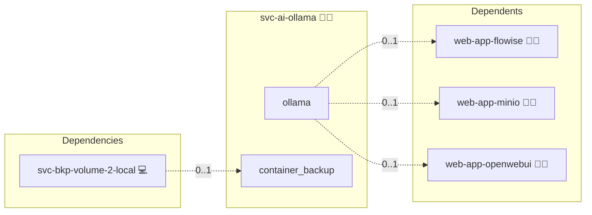

# Ollama

## Description

[Ollama](https://ollama.com) is a local model server that runs open LLMs on your hardware and exposes a simple HTTP API. Prompts and data stay on your machines, making it the backbone for privacy-first AI.

## Overview

This role deploys Ollama as a local model server using Docker Compose. It integrates with Open WebUI for chat and Flowise for AI workflow automation, and configures local model caching so models can be reused across sessions or run fully offline.

## Cosmos

The diagram places Ollama in the Infinito.Nexus cosmos: the components it deploys (capabilities), the central services it consumes (dependencies), and its outward reach (federation and bridged external networks).



Solid `1:1` edges are fixed relationships; dashed `0..1` edges are conditional (enabled only in matching deployments). Node markers show the role's deploy modes (💻 host, 🐳 compose, 🐝 swarm); ❌ marks a service that is explicitly turned off.

## Features

- **Local model execution:** Run popular open models (chat, code, embeddings) on your own hardware.
- **HTTP API:** Simple, predictable HTTP API for application developers.
- **Local caching:** Models are cached locally to avoid repeated downloads.
- **Integrations:** Works seamlessly with Open WebUI and Flowise.
- **Offline support:** Fully offline-capable for air-gapped deployments.

## Quick Setup

### Development

Clone, set up the workstation, and deploy Ollama onto the local stack:

```bash
git clone https://github.com/infinito-nexus/core.git
cd core
make onboard
make compose-deploy mode=reinstall apps=svc-ai-ollama full_cycle=false
```

### Production

Run the published image to provision the inventory and deploy Ollama to a managed server (the mounted volume persists the inventory between the two runs):

```bash
docker run --rm -it \
  -v "$PWD/inventories:/etc/infinito.nexus/inventories" \
  ghcr.io/infinito-nexus/core/debian \
  infinito administration inventory provision /etc/infinito.nexus/inventories/prod \
  --inventory-file /etc/infinito.nexus/inventories/prod/devices.yml \
  --host <your-server> \
  --vars-file inventories/<env>/default.yml \
  --include 'svc-ai-ollama'

docker run --rm -it \
  -v "$PWD/inventories:/etc/infinito.nexus/inventories" \
  ghcr.io/infinito-nexus/core/debian \
  infinito administration deploy dedicated /etc/infinito.nexus/inventories/prod/devices.yml \
  --password-file /etc/infinito.nexus/inventories/prod/.password \
  --id svc-ai-ollama \
  --diff \
  -vv
```

## Further resources

- [Ollama](https://ollama.com)
- [Ollama Model Library](https://ollama.com/library)

## Credits

Implemented by **[Kevin Veen-Birkenbach](https://www.veen.world)**.
Part of the [Infinito.Nexus Project](https://s.infinito.nexus/code) and maintained by [Kevin Veen-Birkenbach](https://www.veen.world).
Licensed under the [Infinito.Nexus Community License (Non-Commercial)](https://s.infinito.nexus/license).
