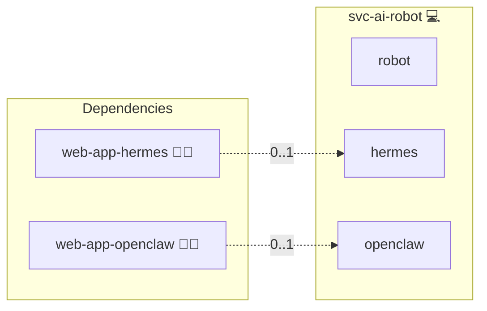

# Robot Platform

## Description

[Hermes Agent](https://hermes-agent.nousresearch.com/) is an autonomous agent runtime. This role runs it in embodied mode: on a machine that is dedicated to it, with direct access to the hardware of that machine. Where the container roles put a kernel boundary between the agent and its host, here the boundary is the device itself.

> **⚠️ Hardware safety is yours, not the platform's.** An agent driving motors, actuators or relays can cause physical harm. Emergency stop, current and motion limits, and fail-safe wiring are out of this platform's scope and are not enforced by this role. Provide them yourself before granting access to anything that moves.

## Overview

Adding this role to a device switches the agent from isolated to embodied. The agent then receives exactly the devices listed in `ROBOT_DEVICE_ALLOWLIST` and nothing else, and the kernel-isolating runtime is dropped, because a microVM between the agent and hardware it is supposed to drive defeats the purpose. The trust boundary moves outward to the machine, but only as far as the listed devices: the container is not privileged, so a device that is not on the list is not reachable, and a lint keeps it that way.

Because that grant is irreversible once the container starts, the checks run inside the agent role before it deploys, not afterwards in this role: the agent is a shared service, so the service loader brings it up in the constructor stage while `svc-ai` roles only run at the following step. A check placed here would sit behind the deployment it exists to prevent.

Which agent embodies the device follows from the deployment itself: whichever of Hermes Agent and OpenClaw is present is the one that runs, and Hermes Agent wins if both are. A device with neither aborts instead of deploying an empty robot.

## Blast radius

The agent can do anything the granted devices allow. A GPIO or I2C grant means it can drive whatever is wired to those pins; a video grant means it can watch the room; a serial grant means it can talk to whatever sits on the bus. The allowlist is the entire boundary, which is why an empty one is refused and why the device must be dedicated, single-tenant and network-segmented.

## Cosmos

The diagram places Robot Platform in the Infinito.Nexus cosmos: the components it deploys (capabilities), the central services it consumes (dependencies), and its outward reach (federation and bridged external networks).



Solid `1:1` edges are fixed relationships; dashed `0..1` edges are conditional (enabled only in matching deployments); red `0..0` edges are turned off in this role. Node markers show the role's deploy modes (💻 host, 🐳 compose, 🐝 swarm); ❌ marks a service that is explicitly turned off, and ⚙️ an Ansible role dependency declared in `meta/main.yml`.

## Features

- **Declared hardware access:** Every device the agent may drive is listed by the operator and bound into the container; an empty list is refused rather than silently treated as deny-all-but-deployable.
- **Dedicated-device guard:** Deployment aborts when another application shares the host or when the device is part of a multi-node swarm, naming the offender.
- **Checks precede the grant:** The admission checks run inside the agent role before it deploys, so a refusal prevents the embodied container rather than following it.
- **Selectable agent:** Whichever agent role the deployment carries embodies the device, Hermes Agent taking precedence; the matrix deploys both so neither path rots.
- **Agent reuse:** The embodied deployment is the agent role itself, so image, configuration and model routing stay identical to the isolated deployments.

## Quick Setup

### Development

Clone, set up the workstation, and deploy Robot Platform onto the local stack:

```bash
git clone https://github.com/infinito-nexus/core.git
cd core
make onboard
make compose-deploy mode=reinstall apps=svc-ai-robot full_cycle=false
```

### Production

Install Robot Platform directly onto the target machine: clone the repository, install the OS prerequisites and the repository toolchain, then deploy against localhost over a local connection (no SSH, no container):

```bash
git clone https://github.com/infinito-nexus/core.git
cd core
bash scripts/install/package.sh
make install
source scripts/meta/env/load.sh

APP=svc-ai-robot
DOMAIN=<your-domain>
TLS_MODE=self_signed
SSH_PUBLIC_KEY="<your-ssh-public-key>"
INVENTORY=inventories/production
infinito administration inventory provision "$INVENTORY" \
  --inventory-file "$INVENTORY/devices.yml" \
  --host localhost \
  --include "$APP" \
  --vars "{\"TLS_MODE\": \"$TLS_MODE\", \"DOMAIN_PRIMARY\": \"$DOMAIN\", \"users\": {\"administrator\": {\"authorized_keys\": [\"$SSH_PUBLIC_KEY\"]}}}"
infinito administration deploy dedicated "$INVENTORY/devices.yml" \
  --password-file "$INVENTORY/.password" \
  --diff -vv
```

## Credits

Implemented by **[Kevin Veen-Birkenbach](https://www.veen.world)**.
Part of the [Infinito.Nexus Project](https://s.infinito.nexus/code) and maintained by [Kevin Veen-Birkenbach](https://www.veen.world).
Licensed under the [Infinito.Nexus Community License (Non-Commercial)](https://s.infinito.nexus/license).
