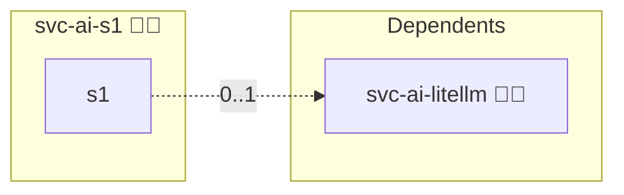

# System One

## Description

Self-hosted System One decision service. It answers typed questions (`choice`, `score`, `noul`) over a non-autoregressive encoder instead of generating text, on the `POST /v1/systemone` contract.

## Overview

[`svc-ai-litellm`](../svc-ai-litellm/) publishes one routing alias. When this service is deployed, the gateway's pre-call hook asks it which of the eligible models should answer, passing the prompt as the state and the surviving aliases as the options of a single `choice` question. `services.litellm.router.strategy` follows `services.s1.enabled`, so deploying this role is what switches the gateway from a weighted score to a System One decision.

`services.s1.flavor` selects which implementation answers that contract. `laya` runs [Laya](https://huggingface.co/convaiinnovations/laya), the default; `torch` and `onnx` run [jeff](https://github.com/logan-markewich/jeff) over a GLiFormer encoder, which is what the role carried before. Neither upstream ships a container image, so the role builds one and bakes the checkpoints into it. Baking keeps the deploy free of a download at container start, which is the failure mode a sibling role's model pull already hit.

## Cosmos

The diagram places System One in the Infinito.Nexus cosmos: the components it deploys (capabilities), the central services it consumes (dependencies), and its outward reach (federation and bridged external networks).



Solid `1:1` edges are fixed relationships; dashed `0..1` edges are conditional (enabled only in matching deployments); red `0..0` edges are turned off in this role. Node markers show the role's deploy modes (💻 host, 🐳 compose, 🐝 swarm); ❌ marks a service that is explicitly turned off, and ⚙️ an Ansible role dependency declared in `meta/main.yml`.

## Features

- **One contract, three flavors.** `laya` serves multilingual checkpoints and preloads them at start; `torch` runs the GLiFormer checkpoint as published; `onnx` exports an int8 graph at build time and needs roughly a quarter of the memory. Every flavor answers the same `POST /v1/systemone`, so the gateway does not know which one it asked.
- **Typed answers, no generation.** A routing decision costs one forward pass over an encoder, not a completion.
- **Build-time model.** The checkpoint is a cached image layer rather than a download the first container start waits for.
- **Bearer authentication.** An empty key list would disable auth, so the role always renders one.

## Settings

| Setting | Meaning |
| --- | --- |
| `services.s1.flavor` | `laya`, `torch` or `onnx`; the role refuses anything else |
| `services.s1.model_alias` | alias the API accepts in a request's `model` field |
| `services.s1.request_timeout` | seconds the gateway waits for a routing answer |
| `services.s1.laya.checkpoints` | checkpoints the `laya` flavor bakes, each a `name` the server preloads and the `repo` it comes from |
| `services.s1.jeff.ref` | upstream commit the `torch` and `onnx` flavors build from; upstream publishes no tags |
| `services.s1.jeff.model_repo` | Hugging Face repository those flavors download at build time |
| `secrets.credentials.api_key` | bearer key the server accepts |

## Quick Setup

### Development

Clone, set up the workstation, and deploy System One onto the local stack:

```bash
git clone https://github.com/infinito-nexus/core.git
cd core
make onboard
make compose-deploy mode=reinstall apps=svc-ai-s1 full_cycle=false
```

### Production

Run the published image to provision the inventory and deploy System One to a managed server (the mounted volume persists the inventory):

```bash
APP=svc-ai-s1
HOST=<your-server>
DOMAIN=<your-domain>
TLS_MODE=self_signed
SSH_PUBLIC_KEY="<your-ssh-public-key>"

docker run --rm -it \
  -v "$PWD/inventories:/etc/infinito.nexus/inventories" \
  -e APP="$APP" -e HOST="$HOST" -e DOMAIN="$DOMAIN" -e TLS_MODE="$TLS_MODE" -e SSH_PUBLIC_KEY="$SSH_PUBLIC_KEY" \
  ghcr.io/infinito-nexus/core/debian bash -c '
    INVENTORY=/etc/infinito.nexus/inventories/production
    infinito administration inventory provision "$INVENTORY" \
      --inventory-file "$INVENTORY/devices.yml" \
      --host "$HOST" \
      --include "$APP" \
      --vars "{\"TLS_MODE\": \"$TLS_MODE\", \"DOMAIN_PRIMARY\": \"$DOMAIN\", \"users\": {\"administrator\": {\"authorized_keys\": [\"$SSH_PUBLIC_KEY\"]}}}" &&
    infinito administration deploy dedicated "$INVENTORY/devices.yml" \
      --password-file "$INVENTORY/.password" \
      --diff -vv'
```

## Limits that shape the caller

Both flavors cap the state and the option count and answer HTTP 422 above them, so the gateway truncates the prompt to `services.litellm.router.state_chars` before asking. The `laya` flavor shares a fixed token budget across the options of one question, so accuracy falls off well before its own cap; the deployments here put a handful of model aliases to it, far below where that matters.

## Credits

Implemented by **[Kevin Veen-Birkenbach](https://www.veen.world)**.
Part of the [Infinito.Nexus Project](https://s.infinito.nexus/code) and maintained by [Kevin Veen-Birkenbach](https://www.veen.world).
Licensed under the [Infinito.Nexus Community License (Non-Commercial)](https://s.infinito.nexus/license).
