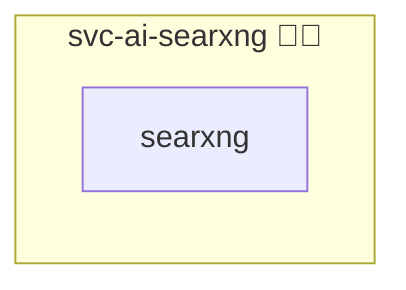

# Searxng

## Description

[SearXNG](https://docs.searxng.org/) is a metasearch engine. It forwards a query to other search engines and returns the merged result without an account and without a tracking profile.

## Overview

The role renders `settings.yml` from the deployment's own secret key and mounts it read-only. `formats` carries `json` next to `html`, because a machine consumer gets HTTP 403 on the JSON endpoint otherwise, and the rate limiter is off since the only clients are platform services on the container network.

A consumer reaches it as `http://searxng:8080/search?q=<query>` once it declares `searxng` in its own `meta/services.yml` with `enabled` and `shared` set. `web-app-openwebui` ships that flag and sends `WEB_SEARCH_ENGINE=searxng` with it.

## Cosmos

The diagram places Searxng in the Infinito.Nexus cosmos: the components it deploys (capabilities), the central services it consumes (dependencies), and its outward reach (federation and bridged external networks).



Solid `1:1` edges are fixed relationships; dashed `0..1` edges are conditional (enabled only in matching deployments); red `0..0` edges are turned off in this role. Node markers show the role's deploy modes (💻 host, 🐳 compose, 🐝 swarm); ❌ marks a service that is explicitly turned off, and ⚙️ an Ansible role dependency declared in `meta/main.yml`.

## Features

- **JSON enabled:** the settings add the `json` output format, which upstream ships disabled and which every API client needs.
- **Internal only:** no published port, no proxy entry; the limiter is off because the clients are platform services.
- **Named state:** the configuration and cache directories the image declares as volumes are pinned to named volumes, so no anonymous volume is left behind.

## Quick Setup

### Development

Clone, set up the workstation, and deploy Searxng onto the local stack:

```bash
git clone https://github.com/infinito-nexus/core.git
cd core
make onboard
make compose-deploy mode=reinstall apps=svc-ai-searxng full_cycle=false
```

### Production

Run the published image to provision the inventory and deploy Searxng to a managed server (the mounted volume persists the inventory):

```bash
APP=svc-ai-searxng
HOST=<your-server>
DOMAIN=<your-domain>
TLS_MODE=self_signed
SSH_PUBLIC_KEY="<your-ssh-public-key>"

docker run --rm -it \
  -v "$PWD/inventories:/etc/infinito.nexus/inventories" \
  -e APP="$APP" -e HOST="$HOST" -e DOMAIN="$DOMAIN" -e TLS_MODE="$TLS_MODE" -e SSH_PUBLIC_KEY="$SSH_PUBLIC_KEY" \
  ghcr.io/infinito-nexus/core/debian bash -c '
    INVENTORY=/etc/infinito.nexus/inventories/production
    infinito administration inventory provision "$INVENTORY" \
      --inventory-file "$INVENTORY/devices.yml" \
      --host "$HOST" \
      --include "$APP" \
      --vars "{\"TLS_MODE\": \"$TLS_MODE\", \"DOMAIN_PRIMARY\": \"$DOMAIN\", \"users\": {\"administrator\": {\"authorized_keys\": [\"$SSH_PUBLIC_KEY\"]}}}" &&
    infinito administration deploy dedicated "$INVENTORY/devices.yml" \
      --password-file "$INVENTORY/.password" \
      --diff -vv'
```

## Credits

Implemented by **[Kevin Veen-Birkenbach](https://www.veen.world)**.
Part of the [Infinito.Nexus Project](https://s.infinito.nexus/code) and maintained by [Kevin Veen-Birkenbach](https://www.veen.world).
Licensed under the [Infinito.Nexus Community License (Non-Commercial)](https://s.infinito.nexus/license).
