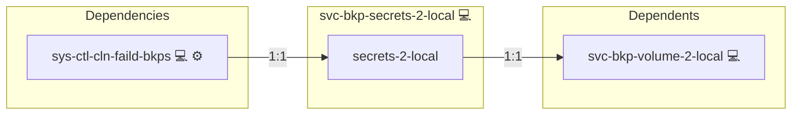
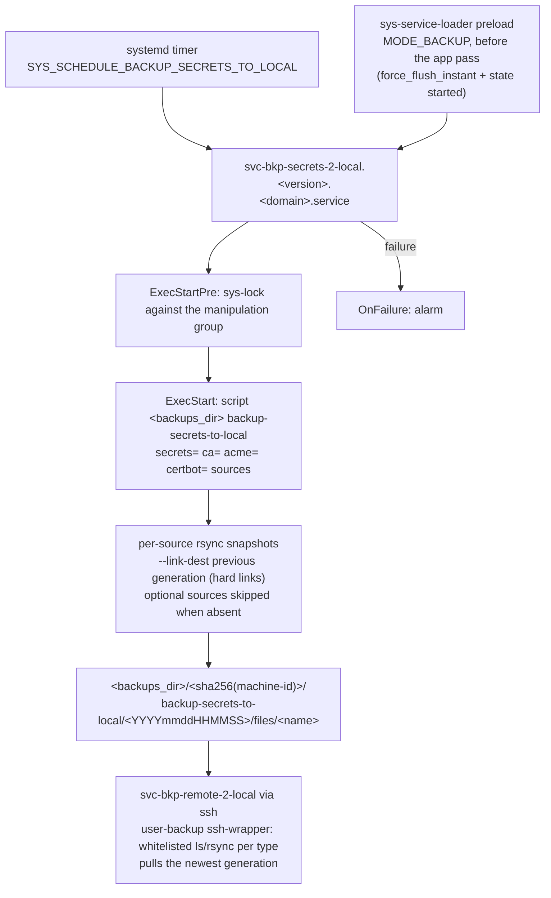

# Backup Host Secrets

## Description

A scheduled, deduplicating backup of the host's generated secret
material to the local backup directory: the Infinito.Nexus secrets and
tokens, the self-signed root CA, the Let's Encrypt account + certificates,
the ACME DNS credentials, and the node identity (ssh host keys +
machine-id). None of this lives in a docker volume, the NFS export or
the operator inventory, so it is the gap the volume/nfs backup roles do
not cover.

## Overview

The role installs a systemd unit that snapshots each configured source
directory into `<backups>/<machine-hash>/backup-secrets-to-local/<generation>/files/<name>`,
hard-linked against the previous generation. Optional sources are
skipped when absent (the CA in Let's Encrypt mode, ACME/certbot in
self-signed mode). The generation joins the same backup tree the pull
and device roles consume, so it flows to the backup host and the
encrypted device automatically.

## Cosmos

The diagram places Backup Host Secrets in the Infinito.Nexus cosmos: the components it deploys (capabilities), the central services it consumes (dependencies), and its outward reach (federation and bridged external networks).



Solid `1:1` edges are fixed relationships; dashed `0..1` edges are conditional (enabled only in matching deployments). Node markers show the role's deploy modes (💻 host, 🐳 compose, 🐝 swarm); ❌ marks a service that is explicitly turned off, and ⚙️ an Ansible role dependency declared in `meta/main.yml`.

## Schema



## Features

- **Complete secret coverage:** secrets + tokens, self-signed CA,
  Let's Encrypt tree, ACME DNS credentials, ssh host keys and
  machine-id in one differential generation.
- **Differential snapshots:** rsync `--link-dest` per subtree against
  the previous generation deduplicates unchanged files.
- **Mode-aware:** absent optional sources are skipped, not failed, so
  the same role works in both self-signed and Let's Encrypt setups.
- **Chain-native:** the generation lands in the standard backup tree,
  so `svc-bkp-remote-2-local` pulls it and `svc-bkp-local-2-device`
  mirrors it onto the encrypted device without extra wiring.

## Quick Setup

### Development

Clone, set up the workstation, and deploy Backup Host Secrets onto the local stack:

```bash
git clone https://github.com/infinito-nexus/core.git
cd core
make onboard
make compose-deploy mode=reinstall apps=svc-bkp-secrets-2-local full_cycle=false
```

### Production

Run the published image to provision the inventory and deploy Backup Host Secrets to a managed server (the mounted volume persists the inventory):

```bash
APP=svc-bkp-secrets-2-local
HOST=<your-server>

docker run --rm -it \
  -v "$PWD/inventories:/etc/infinito.nexus/inventories" \
  -e APP="$APP" -e HOST="$HOST" \
  ghcr.io/infinito-nexus/core/debian bash -c '
    INVENTORY=/etc/infinito.nexus/inventories/prod
    infinito administration inventory provision "$INVENTORY" \
      --inventory-file "$INVENTORY/devices.yml" \
      --host "$HOST" \
      --include "$APP" &&
    infinito administration deploy dedicated "$INVENTORY/devices.yml" \
      --password-file "$INVENTORY/.password" \
      --diff -vv'
```

## Recover

Run `files/recover.py` on the target host:

```
recover.py <backups>/<machine-hash>/backup-secrets-to-local/<generation>/files [--restore-node-identity]
```

The script first starts the role's deployed backup unit (a fresh
differential generation of the live material), then mirrors each present
subtree back to its fixed system path (`rsync -a --delete`): `secrets`
into `/var/lib/infinito/secrets`, `ca` into `/etc/<domain>/ca`, `acme`
into `/etc/letsencrypt`, `certbot` into `/etc/certbot`. `--no-safety-backup`
skips the pre-recover unit run. The `node` subtree (ssh host keys +
machine-id) is restored only with `--restore-node-identity`, because
overwriting the running machine-id / ssh host keys changes the host's
identity mid-flight — do it on a fresh host after total loss.

## Credits

Implemented by **[Kevin Veen-Birkenbach](https://www.veen.world)**.
Part of the [Infinito.Nexus Project](https://s.infinito.nexus/code) and maintained by [Kevin Veen-Birkenbach](https://www.veen.world).
Licensed under the [Infinito.Nexus Community License (Non-Commercial)](https://s.infinito.nexus/license).
