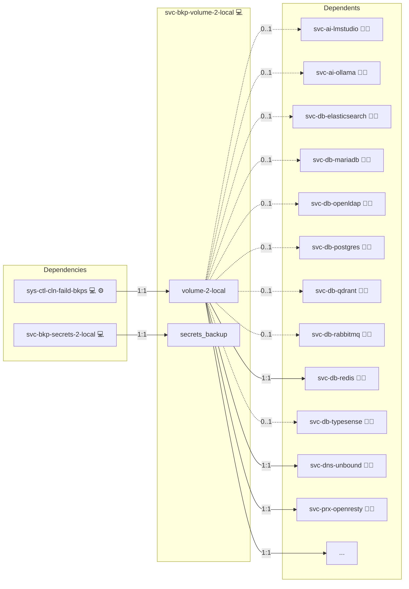
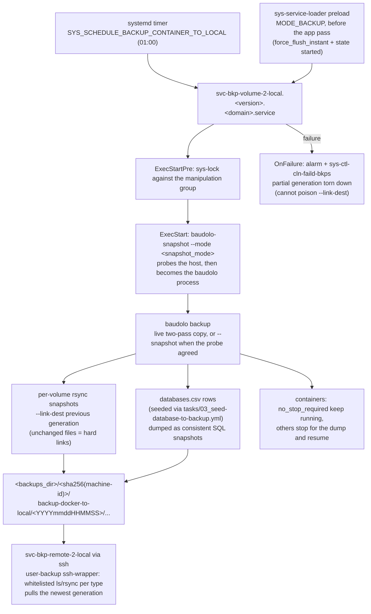
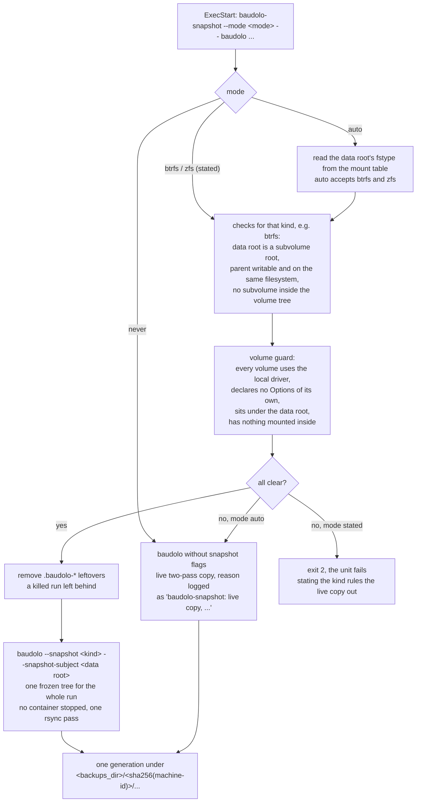
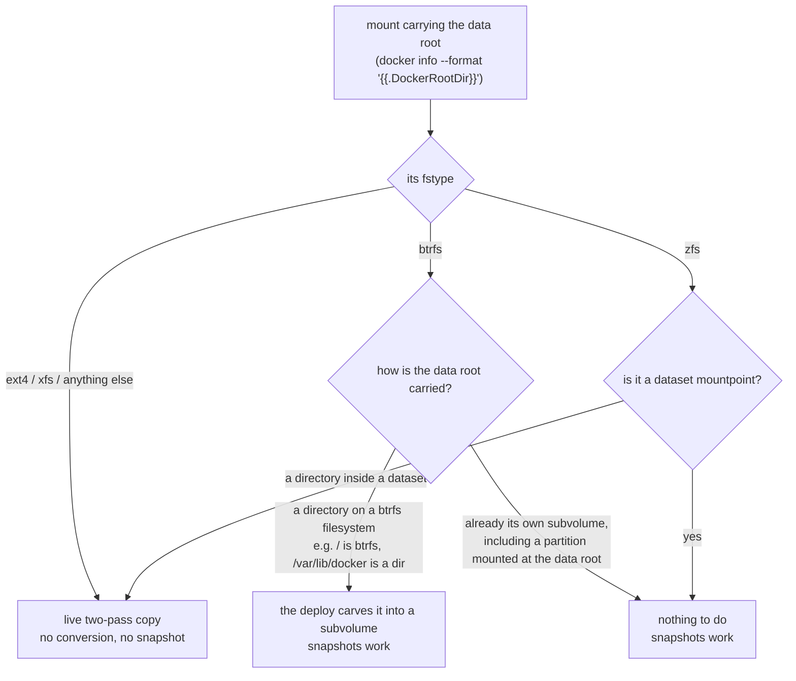

# Backup Docker Volumes

## Description

A scheduled, deduplicating backup of every Docker container's data on this host to a local backup directory.
File payloads are captured with rsync hard-link snapshots; databases register themselves into a central seed file so each backup run also dumps a consistent SQL snapshot via [baudolo](https://github.com/kevinveenbirkenbach/backup-docker-to-local).

## Overview

This role installs the `baudolo` CLI, lays out the on-host backup tree, deploys the systemd service that drives the periodic run, and wires the cleanup-of-failed-backups dependency so partial snapshots are not retained.
Database seeding for individual apps is contributed by the consumer roles via `tasks/03_seed-database-to-backup.yml`, which they include conditionally once `svc-bkp-volume-2-local` is in `group_names`.

## Cosmos

The diagram places Backup Docker Volumes in the Infinito.Nexus cosmos: the components it deploys (capabilities), the central services it consumes (dependencies), and its outward reach (federation and bridged external networks).



Solid `1:1` edges are fixed relationships; dashed `0..1` edges are conditional (enabled only in matching deployments). Node markers show the role's deploy modes (💻 host, 🐳 compose, 🐝 swarm); ❌ marks a service that is explicitly turned off, and ⚙️ an Ansible role dependency declared in `meta/main.yml`.

## Schema



## Features

- **Per-container snapshots:** rsync `--link-dest` snapshots deduplicate unchanged files across runs.
- **Database-aware:** consumer apps seed their connection metadata into a central `databases.csv`, so the same run can dump SQL state alongside the file payload.
- **Live-aware:** containers tagged `no_stop_required` stay running during the dump; others stop briefly and resume.
- **Snapshot-aware:** on a btrfs data root the whole run is captured from one atomic filesystem snapshot with no container stopped; the host is probed before every run and falls back to the live copy when a snapshot would not be faithful.
- **Systemd-driven:** a generated unit fires on the configured schedule (`SYS_SCHEDULE_BACKUP_CONTAINER_TO_LOCAL`), serialised against other backup/cleanup/repair groups by `sys-lock`.
- **Self-cleaning:** failed backup attempts are torn down by `sys-ctl-cln-faild-bkps` so a broken run cannot poison the next.

## Filesystem snapshots

`services.volume-2-local.snapshot_mode` (declared in `meta/services.yml`, overridable
per host from the inventory) decides whether a run uses baudolo's `--snapshot` mode.
**Quote the value** — YAML reads a bare `off`/`no`/`false` as a boolean, and the
deploy asserts on the result.

| value | behaviour |
| --- | --- |
| `auto` | **default.** Probe the host before every run and snapshot when btrfs or zfs is proven safe; otherwise log the reason and copy live. |
| `never` | Never snapshot; always use the live two-pass copy. |
| `btrfs` / `zfs` | State the kind instead of reading it from the mount table, and abort the run when the host cannot deliver it. Every check below still runs — only the "which filesystem is this" lookup is skipped. |



### What a host's partition layout decides

Only the mount that carries the docker data root matters. A btrfs partition
elsewhere on the host changes nothing — the probe never looks at it.



A dedicated disk mounted straight onto `/var/lib/docker` needs no special layout:
baudolo carves its snapshot **inside** the subject, as `<data root>/.baudolo-<tag>`,
so source and destination are always on the same filesystem. Placing it beside the
subject would fail with `EXDEV` exactly on that layout, since the parent directory
then belongs to a different filesystem.

The probe runs inside the systemd unit, not at deploy time, because the set of
docker volumes changes between deploys and a volume added afterwards would be an
empty stub inside a snapshot. It refuses unless all of the following hold for the
docker data root reported by `docker info`:

- it is a btrfs subvolume root or a zfs dataset mountpoint;
- the matching `btrfs` or `zfs` command is installed and the run is root;
- for btrfs, the data root is writable and no directory in the volume tree is a
  subvolume of its own;
- for zfs, `snapdir` is not `disabled`, no child dataset sits inside the volume
  tree, and the process runs in the init mount namespace;
- every docker volume uses the `local` driver, declares **no** `Options` of its
  own, sits under the data root, and has nothing mounted inside it.

The `Options` rule is what keeps a swarm host with NFS-backed volumes on the live
copy (see [NFS-backed volumes](#nfs-backed-volumes)): such a volume is a separate
filesystem, so a snapshot of the data root would capture it as an empty directory
and the backup would succeed while holding nothing. The declaration is checked
rather than the mount table, because docker mounts those volumes lazily and
unmounts them when the last container stops.

`auto` is advisory and never fails the unit — every refusal is logged to the
journal as `baudolo-snapshot: live copy, <reason>`, so check there if a host you
expect to snapshot does not. A stated `btrfs`/`zfs` fails the unit instead, which
is the point of stating it. Before every snapshot the launcher also removes the
`.baudolo-*` leftovers a killed run leaves inside the data root.

To make snapshots possible on a host that refuses them, give the docker data root
its own btrfs subvolume and install `btrfs-progs`.

## Quick Setup

### Development

Clone, set up the workstation, and deploy Backup Docker Volumes onto the local stack:

```bash
git clone https://github.com/infinito-nexus/core.git
cd core
make onboard
make compose-deploy mode=reinstall apps=svc-bkp-volume-2-local full_cycle=false
```

### Production

Install Backup Docker Volumes directly onto the target machine: clone the repository, install the OS prerequisites and the repository toolchain, then deploy against localhost over a local connection (no SSH, no container):

```bash
git clone https://github.com/infinito-nexus/core.git
cd core
bash scripts/install/package.sh
make install
source scripts/meta/env/load.sh

APP=svc-bkp-volume-2-local
TLS_MODE=self_signed
SSH_PUBLIC_KEY="<your-ssh-public-key>"
INVENTORY=inventories/production
infinito administration inventory provision "$INVENTORY" \
  --inventory-file "$INVENTORY/devices.yml" \
  --host localhost \
  --include "$APP" \
  --vars "{\"TLS_MODE\": \"$TLS_MODE\", \"users\": {\"administrator\": {\"authorized_keys\": [\"$SSH_PUBLIC_KEY\"]}}}"
infinito administration deploy dedicated "$INVENTORY/devices.yml" \
  --password-file "$INVENTORY/.password" \
  --diff -vv
```

## NFS-backed volumes

When a host runs Docker Swarm with NFSv4-backed shared volumes
(see [svc-storage-nfs-server](../svc-storage-nfs-server/) and
[svc-storage-nfs-client](../svc-storage-nfs-client/)), the backup
machinery operates transparently against the existing
`/var/lib/docker/volumes/<vol>/_data` mount paths: the Linux
kernel routes the I/O over NFS instead of the local
filesystem. The rsync hard-link semantics still apply, but with
two caveats:

- **Source-of-truth.** Take backups from the NFS server itself, or
  from a single designated swarm node, NOT from every node. The
  same data is visible from every node, but running multiple
  parallel backups against the same export wastes I/O and may
  race on the `link-dest` target.
- **Snapshot consistency.** For DB data directories that stay
  local-only,
  the existing `databases.csv` SQL-dump path is unchanged. For
  NFS-backed file volumes (e.g. MediaWiki `images/`), point the
  backup directly at the NFS export base on the server side for
  faster snapshots than going through the docker volume.

Restore procedure for an NFS-backed volume: stop the consuming
stack on the swarm manager (`docker stack rm <stack>`), rsync
the desired backup snapshot into the NFS export subdirectory,
re-deploy the stack. The docker volume's NFS driver remounts on
re-deploy and picks up the restored state.

## Recover

Run `files/recover.py` on the backed-up host to restore a volume's files:

```
recover.py <backups>/<machine-hash>/backup-docker-to-local/<generation>/<volume>/files <volume>
```

1. Stop the consuming project (`docker compose down` / `docker stack rm <stack>`).
2. Run the script; it first starts the role's deployed backup unit (a fresh differential baudolo generation of every volume and database), resolves the volume's mountpoint and mirrors the snapshot into it (`rsync -a --delete`). `--no-safety-backup` skips the unit run when the target holds nothing worth saving.
3. Restore databases with `baudolo-restore postgres|mariadb ...`, then start the project again; on swarm, NFS-backed volumes are restored via `svc-bkp-nfs-2-local`'s `recover.py` instead (see below).

## Credits

Implemented by **[Kevin Veen-Birkenbach](https://www.veen.world)**.
Part of the [Infinito.Nexus Project](https://s.infinito.nexus/code) and maintained by [Kevin Veen-Birkenbach](https://www.veen.world).
Licensed under the [Infinito.Nexus Community License (Non-Commercial)](https://s.infinito.nexus/license).
