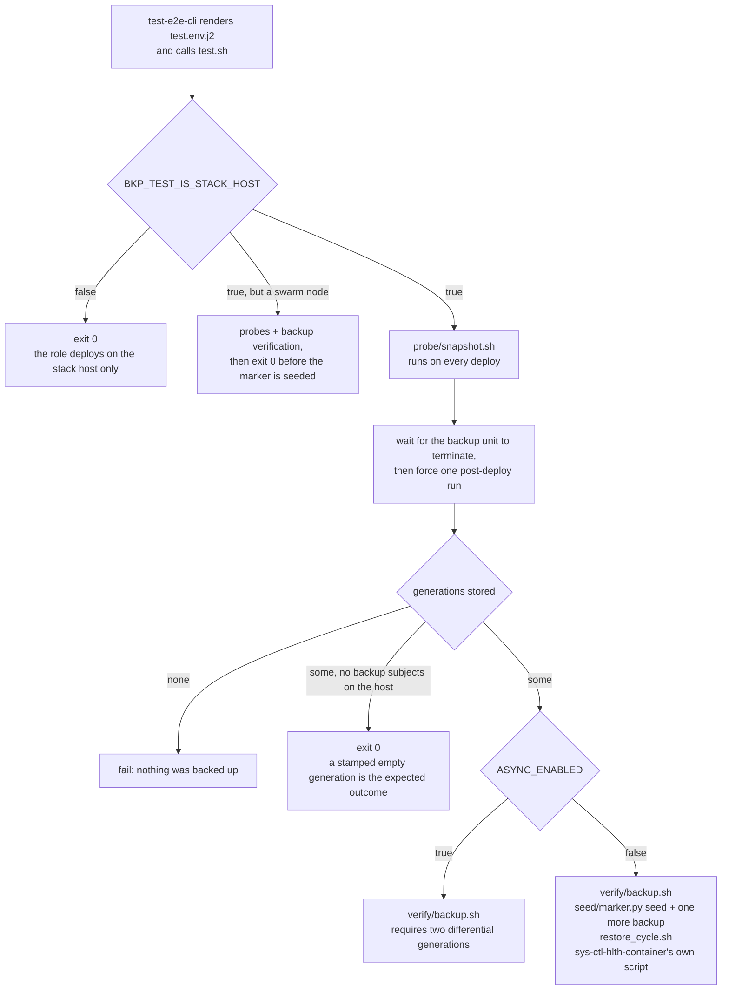
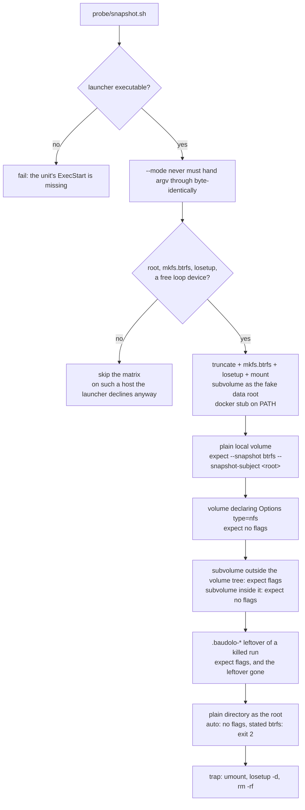
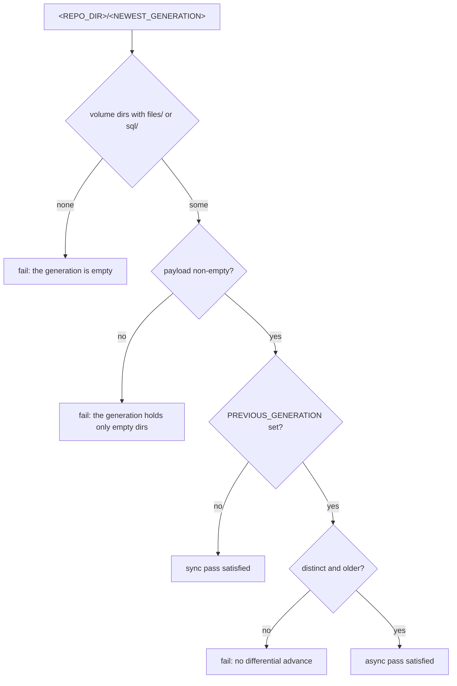
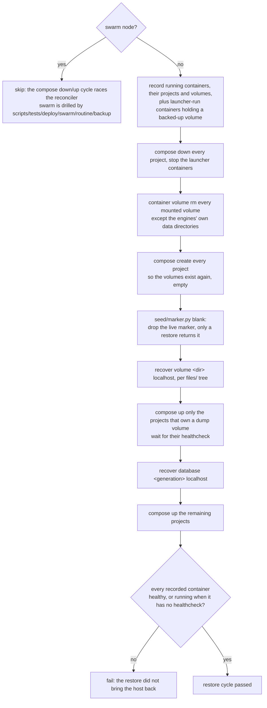

# Deploy drills for `svc-bkp-volume-2-local`

These scripts run **on the deployed host**, not on the controller. `test-e2e-cli`
renders `templates/test.env.j2` into the environment and calls `test.sh`, which
orchestrates the rest. They use `systemctl`, the `container` wrapper and
`/etc/machine-id`, so they only make sense where the role actually deployed.

## Orchestration

`test.sh` runs two different passes, selected by `ASYNC_ENABLED`. The snapshot
probe runs first in both, because it depends on nothing the backup produces.



The sync pass is the whole disaster drill against the host this role deploys on
(`BKP_TEST_IS_STACK_HOST`), in one sequence: back up, seed the marker, back up
again so the tested generation carries it, take every project down, restore
through the recover chain, require the marker and every recorded container
back, and finally let the host's own container health service judge.

That last step is deliberately the deployed
[`sys-ctl-hlth-container` script](../../../sys-ctl-hlth-container/files/shell/script.sh)
rather than a check of the drill's own: it is what watches the host in
production, it knows swarm services, and it dumps 200 log lines per sick
container. It is invoked as a script, not as its systemd unit — the unit's
`OnFailure` starts the soft-repair service, and a drill that repairs what it
found has stopped measuring. It cannot replace the drill's own wait either: a
container that never came back is in no `container ps` filter, so only the
recorded-set check sees it.

## `probe/snapshot.sh`

Drives `baudolo-snapshot`, the launcher that decides per run whether baudolo may
capture the volumes from a filesystem snapshot instead of copying the live tree.
That decision reads mountinfo, inode numbers and `btrfs subvolume list`, so it
cannot be answered by a unit test — it needs a filesystem that really exists.

The probe therefore builds a **throwaway** btrfs on a loop device and puts a stub
on `PATH` in place of the docker daemon. The host's real data root is never
touched, and no state survives the run.



Each case pins one half of the contract: a snapshot is taken **only** where it
would be faithful, and where it would not be, `auto` degrades silently to the
live copy while a stated kind fails the run loudly.

### Running it from the host

It is a standalone script — no environment, no backup generation, no other drill.
It resolves `baudolo-snapshot` from `PATH`, so it tests whatever the role
deployed:

```bash
sudo bash roles/svc-bkp-volume-2-local/files/test/probe/snapshot.sh
```

Without `sudo` the first two assertions still run and the matrix reports `SKIP`,
which is the honest outcome: an unprivileged process cannot create a loop device,
and the launcher refuses to snapshot as non-root anyway.

To exercise it on a host without btrfs tooling, install `baudolo-snapshot` into
a throwaway privileged container and run it there. Note that a container's
`/dev` carries no `/dev/loopN` nodes, so `losetup --find` finds nothing and the
matrix reports `SKIP` unless they are created first (`mknod /dev/loop0 b 7 0`,
…) or the host's `/dev` is bind-mounted in.

## `verify/backup.sh`

Requires the newest generation to hold real payload — a volume counts when it has
a `files/` tree or a non-empty `sql` dump. In the async pass it additionally
requires `PREVIOUS_GENERATION` to be a distinct, older generation, which is what
proves the differential `--link-dest` chain advanced.



## `restore_cycle.sh`

The destructive drill, sync pass only. It proves the backup is restorable rather
than merely present — the property a backup exists for.

The drill owns the **lifecycle** and nothing else. Every restore is
`python3 -m cli.administration.recover`, the same command an operator runs after
a real loss, so the drill exercises that tool instead of a second implementation
of it.



Which project holds a dump is read from the containers themselves, before the
host goes down: each running container's mounts are recorded, and a dump's volume
names its owner. No image is matched, and the database's engine is resolved by
the chain from the repository's service definitions.

**Every mounted volume is discarded**, not only the backed-up ones. A volume
declared `backup: false` claims to be disposable; a drill that spares it never
tests the claim. If its service cannot rebuild it, the health gate goes red —
that is the finding, not a false alarm. The single exception is the data
directory of an engine whose dump is about to be replayed: it carries the
database and its role, which the deploy creates and the container does not, so
wiping it would leave `baudolo-restore --empty -d <db>` with nothing to connect
to and the drill would fail at itself instead of at a defect.

**A generation holding a cluster dump fails the drill.** `baudolo-restore` has
no subcommand that replays one, so that database cannot be proven restorable —
the honest verdict is a red, not a silent skip.

**Not every subject is a compose project.** Discourse is built by its own
`./launcher rebuild` ([handlers/stack_host.yml](../../../web-app-discourse/handlers/stack_host.yml))
and runs as a plain container with no compose label. The drill treats such a
container as a subject whenever it mounts a volume this generation backed up:
it is stopped with everything else and started again at the end, and its return
is asserted like any other. Left running it would take an `rsync --delete` into
its live data directory, and the chain's consumer check — which reads compose
labels — would not see it, so the dump replay would race it exactly like the
zammad failure this whole change came from.

**An engine inside its consumer's project** — matrix with its own postgres, for
instance — is started service by service rather than as a whole project, because
bringing the project up would start the consumer and the chain refuses to replay
while one runs. The discriminator is the dump's volume name against its project
name: equal for the central engines (`postgres` in project `postgres`),
different for a per-app one (`matrix_database` in project `matrix`).

**The app volumes are really discarded** (`down --volumes`) and re-created empty
by `compose create`, so what comes back can only come from the backup. The
database projects go down without `--volumes` on purpose: their data directory
carries the database itself, which the deploy creates and the container does
not, so a wiped datadir would leave `baudolo-restore --empty -d <db>` with
nothing to connect to. The database half loses no proof by it — the pre-clean
drops the schema including the marker table, and only the dump brings it back.

The order is a precondition, not a preference. `baudolo-restore --empty`
pre-cleans the schema in one psql session and replays in the next; a booting
consumer recreates it in between and the dump's own `CREATE TABLE` fails — which
is how zammad turned this drill red with `relation "ar_internal_metadata"
already exists`. The chain refuses the replay while a consumer runs, so a drill
that got the order wrong would fail loudly instead of flaking.

Bringing the apps up **after** the replay also means their healthcheck now runs
against the restored dump, rather than against the data the drill is about to
overwrite.

## `seed/marker.py`

Health proves the host boots, not that it holds its data. Before the backup the
drill seeds one token into every subject — a `.dr-drill-marker` file at the root
of each backed-up volume, a row in `infinito_dr_marker` in each database with a
dump — then forces one more backup run so the generation under test carries it,
and afterwards requires every one of them back. A volume silently dropped or a
dump replayed empty fails here; before, both passed.

Verification runs right after the replay and before the apps start, so "the
restore brought it back" stays separate from "an app overwrote it", and a
`clean` pass then takes the token out of the live payload again.

The marker file carries the same name as the swarm drill's
(`scripts/tests/deploy/swarm/routine/backup/base.sh`) — one name for one
concept. The implementations stay apart on purpose: the swarm drill follows a
single token across five hops on four machines from the controller, which has
nothing in common with marking every subject of one host beyond the three lines
that write a file and read it back.
