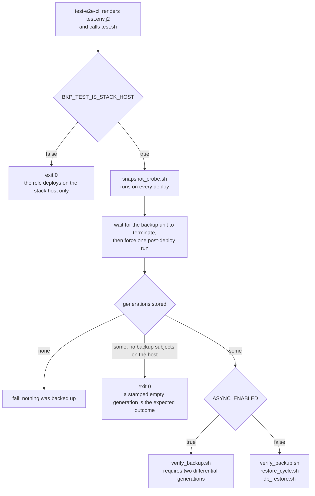
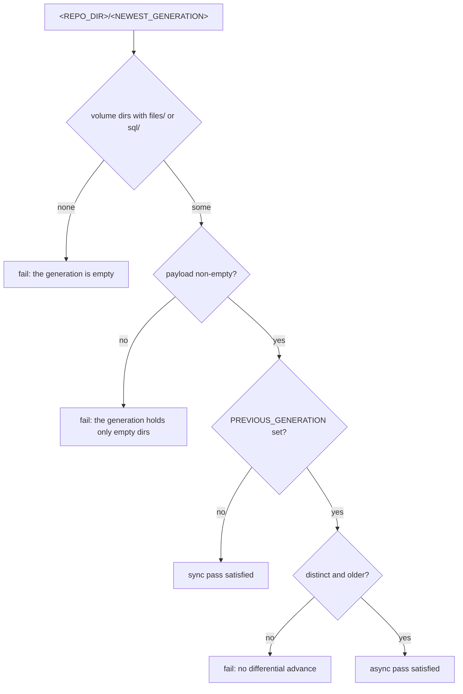
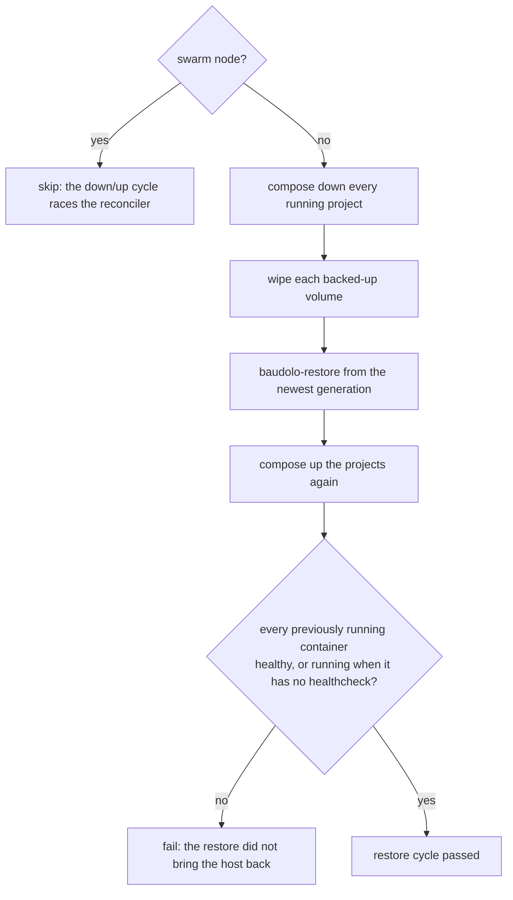
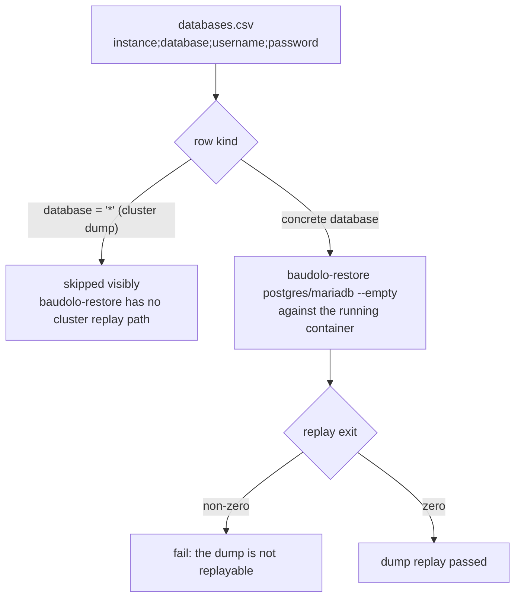

# Deploy drills for `svc-bkp-volume-2-local`

These scripts run **on the deployed host**, not on the controller. `test-e2e-cli`
renders `templates/test.env.j2` into the environment and calls `test.sh`, which
orchestrates the rest. They use `systemctl`, the `container` wrapper and
`/etc/machine-id`, so they only make sense where the role actually deployed.

## Orchestration

`test.sh` runs two different passes, selected by `ASYNC_ENABLED`. The snapshot
probe runs first in both, because it depends on nothing the backup produces.



## `snapshot_probe.sh`

Drives `baudolo-snapshot`, the launcher that decides per run whether baudolo may
capture the volumes from a filesystem snapshot instead of copying the live tree.
That decision reads mountinfo, inode numbers and `btrfs subvolume list`, so it
cannot be answered by a unit test — it needs a filesystem that really exists.

The probe therefore builds a **throwaway** btrfs on a loop device and puts a stub
on `PATH` in place of the docker daemon. The host's real data root is never
touched, and no state survives the run.


Each case pins one half of the contract: a snapshot is taken **only** where it
would be faithful, and where it would not be, `auto` degrades silently to the
live copy while a stated kind fails the run loudly.

### Running it from the host

It is a standalone script — no environment, no backup generation, no other drill.
It resolves `baudolo-snapshot` from `PATH`, so it tests whatever the role
deployed:

```bash
sudo bash roles/svc-bkp-volume-2-local/files/test/snapshot_probe.sh
```

Without `sudo` the first two assertions still run and the matrix reports `SKIP`,
which is the honest outcome: an unprivileged process cannot create a loop device,
and the launcher refuses to snapshot as non-root anyway.

To exercise it on a host without btrfs tooling, install `baudolo-snapshot` into
a throwaway privileged container and run it there. Note that a container's
`/dev` carries no `/dev/loopN` nodes, so `losetup --find` finds nothing and the
matrix reports `SKIP` unless they are created first (`mknod /dev/loop0 b 7 0`,
…) or the host's `/dev` is bind-mounted in.

## `verify_backup.sh`

Requires the newest generation to hold real payload — a volume counts when it has
a `files/` tree or a non-empty `sql` dump. In the async pass it additionally
requires `PREVIOUS_GENERATION` to be a distinct, older generation, which is what
proves the differential `--link-dest` chain advanced.



## `restore_cycle.sh`

The destructive drill, sync pass only. It proves the backup is restorable rather
than merely present — the property a backup exists for.



## `db_restore.sh`

Replays the text dumps into the databases the previous step restarted, using the
credentials from `databases.csv`.


