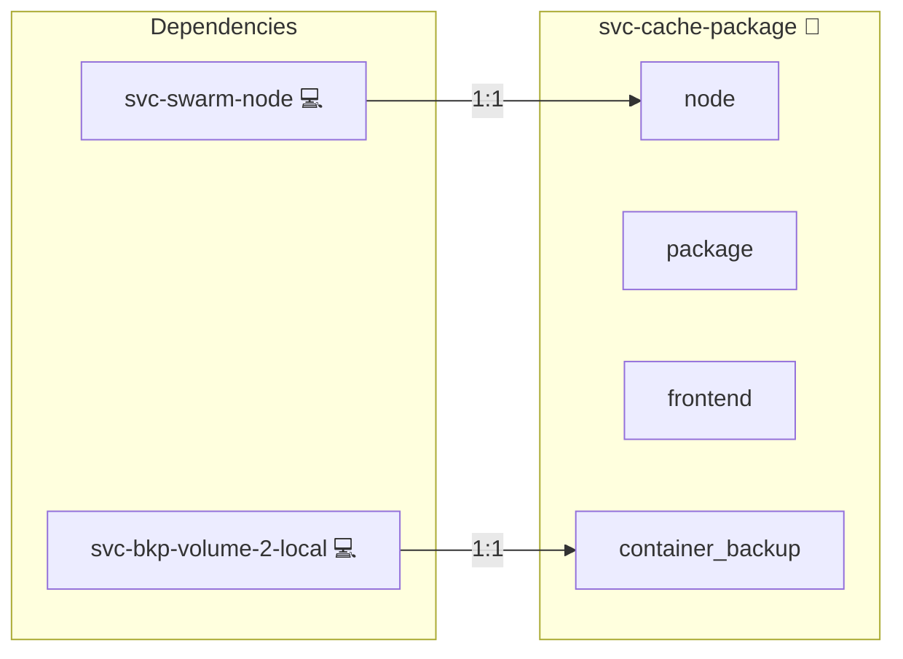

# Package cache

## Description

[Nexus Repository](https://www.sonatype.com/products/sonatype-nexus-repository) is a repository manager that proxies package registries and serves an artefact it has already fetched from local disk. [nginx](https://nginx.org/) sits in front of it and answers for the upstream hostnames themselves, so a package manager keeps the URLs it was built with and still reads through the proxy.

## Overview

The role deploys two containers on its inventory group's host: the repository manager and its nginx frontend. Both run in compose mode on the manager, like the sibling [svc-registry-cache](../svc-registry-cache/README.md).

[upstreams.conf.j2](./templates/upstreams.conf.j2) is rendered to the host and mounted into the frontend as `conf.d/upstreams.conf`. Its content comes from the `cache:` sections of the roles' `meta/networks.yml`, so no hostname, repository or upstream URL is written in this role.

`compose.cache-consumer.yml.j2`, `apt.list.j2`, `npmrc.j2` and `pip.conf.j2` under `templates/`, and the shell scripts under `files/`, belong to the development compose stack, which drives them through [render.py](../../utils/cache/render.py) and [compose.py](../../cli/administration/deploy/development/compose.py). The Ansible deployment reads none of them.

## Cosmos

The diagram places Package cache in the Infinito.Nexus cosmos: the components it deploys (capabilities), the central services it consumes (dependencies), and its outward reach (federation and bridged external networks).



Solid `1:1` edges are fixed relationships; dashed `0..1` edges are conditional (enabled only in matching deployments); red `0..0` edges are turned off in this role. Node markers show the role's deploy modes (💻 host, 🐳 compose, 🐝 swarm); ❌ marks a service that is explicitly turned off, and ⚙️ an Ansible role dependency declared in `meta/main.yml`.

## Features

- **Declaration driven:** Every proxied repository and every answered hostname comes from the `cache:` declarations, collected by the `cache_upstreams` and `cache_repos` lookups. A new upstream is added by declaring it there.
- **Mirror failover:** A repository that declares a mirror is served through a guarded location: a 5xx from its primary remote re-runs the same path against the sibling repository, while a 404 is passed straight back.
- **Persistent store:** Proxied artefacts live in a named volume, so a redeploy reuses what earlier runs already pulled.
- **Backup free:** The volume is backup-disabled and its backup consumer stays off; every artefact in it is re-fetchable from its upstream.

## Quick Setup

### Development

Clone, set up the workstation, and deploy Package cache onto the local stack:

```bash
git clone https://github.com/infinito-nexus/core.git
cd core
make onboard
make compose-deploy mode=reinstall apps=svc-cache-package full_cycle=false
```

### Production

Run the published image to provision the inventory and deploy Package cache to a managed server (the mounted volume persists the inventory):

```bash
APP=svc-cache-package
HOST="<your-server>"
DOMAIN="<your-domain>"
TLS_MODE=self_signed
SSH_PUBLIC_KEY="<your-ssh-public-key>"

docker run --rm -it \
  -v "$PWD/inventories:/etc/infinito.nexus/inventories" \
  -e APP="$APP" -e HOST="$HOST" -e DOMAIN="$DOMAIN" -e TLS_MODE="$TLS_MODE" -e SSH_PUBLIC_KEY="$SSH_PUBLIC_KEY" \
  ghcr.io/infinito-nexus/core/debian:latest bash -c '
    INVENTORY=/etc/infinito.nexus/inventories/production
    infinito administration inventory provision "$INVENTORY" \
      --inventory-file "$INVENTORY/devices.yml" \
      --host "$HOST" \
      --include "$APP" \
      --vars "{\"TLS_MODE\": \"$TLS_MODE\", \"DOMAIN_PRIMARY\": \"$DOMAIN\", \"users\": {\"administrator\": {\"authorized_keys\": [\"$SSH_PUBLIC_KEY\"]}}}" &&
    infinito administration deploy dedicated "$INVENTORY/devices.yml" \
      --password-file "$INVENTORY/.password" \
      --diff -vv'
```

## Credits

Implemented by **[Kevin Veen-Birkenbach](https://social.infinito.nexus/profile/kevinveenbirkenbach/profile)**.
Part of the [Infinito.Nexus Project](https://s.infinito.nexus/code) and maintained by [Kevin Veen-Birkenbach](https://www.veen.world).
Licensed under the [Infinito.Nexus Community License (Non-Commercial)](https://s.infinito.nexus/license).
