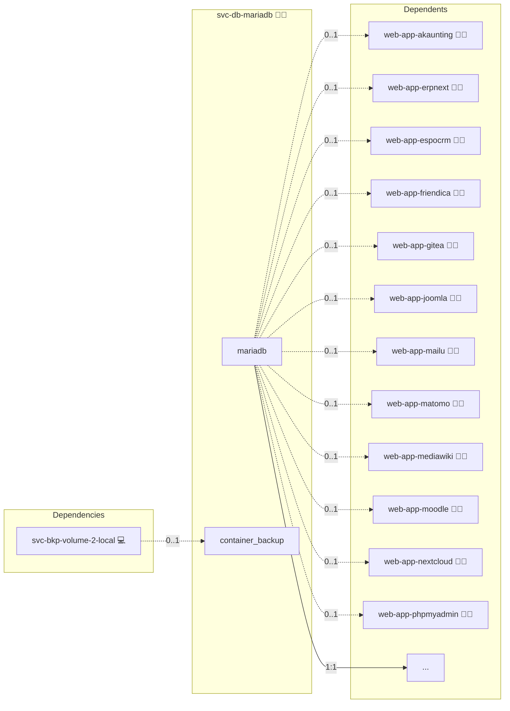

# MariaDB

## Description

The Docker MariaDB Role offers an easy and efficient way to deploy a MariaDB server inside a Docker container. Manage your data securely and effectively, making it ideal for production or local development.

## Overview

This Ansible role facilitates the deployment of a MariaDB server using Docker. It is designed to ensure ease of installation and configuration, with the flexibility to adapt to different environments.

## Cosmos

The diagram places MariaDB in the Infinito.Nexus cosmos: the components it deploys (capabilities), the central services it consumes (dependencies), and its outward reach (federation and bridged external networks).



Solid `1:1` edges are fixed relationships; dashed `0..1` edges are conditional (enabled only in matching deployments). Node markers show the role's deploy modes (💻 host, 🐳 compose, 🐝 swarm); ❌ marks a service that is explicitly turned off, and ⚙️ an Ansible role dependency declared in `meta/main.yml`.

## Features

- **Dockerized MariaDB**: Leverages Docker for MariaDB deployment, ensuring consistency across different environments.
- **Customizable Settings**: Allows customization of the MariaDB instance through various Ansible variables.
- **Network Configuration**: Includes setup of a dedicated Docker network for MariaDB.
- **Idempotent Design**: Ensures that repeat runs of the playbook do not result in unwanted changes.
- **Security Focused**: Implements best practices for securing the MariaDB root password.

## Quick Setup

### Development

Clone, set up the workstation, and deploy MariaDB onto the local stack:

```bash
git clone https://github.com/infinito-nexus/core.git
cd core
make onboard
make compose-deploy mode=reinstall apps=svc-db-mariadb full_cycle=false
```

### Production

Run the published image to provision the inventory and deploy MariaDB to a managed server (the mounted volume persists the inventory):

```bash
APP=svc-db-mariadb
HOST=<your-server>
TLS_MODE=self_signed
SSH_PUBLIC_KEY="<your-ssh-public-key>"

docker run --rm -it \
  -v "$PWD/inventories:/etc/infinito.nexus/inventories" \
  -e APP="$APP" -e HOST="$HOST" -e TLS_MODE="$TLS_MODE" -e SSH_PUBLIC_KEY="$SSH_PUBLIC_KEY" \
  ghcr.io/infinito-nexus/core/debian bash -c '
    INVENTORY=/etc/infinito.nexus/inventories/production
    infinito administration inventory provision "$INVENTORY" \
      --inventory-file "$INVENTORY/devices.yml" \
      --host "$HOST" \
      --include "$APP" \
      --vars "{\"TLS_MODE\": \"$TLS_MODE\", \"users\": {\"administrator\": {\"authorized_keys\": [\"$SSH_PUBLIC_KEY\"]}}}" &&
    infinito administration deploy dedicated "$INVENTORY/devices.yml" \
      --password-file "$INVENTORY/.password" \
      --diff -vv'
```

## Prerequisites

Before using this role, ensure you have the following:

- Ansible installed on the control machine.
- Docker installed on the target host(s).
- Access to the target host(s) via SSH.

## Configuration

Configure the role by setting the required variables. These can be set in the playbook or in a separate variable file:

- `central_mariadb_root_password`: The root password for the MariaDB server.
- `database_name`: The name of the initial database to create.
- `database_username`: The username for the database user.
- `database_password`: The password for the database user.

## Contributing

Contributions to this project are welcome. Please submit issues and pull requests with your suggestions.

## Further Resources

- [Reset Password for MariaDB/MySQL in Docker](https://wolfgang.gassler.org/reset-password-mariadb-mysql-docker/)

## Credits

Implemented by **[Kevin Veen-Birkenbach](https://www.veen.world)**.
Part of the [Infinito.Nexus Project](https://s.infinito.nexus/code) and maintained by [Kevin Veen-Birkenbach](https://www.veen.world).
Licensed under the [Infinito.Nexus Community License (Non-Commercial)](https://s.infinito.nexus/license).
