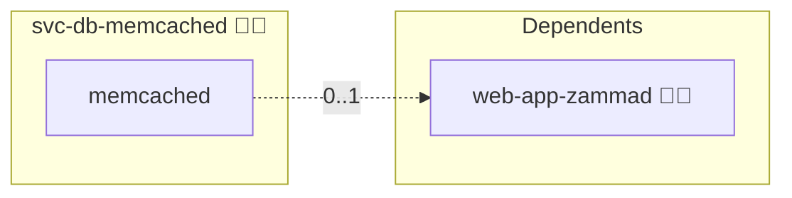

# Memcached

## Description

This Ansible role runs Memcached as a central engine dependency, mirroring the central-database pattern (`svc-db-postgres`). A consumer reaches it either embedded (a sidecar inside its own stack, `shared: false`) or from this central pinned stack (`shared: true`).

## Overview

Built as one of the central engine roles described in `docs/architecture/central-engines.md`, this role:

- Deploys a standalone Memcached stack pinned to the swarm manager (`placement: manager`).
- Waits until the container is running and the engine answers the `version` handshake.
- Ships an embedded sidecar snippet (`templates/service.yml.j2`) for the `shared: false` opt-out path.

## Cosmos

The diagram places Memcached in the Infinito.Nexus cosmos: the components it deploys (capabilities), the central services it consumes (dependencies), and its outward reach (federation and bridged external networks).



Solid `1:1` edges are fixed relationships; dashed `0..1` edges are conditional (enabled only in matching deployments). Node markers show the role's deploy modes (💻 host, 🐳 compose, 🐝 swarm); ❌ marks a service that is explicitly turned off, and ⚙️ an Ansible role dependency declared in `meta/main.yml`.

## Per-consumer isolation

Memcached has no native auth or namespace. Consumer isolation is key-prefix only and is resolved by `lookup('engine', 'memcached', consumer_id)` at consume time, so `tasks/02_init.yml` is a no-op.

## Features

- **Automated provisioning:** Configured by Ansible without manual steps.
- **Central or embedded:** Same `shared` toggle as the central databases.
- **Readiness gating:** Bootstrap blocks until the engine accepts connections.

## Quick Setup

### Development

Clone, set up the workstation, and deploy Memcached onto the local stack:

```bash
git clone https://github.com/infinito-nexus/core.git
cd core
make onboard
make compose-deploy mode=reinstall apps=svc-db-memcached full_cycle=false
```

### Production

Run the published image to provision the inventory and deploy Memcached to a managed server (the mounted volume persists the inventory):

```bash
APP=svc-db-memcached
HOST=<your-server>
TLS_MODE=self_signed
SSH_PUBLIC_KEY="<your-ssh-public-key>"

docker run --rm -it \
  -v "$PWD/inventories:/etc/infinito.nexus/inventories" \
  -e APP="$APP" -e HOST="$HOST" -e TLS_MODE="$TLS_MODE" -e SSH_PUBLIC_KEY="$SSH_PUBLIC_KEY" \
  ghcr.io/infinito-nexus/core/debian bash -c '
    INVENTORY=/etc/infinito.nexus/inventories/production
    infinito administration inventory provision "$INVENTORY" \
      --inventory-file "$INVENTORY/devices.yml" \
      --host "$HOST" \
      --include "$APP" \
      --vars "{\"TLS_MODE\": \"$TLS_MODE\", \"users\": {\"administrator\": {\"authorized_keys\": [\"$SSH_PUBLIC_KEY\"]}}}" &&
    infinito administration deploy dedicated "$INVENTORY/devices.yml" \
      --password-file "$INVENTORY/.password" \
      --diff -vv'
```

## Further Resources

- [Official Memcached Docker image on Docker Hub](https://hub.docker.com/_/memcached)
- [Memcached official documentation](https://memcached.org/)
- [Docker Compose reference](https://docs.docker.com/compose/compose-file/)

## Credits

Implemented by **[Kevin Veen-Birkenbach](https://www.veen.world)**.
Part of the [Infinito.Nexus Project](https://s.infinito.nexus/code) and maintained by [Kevin Veen-Birkenbach](https://www.veen.world).
Licensed under the [Infinito.Nexus Community License (Non-Commercial)](https://s.infinito.nexus/license).
