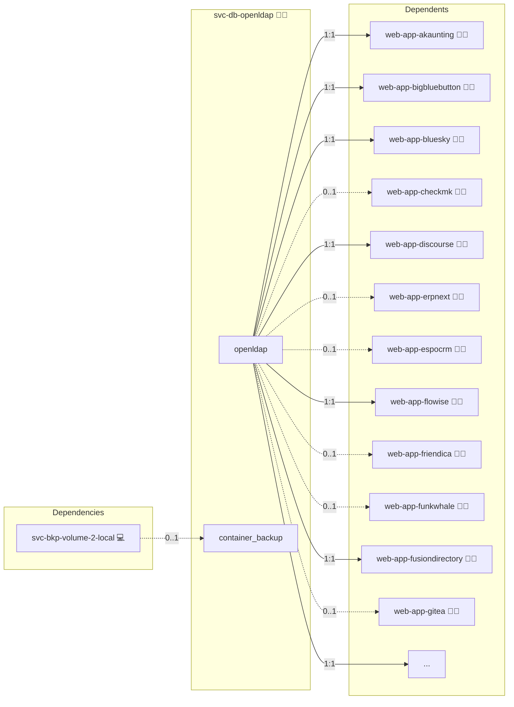

# OpenLDAP

## Description

Unleash the potential of centralized identity management with [OpenLDAP](https://www.openldap.org/). This powerful directory service provides a robust platform for managing users, groups, and organizational units while ensuring secure, scalable, and efficient authentication and authorization.

## Overview

Deploy OpenLDAP in a Docker environment with support for TLS-secured communication via an NGINX stream proxy. OpenLDAP offers advanced directory management capabilities, including flexible schema definitions, dynamic configuration overlays, and comprehensive query support with LDAP search utilities.

## Cosmos

The diagram places OpenLDAP in the Infinito.Nexus cosmos: the components it deploys (capabilities), the central services it consumes (dependencies), and its outward reach (federation and bridged external networks).



Solid `1:1` edges are fixed relationships; dashed `0..1` edges are conditional (enabled only in matching deployments). Node markers show the role's deploy modes (💻 host, 🐳 compose, 🐝 swarm); ❌ marks a service that is explicitly turned off, and ⚙️ an Ansible role dependency declared in `meta/main.yml`.

## Features

- **Centralized Identity Management:** Maintain a unified repository for all users and groups with robust organizational structures.
- **Flexible Schema Support:** Customize and extend directory schemas to meet diverse organizational requirements.
- **Secure Communications:** Enable TLS encryption for data in transit when accessed through an NGINX reverse proxy.
- **Dynamic Configuration:** Leverage runtime configuration overlays to adjust directory settings without downtime.
- **Comprehensive Query Capabilities:** Utilize LDAP search tools to efficiently query and manage directory data.
- **High Performance and Scalability:** Designed to handle large-scale deployments with rapid lookup and authentication response times.

## Quick Setup

### Development

Clone, set up the workstation, and deploy OpenLDAP onto the local stack:

```bash
git clone https://github.com/infinito-nexus/core.git
cd core
make onboard
make compose-deploy mode=reinstall apps=svc-db-openldap full_cycle=false
```

### Production

Run the published image to provision the inventory and deploy OpenLDAP to a managed server (the mounted volume persists the inventory):

```bash
APP=svc-db-openldap
HOST=<your-server>
TLS_MODE=self_signed
SSH_PUBLIC_KEY="<your-ssh-public-key>"

docker run --rm -it \
  -v "$PWD/inventories:/etc/infinito.nexus/inventories" \
  -e APP="$APP" -e HOST="$HOST" -e TLS_MODE="$TLS_MODE" -e SSH_PUBLIC_KEY="$SSH_PUBLIC_KEY" \
  ghcr.io/infinito-nexus/core/debian bash -c '
    INVENTORY=/etc/infinito.nexus/inventories/production
    infinito administration inventory provision "$INVENTORY" \
      --inventory-file "$INVENTORY/devices.yml" \
      --host "$HOST" \
      --include "$APP" \
      --vars "{\"TLS_MODE\": \"$TLS_MODE\", \"users\": {\"administrator\": {\"authorized_keys\": [\"$SSH_PUBLIC_KEY\"]}}}" &&
    infinito administration deploy dedicated "$INVENTORY/devices.yml" \
      --password-file "$INVENTORY/.password" \
      --diff -vv'
```

## User Password Update Policy

By default, LDAP user passwords are updated on every deployment run.

To set a password only once (on initial user creation), set this flag per user:

```yaml
users:
  alice:
    password: "..."
    password_update: false
```

With `password_update: false`, existing LDAP users keep their current password on later runs.

## Developer Notes

For the LDAP variable tree, DN layout, attribute SPOT, and the rules for pairing LDAP attributes with OIDC claims, see [ldap.md](../../docs/contributing/design/iam/ldap.md).

## Further Resources

- [Bitnami OpenLDAP](https://hub.docker.com/r/bitnami/openldap)
- [phpLDAPadmin Documentation](https://github.com/leenooks/phpLDAPadmin/wiki/Docker-Container)
- [LDAP Account Manager](https://github.com/LDAPAccountManager/docker)
- [RBAC Wikipedia](https://de.wikipedia.org/wiki/Role_Based_Access_Control)

## Credits

Implemented by **[Kevin Veen-Birkenbach](https://www.veen.world)**.
Part of the [Infinito.Nexus Project](https://s.infinito.nexus/code) and maintained by [Kevin Veen-Birkenbach](https://www.veen.world).
Licensed under the [Infinito.Nexus Community License (Non-Commercial)](https://s.infinito.nexus/license).
