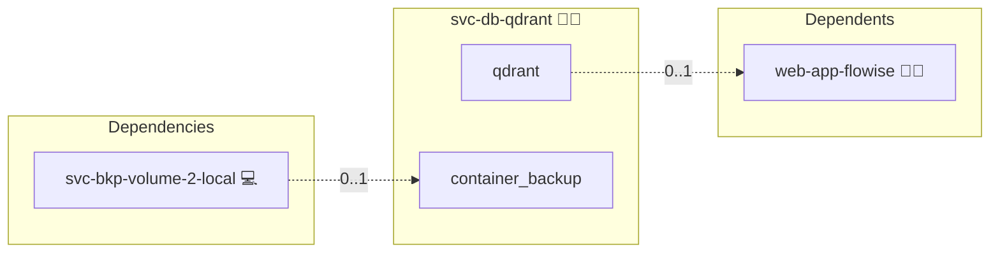

# Qdrant

## Description

This Ansible role deploys and configures a Qdrant vector database in a Docker container using Docker Compose. It runs Qdrant as a central, pinned engine that many application roles share over the cross-stack network, keeping the consumer roles stateless and NFS-shareable in swarm.

## Overview

Built for environments that demand reliability and ease of management, this role:

- Sets up a dedicated Docker network for Qdrant.
- Deploys a Qdrant container with secure configurations and an HTTP readiness healthcheck.
- Provides a connection lookup (`engine`) so consumers resolve the central instance and their own per-consumer collection prefix.

## Cosmos

The diagram places Qdrant in the Infinito.Nexus cosmos: the components it deploys (capabilities), the central services it consumes (dependencies), and its outward reach (federation and bridged external networks).



Solid `1:1` edges are fixed relationships; dashed `0..1` edges are conditional (enabled only in matching deployments). Node markers show the role's deploy modes (💻 host, 🐳 compose, 🐝 swarm); ❌ marks a service that is explicitly turned off, and ⚙️ an Ansible role dependency declared in `meta/main.yml`.

## Purpose

The purpose of this role is to provide an effortless way to deploy a Qdrant vector database via Docker. It minimizes manual interventions while ensuring that the engine is configured securely and reliably for both production and development scenarios.

## Features

- **Automated Deployment:** Installs Qdrant with minimal manual steps.
- **Central Engine:** A single pinned stack shared by many consumers, mirroring the central database roles.
- **Per-Consumer Isolation:** OSS Qdrant has no per-user auth; each consumer is isolated by the collection-name prefix `{entity}_`.
- **Enhanced Security:** The service is bound to `127.0.0.1:6333`, restricting access and enhancing security.
- **Seamless Docker Integration:** Works harmoniously with Docker Compose and other roles in your infrastructure.

## Quick Setup

### Development

Clone, set up the workstation, and deploy Qdrant onto the local stack:

```bash
git clone https://github.com/infinito-nexus/core.git
cd core
make onboard
make compose-deploy mode=reinstall apps=svc-db-qdrant full_cycle=false
```

### Production

Run the published image to provision the inventory and deploy Qdrant to a managed server (the mounted volume persists the inventory):

```bash
APP=svc-db-qdrant
HOST=<your-server>
TLS_MODE=self_signed
SSH_PUBLIC_KEY="<your-ssh-public-key>"

docker run --rm -it \
  -v "$PWD/inventories:/etc/infinito.nexus/inventories" \
  -e APP="$APP" -e HOST="$HOST" -e TLS_MODE="$TLS_MODE" -e SSH_PUBLIC_KEY="$SSH_PUBLIC_KEY" \
  ghcr.io/infinito-nexus/core/debian bash -c '
    INVENTORY=/etc/infinito.nexus/inventories/production
    infinito administration inventory provision "$INVENTORY" \
      --inventory-file "$INVENTORY/devices.yml" \
      --host "$HOST" \
      --include "$APP" \
      --vars "{\"TLS_MODE\": \"$TLS_MODE\", \"users\": {\"administrator\": {\"authorized_keys\": [\"$SSH_PUBLIC_KEY\"]}}}" &&
    infinito administration deploy dedicated "$INVENTORY/devices.yml" \
      --password-file "$INVENTORY/.password" \
      --diff -vv'
```

## Credits

Implemented by **[Kevin Veen-Birkenbach](https://www.veen.world)**.
Part of the [Infinito.Nexus Project](https://s.infinito.nexus/code) and maintained by [Kevin Veen-Birkenbach](https://www.veen.world).
Licensed under the [Infinito.Nexus Community License (Non-Commercial)](https://s.infinito.nexus/license).
