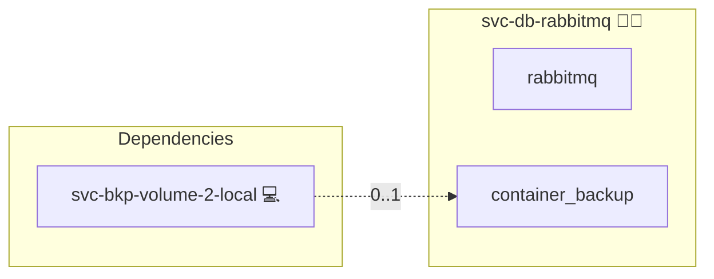

# RabbitMQ

## Description

This Ansible role provides a central RabbitMQ message broker that many roles share. It runs the broker inside a Docker container and isolates each consumer with its own virtual host and user, making it suitable for production or local development.

## Overview

The central stack (`templates/compose.yml.j2`) runs the `rabbitmq` image with:

- An `admin` user authenticated from the `RABBITMQ_PASSWORD` credential.
- A bind on `127.0.0.1:5672` plus the shared cross-stack overlay network for consumers.
- A built-in `rabbitmq-diagnostics ping` healthcheck.

Per-consumer provisioning (`tasks/02_init.yml`) runs with `application_id=svc-db-rabbitmq` and `database_consumer_id=<consumer>`; it resolves the consumer's vhost name, username and password via `lookup('engine', 'rabbitmq', <consumer>, ...)` and reconciles an idempotent vhost, user and `set_permissions` grant scoped to that vhost. Existing vhosts and users are skipped, and the consumer password is realigned with the inventory on every deploy.

## Cosmos

The diagram places RabbitMQ in the Infinito.Nexus cosmos: the components it deploys (capabilities), the central services it consumes (dependencies), and its outward reach (federation and bridged external networks).



Solid `1:1` edges are fixed relationships; dashed `0..1` edges are conditional (enabled only in matching deployments). Node markers show the role's deploy modes (💻 host, 🐳 compose, 🐝 swarm); ❌ marks a service that is explicitly turned off, and ⚙️ an Ansible role dependency declared in `meta/main.yml`.

## Features

- **Central broker** one shared RabbitMQ stack consumed by many roles.
- **Vhost isolation** one virtual host per consumer.
- **User isolation** one RabbitMQ user per consumer, granted full permissions only on its own vhost.
- **Idempotent provisioning** vhosts, users and permissions reconciled on every deploy via `rabbitmqctl`.
- **Built-in healthcheck** `rabbitmq-diagnostics ping`.

## Quick Setup

### Development

Clone, set up the workstation, and deploy RabbitMQ onto the local stack:

```bash
git clone https://github.com/infinito-nexus/core.git
cd core
make onboard
make compose-deploy mode=reinstall apps=svc-db-rabbitmq full_cycle=false
```

### Production

Run the published image to provision the inventory and deploy RabbitMQ to a managed server (the mounted volume persists the inventory):

```bash
APP=svc-db-rabbitmq
HOST=<your-server>
TLS_MODE=self_signed
SSH_PUBLIC_KEY="<your-ssh-public-key>"

docker run --rm -it \
  -v "$PWD/inventories:/etc/infinito.nexus/inventories" \
  -e APP="$APP" -e HOST="$HOST" -e TLS_MODE="$TLS_MODE" -e SSH_PUBLIC_KEY="$SSH_PUBLIC_KEY" \
  ghcr.io/infinito-nexus/core/debian bash -c '
    INVENTORY=/etc/infinito.nexus/inventories/production
    infinito administration inventory provision "$INVENTORY" \
      --inventory-file "$INVENTORY/devices.yml" \
      --host "$HOST" \
      --include "$APP" \
      --vars "{\"TLS_MODE\": \"$TLS_MODE\", \"users\": {\"administrator\": {\"authorized_keys\": [\"$SSH_PUBLIC_KEY\"]}}}" &&
    infinito administration deploy dedicated "$INVENTORY/devices.yml" \
      --password-file "$INVENTORY/.password" \
      --diff -vv'
```

## Further Resources

- [Official RabbitMQ Docker image on Docker Hub](https://hub.docker.com/_/rabbitmq)
- [rabbitmqctl management documentation](https://www.rabbitmq.com/docs/cli)
- [Docker Compose reference](https://docs.docker.com/compose/compose-file/)

## Credits

Implemented by **[Kevin Veen-Birkenbach](https://www.veen.world)**.
Part of the [Infinito.Nexus Project](https://s.infinito.nexus/code) and maintained by [Kevin Veen-Birkenbach](https://www.veen.world).
Licensed under the [Infinito.Nexus Community License (Non-Commercial)](https://s.infinito.nexus/license).
