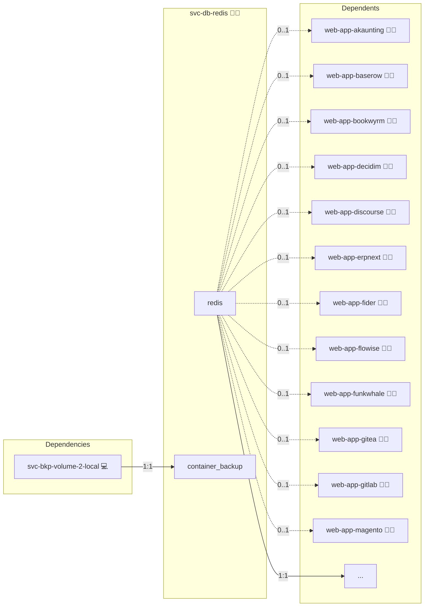

# Redis

## Description

This Ansible role provides Redis in two interchangeable shapes, selected per consumer with the `shared` flag (mirroring `svc-db-postgres`):

- **Central** (`enabled: true`, `shared: true`): a standalone, manager-pinned Redis stack that many roles share. Each consumer gets its own ACL user restricted to the key-prefix `{entity}:*`.
- **Embedded** (`enabled: true`, `shared: false`): a Redis sidecar rendered into the consumer's own compose stack via `templates/service.yml.j2`.

## Overview

The central stack (`templates/compose.yml.j2`) runs `redis:alpine` with:

- `requirepass` for the `default` (admin) user, sourced from the `REDIS_PASSWORD` credential.
- AOF persistence for cached data.
- A `maxmemory` ceiling derived from the service `mem_limit` with an `allkeys-lru` policy.
- A bind on `127.0.0.1:6379` plus the shared cross-stack overlay network for consumers.

Per-consumer provisioning (`tasks/02_init.yml`) runs with `application_id=svc-db-redis` and `database_consumer_id=<consumer>`; it resolves the consumer's username, password and key-prefix via `lookup('engine', 'redis', <consumer>, ...)` and reconciles an idempotent `ACL SETUSER` restricted to `~{entity}:*`. The ACL users are recreated by the consumer's `02_init` on every deploy, so a container restart that drops the in-memory ACL set is healed on the next run.

The embedded snippet (`templates/service.yml.j2`) keeps the previous single-host behaviour: an unauthenticated in-memory Redis attached to the consumer stack's default network.

## Cosmos

The diagram places Redis in the Infinito.Nexus cosmos: the components it deploys (capabilities), the central services it consumes (dependencies), and its outward reach (federation and bridged external networks).



Solid `1:1` edges are fixed relationships; dashed `0..1` edges are conditional (enabled only in matching deployments). Node markers show the role's deploy modes (💻 host, 🐳 compose, 🐝 swarm); ❌ marks a service that is explicitly turned off, and ⚙️ an Ansible role dependency declared in `meta/main.yml`.

## Features

- **Central or embedded** selected per consumer via `services.redis.shared`.
- **ACL isolation** one Redis user per consumer, scoped to `{entity}:*` keys.
- **Idempotent provisioning** ACL users reconciled on every deploy via `ACL SETUSER`.
- **Manager-pinned** central on-disk state stays node-local (never on NFS) in swarm.
- **Built-in healthcheck** authenticated `redis-cli ping`.

## Quick Setup

### Development

Clone, set up the workstation, and deploy Redis onto the local stack:

```bash
git clone https://github.com/infinito-nexus/core.git
cd core
make onboard
make compose-deploy mode=reinstall apps=svc-db-redis full_cycle=false
```

### Production

Run the published image to provision the inventory and deploy Redis to a managed server (the mounted volume persists the inventory):

```bash
APP=svc-db-redis
HOST=<your-server>
TLS_MODE=self_signed
SSH_PUBLIC_KEY="<your-ssh-public-key>"

docker run --rm -it \
  -v "$PWD/inventories:/etc/infinito.nexus/inventories" \
  -e APP="$APP" -e HOST="$HOST" -e TLS_MODE="$TLS_MODE" -e SSH_PUBLIC_KEY="$SSH_PUBLIC_KEY" \
  ghcr.io/infinito-nexus/core/debian bash -c '
    INVENTORY=/etc/infinito.nexus/inventories/production
    infinito administration inventory provision "$INVENTORY" \
      --inventory-file "$INVENTORY/devices.yml" \
      --host "$HOST" \
      --include "$APP" \
      --vars "{\"TLS_MODE\": \"$TLS_MODE\", \"users\": {\"administrator\": {\"authorized_keys\": [\"$SSH_PUBLIC_KEY\"]}}}" &&
    infinito administration deploy dedicated "$INVENTORY/devices.yml" \
      --password-file "$INVENTORY/.password" \
      --diff -vv'
```

## Further Resources

- [Official Redis Docker image on Docker Hub](https://hub.docker.com/_/redis)
- [Redis ACL documentation](https://redis.io/docs/latest/operate/oss_and_stack/management/security/acl/)
- [Docker Compose reference](https://docs.docker.com/compose/compose-file/)

## Credits

Implemented by **[Kevin Veen-Birkenbach](https://www.veen.world)**.
Part of the [Infinito.Nexus Project](https://s.infinito.nexus/code) and maintained by [Kevin Veen-Birkenbach](https://www.veen.world).
Licensed under the [Infinito.Nexus Community License (Non-Commercial)](https://s.infinito.nexus/license).
