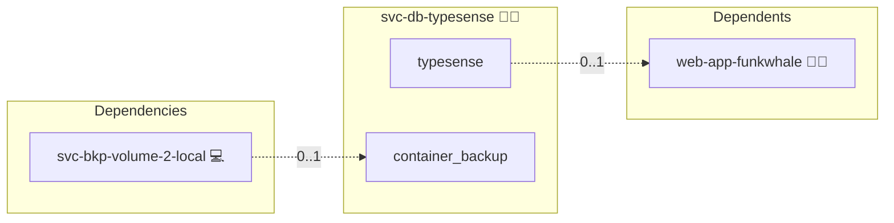

# Typesense

## Description

This Ansible role deploys and configures a central Typesense search engine in a Docker container using Docker Compose. It is designed as a central engine: many application roles share one pinned Typesense stack instead of each embedding its own sidecar, keeping the application roles stateless, unpinned and NFS-shareable in swarm.

## Overview

Built for environments that demand reliability and ease of management, this role:

- Sets up a dedicated Docker network for Typesense.
- Deploys a Typesense container with healthchecks and a bootstrap admin API key.
- Provisions a per-consumer scoped API key (limited to collections prefixed `<entity>_`) over the Typesense `/keys` API, idempotently.

## Cosmos

The diagram places Typesense in the Infinito.Nexus cosmos: the components it deploys (capabilities), the central services it consumes (dependencies), and its outward reach (federation and bridged external networks).



Solid `1:1` edges are fixed relationships; dashed `0..1` edges are conditional (enabled only in matching deployments). Node markers show the role's deploy modes (💻 host, 🐳 compose, 🐝 swarm); ❌ marks a service that is explicitly turned off.

## Purpose

The purpose of this role is to provide an effortless way to run a shared Typesense engine via Docker while giving each consumer its own isolated, scoped credential. It minimizes manual interventions while keeping engine on-disk state node-local (it cannot live on NFS).

## Features

- **Automated Deployment:** Installs Typesense with minimal manual steps.
- **Per-Consumer Isolation:** Issues a scoped API key per consumer, restricted to its own collection namespace.
- **Enhanced Security:** The service is bound to `127.0.0.1:8108`, restricting access and enhancing security.
- **Seamless Docker Integration:** Works harmoniously with Docker Compose and other roles in your infrastructure.

## Quick Setup

### Development

Clone, set up the workstation, and deploy Typesense onto the local stack:

```bash
git clone https://github.com/infinito-nexus/core.git
cd core
make onboard
make compose-deploy mode=reinstall apps=svc-db-typesense full_cycle=false
```

### Production

Run the published image to provision the inventory and deploy Typesense to a managed server (the mounted volume persists the inventory between the two runs):

```bash
docker run --rm -it \
  -v "$PWD/inventories:/etc/infinito.nexus/inventories" \
  ghcr.io/infinito-nexus/core/debian \
  infinito administration inventory provision /etc/infinito.nexus/inventories/prod \
  --inventory-file /etc/infinito.nexus/inventories/prod/devices.yml \
  --host <your-server> \
  --vars-file inventories/<env>/default.yml \
  --include 'svc-db-typesense'

docker run --rm -it \
  -v "$PWD/inventories:/etc/infinito.nexus/inventories" \
  ghcr.io/infinito-nexus/core/debian \
  infinito administration deploy dedicated /etc/infinito.nexus/inventories/prod/devices.yml \
  --password-file /etc/infinito.nexus/inventories/prod/.password \
  --id svc-db-typesense \
  --diff \
  -vv
```

## Credits

Implemented by **[Kevin Veen-Birkenbach](https://www.veen.world)**.
Part of the [Infinito.Nexus Project](https://s.infinito.nexus/code) and maintained by [Kevin Veen-Birkenbach](https://www.veen.world).
Licensed under the [Infinito.Nexus Community License (Non-Commercial)](https://s.infinito.nexus/license).
