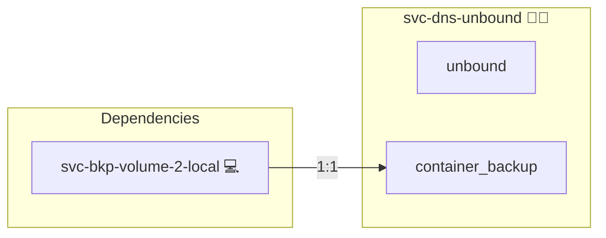

# Unbound

## Description

This Ansible role deploys a central recursive/forwarding DNSSEC resolver (Unbound) in a Docker container using Docker Compose. It runs as a trivial single-service stack with a static IP on its own network, so consumer stacks can point their `dns:` at it instead of embedding their own resolver.

## Overview

Built as a central engine (mirroring `svc-db-postgres`), this role:

- Sets up a dedicated Docker network for Unbound with a fixed subnet.
- Deploys an Unbound container at a static IP on that network.
- Waits until the resolver answers before consumers are wired to it.

## Cosmos

The diagram places Unbound in the Infinito.Nexus cosmos: the components it deploys (capabilities), the central services it consumes (dependencies), and its outward reach (federation and bridged external networks).



Solid `1:1` edges are fixed relationships; dashed `0..1` edges are conditional (enabled only in matching deployments). Node markers show the role's deploy modes (💻 host, 🐳 compose, 🐝 swarm); ❌ marks a service that is explicitly turned off, and ⚙️ an Ansible role dependency declared in `meta/main.yml`.

## Purpose

The purpose of this role is to externalise the static-IP DNS resolver out of large multi-service stacks (such as mail) into a single-service stack. Keeping the static-IP allocation in a trivial 1-service / 1-network stack avoids the swarm VIP-allocation deadlock that a 13-service / 4-network stack triggers, and lets consumer roles stay stateless and unpinned.

## Features

- **Central Resolver:** One shared recursive/forwarding DNSSEC resolver for many consumers.
- **Static IP:** Exposes a fixed resolver address on its own network for `dns:` targeting.
- **DinD-aware:** Forwards to public resolvers in nested-Docker/CI where iterative resolution via root-hints is unsupported.
- **Seamless Docker Integration:** Works with Docker Compose and the central-engine deploy machinery.

## Quick Setup

### Development

Clone, set up the workstation, and deploy Unbound onto the local stack:

```bash
git clone https://github.com/infinito-nexus/core.git
cd core
make onboard
make compose-deploy mode=reinstall apps=svc-dns-unbound full_cycle=false
```

### Production

Run the published image to provision the inventory and deploy Unbound to a managed server (the mounted volume persists the inventory):

```bash
APP=svc-dns-unbound
HOST=<your-server>
TLS_MODE=self_signed
SSH_PUBLIC_KEY="<your-ssh-public-key>"

docker run --rm -it \
  -v "$PWD/inventories:/etc/infinito.nexus/inventories" \
  -e APP="$APP" -e HOST="$HOST" -e TLS_MODE="$TLS_MODE" -e SSH_PUBLIC_KEY="$SSH_PUBLIC_KEY" \
  ghcr.io/infinito-nexus/core/debian bash -c '
    INVENTORY=/etc/infinito.nexus/inventories/production
    infinito administration inventory provision "$INVENTORY" \
      --inventory-file "$INVENTORY/devices.yml" \
      --host "$HOST" \
      --include "$APP" \
      --vars "{\"TLS_MODE\": \"$TLS_MODE\", \"users\": {\"administrator\": {\"authorized_keys\": [\"$SSH_PUBLIC_KEY\"]}}}" &&
    infinito administration deploy dedicated "$INVENTORY/devices.yml" \
      --password-file "$INVENTORY/.password" \
      --diff -vv'
```

## Credits

Implemented by **[Kevin Veen-Birkenbach](https://www.veen.world)**.
Part of the [Infinito.Nexus Project](https://s.infinito.nexus/code) and maintained by [Kevin Veen-Birkenbach](https://www.veen.world).
Licensed under the [Infinito.Nexus Community License (Non-Commercial)](https://s.infinito.nexus/license).
