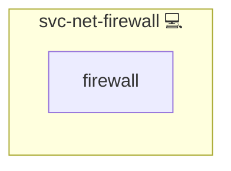

# Firewall ruleset

## Description

[nftables](https://www.netfilter.org/projects/nftables/) is the packet filtering framework of the Linux kernel and the successor to `iptables`. Its rules live in memory: a reboot drops them unless something loads them again.

## Overview

This role gives every other role one place to put packet filter rules. A role that needs them writes `templates/nftables.conf.j2` declaring its own nftables table and includes this role; the fragment is rendered to `/etc/nftables.d/<role>.conf`, checked, loaded, and read back, so a deploy fails rather than quietly leaving a gap. Deployed on its own, the role installs nftables, the ruleset that loads every fragment, and the `nftables.service` that replays them at boot.

One table per role is what makes the rules composable. A fragment replaces its own table and touches no other, so two roles on one host neither overwrite nor merge into each other, and a broken fragment fails alone instead of freezing everyone's rules.

Replacing beats adding. `nft -f` on an existing table merges, so a rule dropped from the declaration would stay in the kernel and the ruleset could only ever grow. Each fragment therefore creates, deletes and redeclares its table in one transaction, which is also why the table is never observed empty: unlike a flush followed by rules, there is no window in which the boundary is gone.

## Cosmos

The diagram places Firewall ruleset in the Infinito.Nexus cosmos: the components it deploys (capabilities), the central services it consumes (dependencies), and its outward reach (federation and bridged external networks).



Solid `1:1` edges are fixed relationships; dashed `0..1` edges are conditional (enabled only in matching deployments); red `0..0` edges are turned off in this role. Node markers show the role's deploy modes (💻 host, 🐳 compose, 🐝 swarm); ❌ marks a service that is explicitly turned off, and ⚙️ an Ansible role dependency declared in `meta/main.yml`.

## Features

- **Owned per role:** Each consumer declares one table under its own name, so rules are added and retired with the role that needs them.
- **Atomic:** A fragment is applied in a single `nft -f` transaction, so the table is never observed half built.
- **Persistent:** `nftables.service` loads every fragment at boot, so rules outlive a reboot without a unit of this project's own. The ruleset it reads is a distribution decision, so the path follows `os_family`: RedHat reads `/etc/sysconfig/nftables.conf`, the others `/etc/nftables.conf`.
- **Independent of docker:** Docker owns its own tables and never touches these, so no rule has to be inserted into a chain another component controls. The unit is only enabled, never started or restarted: on Debian its `ExecStop` flushes the entire ruleset, docker's tables included, and the fragments are loaded explicitly anyway.
- **Verified:** `nft -c` rejects a fragment before it is written, and the loaded table is read back and refused when it carries no chain. A table that exists is not a rule that runs, so the policy itself is proven by the role that owns it.

## Use Cases

- Bounding a service port that carries no access policy of its own, where the packet filter is the only boundary available.
- Redirecting or translating traffic a role owns, scoped to an address range nothing else claims.

A fragment can only ever be stricter than the host already is. In nftables an `accept` terminates its own base chain and nothing more: the packet still traverses every other chain at that hook, and a `drop` in any of them wins. A rule that has to overrule a policy someone else set, such as the `DROP` docker installs on forwarded packets, does not belong in a fragment at all; it belongs in the chain that carries that policy.

## Quick Setup

### Development

Clone, set up the workstation, and deploy Firewall ruleset onto the local stack:

```bash
git clone https://github.com/infinito-nexus/core.git
cd core
make onboard
make compose-deploy mode=reinstall apps=svc-net-firewall full_cycle=false
```

### Production

Install Firewall ruleset directly onto the target machine: clone the repository, install the OS prerequisites and the repository toolchain, then deploy against localhost over a local connection (no SSH, no container):

```bash
git clone https://github.com/infinito-nexus/core.git
cd core
bash scripts/install/package.sh
make install
source scripts/meta/env/load.sh

APP=svc-net-firewall
DOMAIN=<your-domain>
TLS_MODE=self_signed
SSH_PUBLIC_KEY="<your-ssh-public-key>"
INVENTORY=inventories/production
infinito administration inventory provision "$INVENTORY" \
  --inventory-file "$INVENTORY/devices.yml" \
  --host localhost \
  --include "$APP" \
  --vars "{\"TLS_MODE\": \"$TLS_MODE\", \"DOMAIN_PRIMARY\": \"$DOMAIN\", \"users\": {\"administrator\": {\"authorized_keys\": [\"$SSH_PUBLIC_KEY\"]}}}"
infinito administration deploy dedicated "$INVENTORY/devices.yml" \
  --password-file "$INVENTORY/.password" \
  --diff -vv
```

## Further Resources

- [nftables Wiki](https://wiki.nftables.org/)
- [nft(8) manual page](https://www.netfilter.org/projects/nftables/manpage.html)
- [Moving from iptables to nftables](https://wiki.nftables.org/wiki-nftables/index.php/Moving_from_iptables_to_nftables)

## Credits

Implemented by **[Kevin Veen-Birkenbach](https://www.veen.world)**.
Part of the [Infinito.Nexus Project](https://s.infinito.nexus/code) and maintained by [Kevin Veen-Birkenbach](https://www.veen.world).
Licensed under the [Infinito.Nexus Community License (Non-Commercial)](https://s.infinito.nexus/license).
