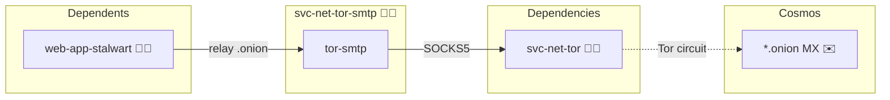

# Tor SMTP Gateway (svc-net-tor-smtp)

## Description

A small SMTP relay that carries `.onion` recipients over Tor. The active mail
provider (Stalwart) cannot open a SOCKS connection of its own, and a `.onion`
address cannot be reached any other way, so the provider hands every `.onion`
recipient to this gateway as an ordinary SMTP relay target and the gateway dials
`<recipient-domain>:25` through Tor's SOCKS5 listener.

## Overview

```
Stalwart  ──(relay route: rcpt ends_with .onion)──▶  tor-smtp:1525
tor-smtp  ──(SOCKS5, remote DNS)──▶  Tor  ──▶  <recipient>.onion:25
```

Clearnet mail is untouched — it stays on the provider's normal MX delivery. The
gateway only ever accepts `.onion` recipients; it is not an open relay.

## Cosmos

The diagram places Tor SMTP Gateway in the Infinito.Nexus cosmos: the container
it deploys (capabilities), the Tor daemon it consumes (dependencies), and its
outward reach to `.onion` mail hosts (cosmos).



Solid edges are fixed relationships; dashed edges are conditional. Node markers
show the role's deploy modes (💻 host, 🐳 compose, 🐝 swarm).

## Features

- **Onion-only relay:** accepts a recipient only when its domain ends with
  `.onion`; every clearnet recipient is refused with `550`.
- **Remote resolution:** dials through Tor's SOCKS5 with `proxy_rdns`, so the
  `.onion` name is resolved by Tor and never looked up locally.
- **One hop per domain:** recipients sharing a `.onion` domain are delivered in a
  single SMTP transaction.
- **Clearnet untouched:** normal SMTP reputation, DKIM and SPF delivery never
  pass through Tor.

## Quick Setup

### Development

Clone, set up the workstation, and deploy Tor SMTP Gateway (svc-net-tor-smtp) onto the local stack:

```bash
git clone https://github.com/infinito-nexus/core.git
cd core
make onboard
make compose-deploy mode=reinstall apps=svc-net-tor-smtp full_cycle=false
```

### Production

Run the published image to provision the inventory and deploy Tor SMTP Gateway (svc-net-tor-smtp) to a managed server (the mounted volume persists the inventory):

```bash
APP=svc-net-tor-smtp
HOST=<your-server>
TLS_MODE=self_signed
SSH_PUBLIC_KEY="<your-ssh-public-key>"

docker run --rm -it \
  -v "$PWD/inventories:/etc/infinito.nexus/inventories" \
  -e APP="$APP" -e HOST="$HOST" -e TLS_MODE="$TLS_MODE" -e SSH_PUBLIC_KEY="$SSH_PUBLIC_KEY" \
  ghcr.io/infinito-nexus/core/debian bash -c '
    INVENTORY=/etc/infinito.nexus/inventories/production
    infinito administration inventory provision "$INVENTORY" \
      --inventory-file "$INVENTORY/devices.yml" \
      --host "$HOST" \
      --include "$APP" \
      --vars "{\"TLS_MODE\": \"$TLS_MODE\", \"users\": {\"administrator\": {\"authorized_keys\": [\"$SSH_PUBLIC_KEY\"]}}}" &&
    infinito administration deploy dedicated "$INVENTORY/devices.yml" \
      --password-file "$INVENTORY/.password" \
      --diff -vv'
```

## Design Decisions

- **A dedicated role, not Stalwart config.** Stalwart has no outbound SOCKS
  support ([stalwartlabs/stalwart#644](https://github.com/stalwartlabs/stalwart/issues/644)),
  so the Tor hop lives in a separate service that only the `.onion` route uses.
- **`proxy_rdns` is on.** A `.onion` has no DNS entry, so Tor must resolve it —
  the name is never resolved locally.
- **Co-located with `svc-net-tor`.** It dials that role's SOCKS listener, so it
  is manager-pinned like the Tor daemon.

## Credits

Implemented by **[Alejandro Roman Ibanez](https://github.com/AlejandroRomanIbanez)**.
Part of the [Infinito.Nexus Project](https://s.infinito.nexus/code) and maintained by [Kevin Veen-Birkenbach](https://www.veen.world).
Licensed under the [Infinito.Nexus Community License (Non-Commercial)](https://s.infinito.nexus/license).
