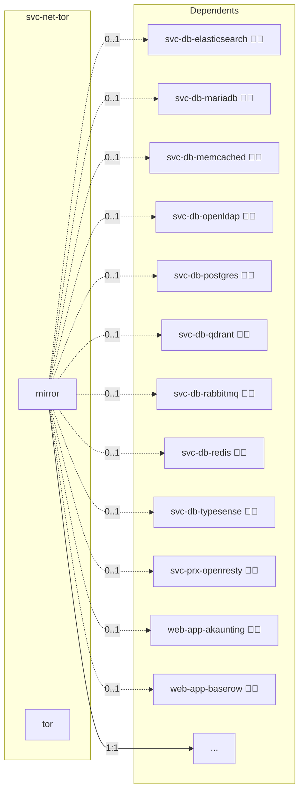

# Tor Onion Service

## Description

Runs a [Tor](https://www.torproject.org/) daemon on the node and publishes a Tor v3 onion service, turning an Infinito.Nexus instance behind NAT/CGNAT into a fully Tor-reachable node without a public IP, port forwarding, VPS, or DynDNS.

## Overview

When `svc-net-tor` is deployed, the node's `DOMAIN_PRIMARY` is the minted `.onion` address, so the whole stack (web vhosts, Keycloak SSO, LDAP, CA) resolves onion domains consistently. The Tor daemon runs as a host-network compose sidecar and maps one hidden service to the host OpenResty (`HiddenServicePort 80 -> 127.0.0.1:80`); per-app subdomains (`<app>.<node>.onion`) are routed by the `Host` header. TLS is off on the onion side (onion v3 already provides transport encryption + server authentication); apps still receive `X-Forwarded-Proto: https` because `.onion` is a browser Secure Context.

The onion key is minted offline during inventory build (`cli.administration.inventory.onion`) and stored in the inventory, so the address is stable across redeploys and restorable from a backup.

## Cosmos

The diagram places Tor Onion Service in the Infinito.Nexus cosmos: the components it deploys (capabilities), the central services it consumes (dependencies), and its outward reach (federation and bridged external networks).



Solid `1:1` edges are fixed relationships; dashed `0..1` edges are conditional (enabled only in matching deployments). Node markers show the role's deploy modes (💻 host, 🐳 compose, 🐝 swarm); ❌ marks a service that is explicitly turned off, and ⚙️ an Ansible role dependency declared in `meta/main.yml`.

## Features

- **Full onion node:** `DOMAIN_PRIMARY` becomes the node `.onion`; the entire stack shifts to Tor with no domain-transform logic.
- **Single key, per-app subdomains:** one hidden service serves every app at `<app>.<node>.onion`, Host-routed by OpenResty.
- **Offline deterministic minting:** the v3 key/address is generated without running Tor and pinned in the inventory (stable, backupable, restorable).
- **HTTP on the onion side:** TLS is forced off for `.onion` (no Let's Encrypt possible); onion v3 crypto is the transport auth.
- **Optional public domains:** extra clearnet domains added to an app keep their own TLS flavor and deploy alongside the onion.
- **Configurable egress:** inbound is always onion; outbound torification is off by default (`TOR_EGRESS_ENABLED`).

## Quick Setup

### Development

Clone, set up the workstation, and deploy Tor Onion Service onto the local stack:

```bash
git clone https://github.com/infinito-nexus/core.git
cd core
make onboard
make compose-deploy mode=reinstall apps=svc-net-tor full_cycle=false
```

### Production

Run the published image to provision the inventory and deploy Tor Onion Service to a managed server (the mounted volume persists the inventory):

```bash
APP=svc-net-tor
HOST=<your-server>
TLS_MODE=self_signed
SSH_PUBLIC_KEY="<your-ssh-public-key>"

docker run --rm -it \
  -v "$PWD/inventories:/etc/infinito.nexus/inventories" \
  -e APP="$APP" -e HOST="$HOST" -e TLS_MODE="$TLS_MODE" -e SSH_PUBLIC_KEY="$SSH_PUBLIC_KEY" \
  ghcr.io/infinito-nexus/core/debian bash -c '
    INVENTORY=/etc/infinito.nexus/inventories/production
    infinito administration inventory provision "$INVENTORY" \
      --inventory-file "$INVENTORY/devices.yml" \
      --host "$HOST" \
      --include "$APP" \
      --vars "{\"TLS_MODE\": \"$TLS_MODE\", \"users\": {\"administrator\": {\"authorized_keys\": [\"$SSH_PUBLIC_KEY\"]}}}" &&
    infinito administration deploy dedicated "$INVENTORY/devices.yml" \
      --password-file "$INVENTORY/.password" \
      --diff -vv'
```

## Limitations

- Targets **fresh** onion nodes; converting an existing clearnet node is out of scope (the LDAP base DN and all identities would shift).
- **No Let's Encrypt** for `.onion` (ACME requires public DNS).
- Outbound mail from `@<node>.onion` senders is not deliverable to the public Internet; onion does not replace public Internet email.

## Credits

Implemented by **Kevin Veen-Birkenbach**.
Part of the [Infinito.Nexus Project](https://s.infinito.nexus/code) and maintained by [Kevin Veen-Birkenbach](https://www.veen.world).
Licensed under the [Infinito.Nexus Community License (Non-Commercial)](https://s.infinito.nexus/license).
