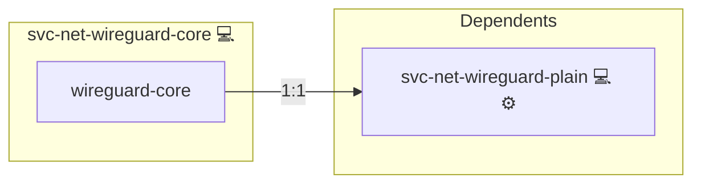

# Wireguard

## Description

This role manages [Wireguard](https://www.wireguard.com/) on the host. It installs the necessary Wireguard packages, configures sysctl settings for IPv4/IPv6 forwarding, and deploys the Wireguard configuration file to enable the VPN service using [wg-quick](https://www.wireguard.com/quickstart/).

## Overview

Optimized for both [Arch Linux](https://wiki.archlinux.org/index.php/WireGuard) and [Ubuntu/Debian](https://wireguard.com/install/), this role performs the following tasks:

- Installs Wireguard tools using the appropriate package manager.
- Copies a sysctl configuration file to enable IP forwarding and proper IPv6 settings.
- Deploys a host-specific Wireguard configuration file to `/etc/wireguard/wg0.infinito.conf`.
- Uses systemd handlers to restart the Wireguard service and reload sysctl settings.

## Cosmos

The diagram places Wireguard in the Infinito.Nexus cosmos: the components it deploys (capabilities), the central services it consumes (dependencies), and its outward reach (federation and bridged external networks).



Solid `1:1` edges are fixed relationships; dashed `0..1` edges are conditional (enabled only in matching deployments). Node markers show the role's deploy modes (💻 host, 🐳 compose, 🐝 swarm); ❌ marks a service that is explicitly turned off, and ⚙️ an Ansible role dependency declared in `meta/main.yml`.

## Purpose

The primary purpose of this role is to set up and manage a Wireguard VPN configuration on the host. By automating package installation and configuration file deployment, it ensures that the VPN service is enabled with optimal network settings for secure connectivity.

## Features

- **Multi-Platform Support:** Installs Wireguard tools using [pacman](https://wiki.archlinux.org/title/Pacman) on Arch Linux and [apt](https://en.wikipedia.org/wiki/APT_(software)) on Ubuntu/Debian.
- **Sysctl Configuration:** Deploys a sysctl configuration file to manage IPv4/IPv6 forwarding and related network parameters.
- **Wireguard Configuration:** Copies a host-specific Wireguard configuration file to `/etc/wireguard/wg0.infinito.conf`.
- **Service Management:** Provides handlers to restart the Wireguard service and reload sysctl settings.

## Quick Setup

### Development

Clone, set up the workstation, and deploy Wireguard onto the local stack:

```bash
git clone https://github.com/infinito-nexus/core.git
cd core
make onboard
make compose-deploy mode=reinstall apps=svc-net-wireguard-core full_cycle=false
```

### Production

Install Wireguard directly onto the target machine — clone the repository, install the OS prerequisites and the repository toolchain, then deploy against localhost over a local connection (no SSH, no container):

```bash
git clone https://github.com/infinito-nexus/core.git
cd core
bash scripts/install/package.sh
make install
source scripts/meta/env/load.sh

APP=svc-net-wireguard-core
TLS_MODE=self_signed
SSH_PUBLIC_KEY="<your-ssh-public-key>"
INVENTORY=inventories/production
infinito administration inventory provision "$INVENTORY" \
  --inventory-file "$INVENTORY/devices.yml" \
  --host localhost \
  --include "$APP" \
  --vars "{\"TLS_MODE\": \"$TLS_MODE\", \"users\": {\"administrator\": {\"authorized_keys\": [\"$SSH_PUBLIC_KEY\"]}}}"
infinito administration deploy dedicated "$INVENTORY/devices.yml" \
  --password-file "$INVENTORY/.password" \
  --diff -vv
```

## Administration

For detailed client setup instructions, please see the [Administration](./Administration.md) file.

## Credits

Implemented by **[Kevin Veen-Birkenbach](https://www.veen.world)**.
Part of the [Infinito.Nexus Project](https://s.infinito.nexus/code) and maintained by [Kevin Veen-Birkenbach](https://www.veen.world).
Licensed under the [Infinito.Nexus Community License (Non-Commercial)](https://s.infinito.nexus/license).
