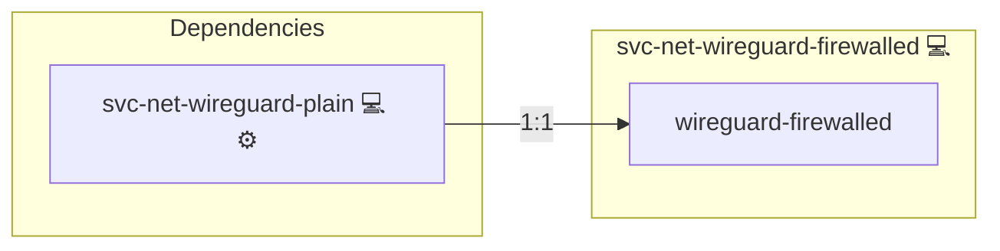

# WireGuard Client behind NAT

## Description

This role adapts iptables rules to enable proper connectivity for a WireGuard client running behind a NAT or firewall. It ensures that traffic is forwarded correctly by applying necessary masquerading rules.

## Overview

Optimized for environments with network address translation (NAT), this role:

- Executes shell commands to modify iptables rules.
- Allows traffic from the WireGuard client interface (e.g. `wg0-client`) and sets up NAT masquerading on the external interface (e.g. `eth0`).
- Works as an extension to the native WireGuard client role.

## Cosmos

The diagram places WireGuard Client behind NAT in the Infinito.Nexus cosmos: the components it deploys (capabilities), the central services it consumes (dependencies), and its outward reach (federation and bridged external networks).



Solid `1:1` edges are fixed relationships; dashed `0..1` edges are conditional (enabled only in matching deployments). Node markers show the role's deploy modes (💻 host, 🐳 compose, 🐝 swarm); ❌ marks a service that is explicitly turned off, and ⚙️ an Ansible role dependency declared in `meta/main.yml`.

## Purpose

The primary purpose of this role is to enable proper routing and connectivity for a WireGuard client situated behind a firewall or NAT device. By adapting iptables rules, it ensures that the client can communicate effectively with external networks.

## Features

- **iptables Rule Adaptation:** Modifies iptables to allow forwarding and NAT masquerading for the WireGuard client.
- **NAT Support:** Configures the external interface for proper masquerading.
- **Role Integration:** Depends on the [svc-net-wireguard-plain](../svc-net-wireguard-plain/README.md) role to ensure that WireGuard is properly configured before applying firewall rules.

## Quick Setup

### Development

Clone, set up the workstation, and deploy WireGuard Client behind NAT onto the local stack:

```bash
git clone https://github.com/infinito-nexus/core.git
cd core
make onboard
make compose-deploy mode=reinstall apps=svc-net-wireguard-firewalled full_cycle=false
```

### Production

Install WireGuard Client behind NAT directly onto the target machine — clone the repository, install the OS prerequisites and the repository toolchain, then deploy against localhost over a local connection (no SSH, no container):

```bash
git clone https://github.com/infinito-nexus/core.git
cd core
bash scripts/install/package.sh
make install
source scripts/meta/env/load.sh

APP=svc-net-wireguard-firewalled
TLS_MODE=self_signed
SSH_PUBLIC_KEY="<your-ssh-public-key>"
INVENTORY=inventories/production
infinito administration inventory provision "$INVENTORY" \
  --inventory-file "$INVENTORY/devices.yml" \
  --host localhost \
  --include "$APP" \
  --vars "{\"TLS_MODE\": \"$TLS_MODE\", \"users\": {\"administrator\": {\"authorized_keys\": [\"$SSH_PUBLIC_KEY\"]}}}"
infinito administration deploy dedicated "$INVENTORY/devices.yml" \
  --password-file "$INVENTORY/.password" \
  --diff -vv
```

## Further Resources

- [Debian Wiki: iptables](https://wiki.debian.org/iptables)

## Credits

Implemented by **[Kevin Veen-Birkenbach](https://www.veen.world)**.
Part of the [Infinito.Nexus Project](https://s.infinito.nexus/code) and maintained by [Kevin Veen-Birkenbach](https://www.veen.world).
Licensed under the [Infinito.Nexus Community License (Non-Commercial)](https://s.infinito.nexus/license).
