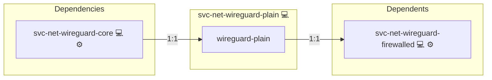

# Wireguard Client

## Description

This role manages WireGuard on a client system. It sets up essential services and scripts to configure and optimize WireGuard connectivity.

## Overview

Optimized for client configurations, this role:

- Deploys a systemd service and its associated script to set the MTU on specified network interfaces.
- Uses a Jinja2 template to generate the `set-mtu.sh` script.
- Ensures that the MTU is configured correctly before starting WireGuard with [wg-quick](https://www.wireguard.com/quickstart/).

## Cosmos

The diagram places Wireguard Client in the Infinito.Nexus cosmos: the components it deploys (capabilities), the central services it consumes (dependencies), and its outward reach (federation and bridged external networks).



Solid `1:1` edges are fixed relationships; dashed `0..1` edges are conditional (enabled only in matching deployments). Node markers show the role's deploy modes (💻 host, 🐳 compose, 🐝 swarm); ❌ marks a service that is explicitly turned off, and ⚙️ an Ansible role dependency declared in `meta/main.yml`.

## Purpose

The primary purpose of this role is to configure WireGuard on a client by setting appropriate MTU values on network interfaces. This ensures a stable and optimized VPN connection.

## Features

- **MTU Configuration:** Deploys a template-based script to set the MTU on all defined internet interfaces.
- **Systemd Service Integration:** Creates and manages a systemd service to execute the MTU configuration script.
- **Administration Support:** For client key creation and further setup, please refer to the [Administration](./Administration.md) file.
- **Modular Design:** Easily integrates with other WireGuard roles or network configuration roles.

## Quick Setup

### Development

Clone, set up the workstation, and deploy Wireguard Client onto the local stack:

```bash
git clone https://github.com/infinito-nexus/core.git
cd core
make onboard
make compose-deploy mode=reinstall apps=svc-net-wireguard-plain full_cycle=false
```

### Production

Install Wireguard Client directly onto the target machine — clone the repository, install the OS prerequisites and the repository toolchain, then deploy against localhost over a local connection (no SSH, no container):

```bash
git clone https://github.com/infinito-nexus/core.git
cd core
bash scripts/install/package.sh
make install
source scripts/meta/env/load.sh

APP=svc-net-wireguard-plain
TLS_MODE=self_signed
SSH_PUBLIC_KEY="<your-ssh-public-key>"
INVENTORY=inventories/production
infinito administration inventory provision "$INVENTORY" \
  --inventory-file "$INVENTORY/devices.yml" \
  --host localhost \
  --include "$APP" \
  --vars "{\"TLS_MODE\": \"$TLS_MODE\", \"users\": {\"administrator\": {\"authorized_keys\": [\"$SSH_PUBLIC_KEY\"]}}}"
infinito administration deploy dedicated "$INVENTORY/devices.yml" \
  --password-file "$INVENTORY/.password" \
  --diff -vv
```

## Further Resources

- [WireGuard Documentation](https://www.wireguard.com/)
- [ArchWiki: WireGuard](https://wiki.archlinux.org/index.php/WireGuard)
- [Subnetting Basics](https://www.scaleuptech.com/de/blog/was-ist-und-wie-funktioniert-subnetting/)
- [WireGuard Permissions Issue Discussion](https://bodhilinux.boards.net/thread/450/wireguard-rtnetlink-answers-permission-denied)
- [UFW and SSH via WireGuard](https://unix.stackexchange.com/questions/717172/why-is-ufw-blocking-acces-to-ssh-via-wireguard)
- [OpenWrt Forum Discussion on WireGuard](https://forum.openwrt.org/t/cannot-ssh-to-clients-on-lan-when-accessing-router-via-wireguard-client/132709/3)
- [WireGuard Connection Dies on Ubuntu](https://serverfault.com/questions/1086297/wireguard-connection-dies-on-ubuntu-peer)
- [SSH Fails with WireGuard IP](https://unix.stackexchange.com/questions/624987/ssh-fails-to-start-when-listenaddress-is-set-to-wireguard-vpn-ip)
- [WireGuard NAT and Firewall Issues](https://serverfault.com/questions/210408/cannot-ssh-debug1-expecting-ssh2-msg-kex-dh-gex-reply)

## Credits

Implemented by **[Kevin Veen-Birkenbach](https://www.veen.world)**.
Part of the [Infinito.Nexus Project](https://s.infinito.nexus/code) and maintained by [Kevin Veen-Birkenbach](https://www.veen.world).
Licensed under the [Infinito.Nexus Community License (Non-Commercial)](https://s.infinito.nexus/license).
