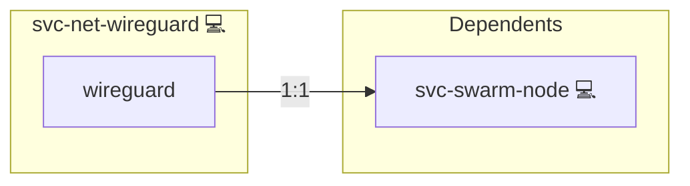

# WireGuard

## Description

[WireGuard](https://www.wireguard.com/) is an in-kernel VPN protocol. Peers
authenticate each other with Curve25519 keypairs and exchange encrypted UDP
datagrams, so a tunnel needs no session state, no certificate authority and no
daemon of its own.

## Overview

This role puts WireGuard under a swarm deployment so that swarm control,
overlay and storage traffic never crosses an untunnelled network. It configures
two hub-and-spoke meshes whose only shared member is the swarm manager: the
`swarm` mesh joins the manager to the worker nodes, and the `data` mesh joins it
to the NFS and backup hosts. The manager forwards between them, which is how a
worker reaches an NFS export it is not a data-plane member of.

The role plans nothing. Every key, address and peer list is written into the
inventory beforehand by `cli.administration.inventory.mesh`, the one pass that
sees every host at once; this role renders what its own host was handed and
then proves the result. The role is inert outside swarm mode.

## Cosmos

The diagram places WireGuard in the Infinito.Nexus cosmos: the components it deploys (capabilities), the central services it consumes (dependencies), and its outward reach (federation and bridged external networks).



Solid `1:1` edges are fixed relationships; dashed `0..1` edges are conditional (enabled only in matching deployments); red `0..0` edges are turned off in this role. Node markers show the role's deploy modes (💻 host, 🐳 compose, 🐝 swarm); ❌ marks a service that is explicitly turned off, and ⚙️ an Ansible role dependency declared in `meta/main.yml`.

## Features

- Two hub-and-spoke meshes with the manager as the only member of both, so the
  two planes stay separate while remaining mutually reachable.
- Per-host interfaces rendered from inventory state, with each private key
  vault-encrypted in exactly one host's `host_vars`.
- Forwarding enabled only on the hub, which is the only member with peers in
  both planes.
- A hard gate that fails the deploy before swarm initialises when any peer is
  unreachable or the path will not carry a full-size payload.

## Quick Setup

### Development

Clone, set up the workstation, and deploy WireGuard onto the local stack:

```bash
git clone https://github.com/infinito-nexus/core.git
cd core
make onboard
make compose-deploy mode=reinstall apps=svc-net-wireguard full_cycle=false
```

### Production

Install WireGuard directly onto the target machine: clone the repository, install the OS prerequisites and the repository toolchain, then deploy against localhost over a local connection (no SSH, no container):

```bash
git clone https://github.com/infinito-nexus/core.git
cd core
bash scripts/install/package.sh
make install
source scripts/meta/env/load.sh

APP=svc-net-wireguard
DOMAIN=<your-domain>
TLS_MODE=self_signed
SSH_PUBLIC_KEY="<your-ssh-public-key>"
INVENTORY=inventories/production
infinito administration inventory provision "$INVENTORY" \
  --inventory-file "$INVENTORY/devices.yml" \
  --host localhost \
  --include "$APP" \
  --vars "{\"TLS_MODE\": \"$TLS_MODE\", \"DOMAIN_PRIMARY\": \"$DOMAIN\", \"users\": {\"administrator\": {\"authorized_keys\": [\"$SSH_PUBLIC_KEY\"]}}}"
infinito administration deploy dedicated "$INVENTORY/devices.yml" \
  --password-file "$INVENTORY/.password" \
  --diff -vv
```

## Administration

The mesh must exist in the inventory before the play runs. Write it once over
every inventory of the deploy, including any sibling file that holds hosts the
cluster inventory does not:

```bash
python3 -m cli.administration.inventory.mesh \
  --inventory /tmp/inv/devices.yml \
  --inventory /tmp/inv/backup.yml \
  --host-vars-dir /tmp/inv/host_vars \
  --vault-password-file /tmp/inv/.password
```

Re-running is a no-op. To replace every keypair, add `--rotate`; that rewrites
the whole mesh in one pass, because rotating one member alone partitions it.

Inspect a live interface on any member:

```bash
wg show swarm
```

A peer with no recent handshake is either unreachable on the underlay or
carrying a key its peer does not know. The second case means the inventory and
the running interface disagree: re-run the mesh writer and redeploy rather than
editing `/etc/wireguard` by hand, which the next deploy overwrites.

## Credits

Implemented by **[Evangelos Tsakoudis](https://github.com/evangelostsak)**.
Part of the [Infinito.Nexus Project](https://s.infinito.nexus/code) and maintained by [Kevin Veen-Birkenbach](https://www.veen.world).
Licensed under the [Infinito.Nexus Community License (Non-Commercial)](https://s.infinito.nexus/license).
