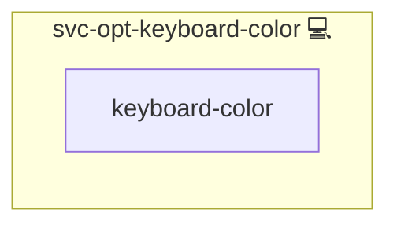

# MSI Keyboard Driver

## Description

[msi-perkeyrgb](https://github.com/Askannz/msi-perkeyrgb) is a tool for setting dynamic per-key RGB keyboard colors on MSI laptops.

## Overview

This role sets up dynamic keyboard color change on MSI laptops running Arch Linux. It requires an MSI laptop and the `msi-perkeyrgb` tool installed on the system.

## Cosmos

The diagram places MSI Keyboard Driver in the Infinito.Nexus cosmos: the components it deploys (capabilities), the central services it consumes (dependencies), and its outward reach (federation and bridged external networks).



Solid `1:1` edges are fixed relationships; dashed `0..1` edges are conditional (enabled only in matching deployments). Node markers show the role's deploy modes (💻 host, 🐳 compose, 🐝 swarm); ❌ marks a service that is explicitly turned off, and ⚙️ an Ansible role dependency declared in `meta/main.yml`.

## Features

- **Dynamic Color Control:** Enables per-key RGB color configuration via `msi-perkeyrgb`.
- **Configurable Hardware ID:** Requires `vendor_and_product_id` to be set to the vendor and product ID of the MSI laptop.

## Quick Setup

### Development

Clone, set up the workstation, and deploy MSI Keyboard Driver onto the local stack:

```bash
git clone https://github.com/infinito-nexus/core.git
cd core
make onboard
make compose-deploy mode=reinstall apps=svc-opt-keyboard-color full_cycle=false
```

### Production

Install MSI Keyboard Driver directly onto the target machine — clone the repository, install the OS prerequisites and the repository toolchain, then deploy against localhost over a local connection (no SSH, no container):

```bash
git clone https://github.com/infinito-nexus/core.git
cd core
bash scripts/install/package.sh
make install
source scripts/meta/env/load.sh

APP=svc-opt-keyboard-color
TLS_MODE=self_signed
SSH_PUBLIC_KEY="<your-ssh-public-key>"
INVENTORY=inventories/production
infinito administration inventory provision "$INVENTORY" \
  --inventory-file "$INVENTORY/devices.yml" \
  --host localhost \
  --include "$APP" \
  --vars "{\"TLS_MODE\": \"$TLS_MODE\", \"users\": {\"administrator\": {\"authorized_keys\": [\"$SSH_PUBLIC_KEY\"]}}}"
infinito administration deploy dedicated "$INVENTORY/devices.yml" \
  --password-file "$INVENTORY/.password" \
  --diff -vv
```

## Credits

Implemented by **[Kevin Veen-Birkenbach](https://www.veen.world)**.
Part of the [Infinito.Nexus Project](https://s.infinito.nexus/code) and maintained by [Kevin Veen-Birkenbach](https://www.veen.world).
Licensed under the [Infinito.Nexus Community License (Non-Commercial)](https://s.infinito.nexus/license).
