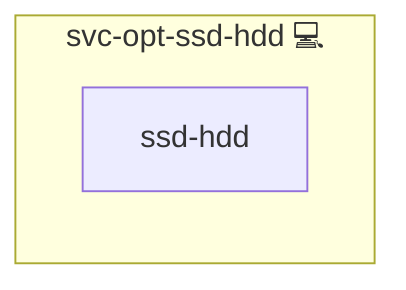

# Storage Optimizer

## Description

This role optimizes storage allocation for Docker volumes by migrating volumes between SSD (rapid storage) and HDD (mass storage) based on container image types. It creates symbolic links to maintain consistent storage paths after migration.

## Overview

The role performs the following tasks:

- Migrates Docker volumes with database workloads to rapid storage (SSD) for improved performance.
- Moves non-database Docker volumes to mass storage (HDD) to optimize storage usage.
- Manages container stopping and restarting during the migration process.
- Creates symbolic links to preserve consistent file paths.

## Cosmos

The diagram places Storage Optimizer in the Infinito.Nexus cosmos: the components it deploys (capabilities), the central services it consumes (dependencies), and its outward reach (federation and bridged external networks).



Solid `1:1` edges are fixed relationships; dashed `0..1` edges are conditional (enabled only in matching deployments). Node markers show the role's deploy modes (💻 host, 🐳 compose, 🐝 swarm); ❌ marks a service that is explicitly turned off, and ⚙️ an Ansible role dependency declared in `meta/main.yml`.

## Purpose

The primary purpose of this role is to enhance system performance by ensuring that Docker volumes are stored on the most appropriate storage medium, optimizing both speed and capacity.

## Features

- **Dynamic Volume Migration:** Moves Docker volumes based on container image types.
- **Symbolic Link Creation:** Maintains consistent access paths after migration.
- **Container Management:** Safely stops and starts containers during volume migration.
- **Performance Optimization:** Improves overall system performance by leveraging appropriate storage media.

## Quick Setup

### Development

Clone, set up the workstation, and deploy Storage Optimizer onto the local stack:

```bash
git clone https://github.com/infinito-nexus/core.git
cd core
make onboard
make compose-deploy mode=reinstall apps=svc-opt-ssd-hdd full_cycle=false
```

### Production

Run the published image to provision the inventory and deploy Storage Optimizer to a managed server (the mounted volume persists the inventory):

```bash
APP=svc-opt-ssd-hdd
HOST=<your-server>

docker run --rm -it \
  -v "$PWD/inventories:/etc/infinito.nexus/inventories" \
  -e APP="$APP" -e HOST="$HOST" \
  ghcr.io/infinito-nexus/core/debian bash -c '
    INVENTORY=/etc/infinito.nexus/inventories/prod
    infinito administration inventory provision "$INVENTORY" \
      --inventory-file "$INVENTORY/devices.yml" \
      --host "$HOST" \
      --include "$APP" &&
    infinito administration deploy dedicated "$INVENTORY/devices.yml" \
      --password-file "$INVENTORY/.password" \
      --diff -vv'
```

## Credits

Implemented by **[Kevin Veen-Birkenbach](https://www.veen.world)**.
Part of the [Infinito.Nexus Project](https://s.infinito.nexus/code) and maintained by [Kevin Veen-Birkenbach](https://www.veen.world).
Licensed under the [Infinito.Nexus Community License (Non-Commercial)](https://s.infinito.nexus/license).
