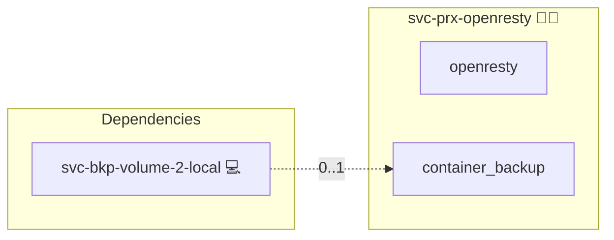

# OpenResty

This role deploys an OpenResty container via Docker Compose, validates its configuration, and restarts it on changes.

## Description

- Runs an OpenResty container in host network mode  
- Mounts NGINX configuration and Let’s Encrypt directories  
- Validates the OpenResty (NGINX) configuration before any restart  
- Restarts the container only if the configuration is valid  

## Overview

1. Loads the base Docker Compose setup  
2. Adds the OpenResty service  
3. Defines handlers to validate and restart the container  
4. Triggers a restart on configuration changes  

## Cosmos

The diagram places OpenResty in the Infinito.Nexus cosmos: the components it deploys (capabilities), the central services it consumes (dependencies), and its outward reach (federation and bridged external networks).



Solid `1:1` edges are fixed relationships; dashed `0..1` edges are conditional (enabled only in matching deployments). Node markers show the role's deploy modes (💻 host, 🐳 compose, 🐝 swarm); ❌ marks a service that is explicitly turned off.

## Features

- **Automated provisioning:** Configured by Ansible without manual steps.

## Quick Setup

### Development

Clone, set up the workstation, and deploy OpenResty onto the local stack:

```bash
git clone https://github.com/infinito-nexus/core.git
cd core
make onboard
make compose-deploy mode=reinstall apps=svc-prx-openresty full_cycle=false
```

### Production

Run the published image to provision the inventory and deploy OpenResty to a managed server (the mounted volume persists the inventory between the two runs):

```bash
docker run --rm -it \
  -v "$PWD/inventories:/etc/infinito.nexus/inventories" \
  ghcr.io/infinito-nexus/core/debian \
  infinito administration inventory provision /etc/infinito.nexus/inventories/prod \
  --inventory-file /etc/infinito.nexus/inventories/prod/devices.yml \
  --host <your-server> \
  --vars-file inventories/<env>/default.yml \
  --include 'svc-prx-openresty'

docker run --rm -it \
  -v "$PWD/inventories:/etc/infinito.nexus/inventories" \
  ghcr.io/infinito-nexus/core/debian \
  infinito administration deploy dedicated /etc/infinito.nexus/inventories/prod/devices.yml \
  --password-file /etc/infinito.nexus/inventories/prod/.password \
  --id svc-prx-openresty \
  --diff \
  -vv
```

## Further Reading

- [OpenResty Docker Hub](https://hub.docker.com/r/openresty/openresty)  
- [OpenResty Official Documentation](https://openresty.org/)  
- [Ansible Docker Compose Role on Galaxy](https://galaxy.ansible.com/)  

## Credits

Implemented by **[Kevin Veen-Birkenbach](https://www.veen.world)**.
Part of the [Infinito.Nexus Project](https://s.infinito.nexus/code) and maintained by [Kevin Veen-Birkenbach](https://www.veen.world).
Licensed under the [Infinito.Nexus Community License (Non-Commercial)](https://s.infinito.nexus/license).
