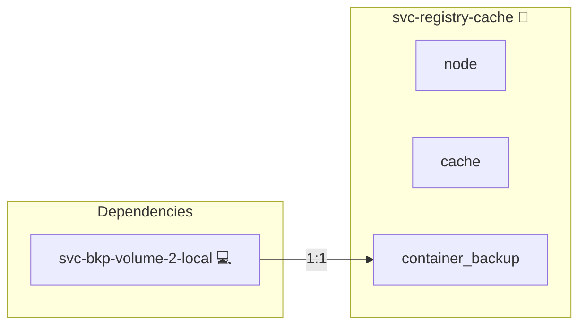

# Docker Registry Cache

## Description

Cluster-local Docker Hub pull-through cache. Worker nodes pull base images via
this mirror instead of going to `registry-1.docker.io` for every node,
eliminating duplicate network transfers and avoiding Docker Hub rate limits.

## Overview

The role deploys a single `registry:2` instance in pull-through proxy mode on its inventory
group's host. Because the group typically holds exactly one host (the swarm
manager), `DEPLOYMENT_MODE` resolves to `compose` for the role; multi-host
fan-out for the cache itself is out of scope for v1.

Any host that should consume the cache joins the role's group as well. The
shared daemon.json template then emits a `registry-mirrors` block pointing at
`http://<cache-host>:<cache-port>` plus an `insecure-registries` entry so
plain-HTTP communication with the cache is permitted.

## Cosmos

The diagram places Docker Registry Cache in the Infinito.Nexus cosmos: the components it deploys (capabilities), the central services it consumes (dependencies), and its outward reach (federation and bridged external networks).



Solid `1:1` edges are fixed relationships; dashed `0..1` edges are conditional (enabled only in matching deployments). Node markers show the role's deploy modes (💻 host, 🐳 compose, 🐝 swarm); ❌ marks a service that is explicitly turned off, and ⚙️ an Ansible role dependency declared in `meta/main.yml`.

## Features

- Transparent Docker Hub mirror via `registry:2`'s built-in proxy mode.
- Idempotent: subsequent role runs reuse the populated cache volume.
- Zero per-image configuration: any image normally pulled from Docker Hub is
  cached on first access and served from local disk afterwards.
- First pull of any image: cache miss, fetched upstream, persisted to disk.
- Subsequent pulls of the same image from any node: served from local cache
  over LAN. On a 3-node cluster pulling identical base images this is the
  difference between three full Hub downloads and one Hub download plus two
  LAN copies.

## Quick Setup

### Development

Clone, set up the workstation, and deploy Docker Registry Cache onto the local stack:

```bash
git clone https://github.com/infinito-nexus/core.git
cd core
make onboard
make compose-deploy mode=reinstall apps=svc-registry-cache full_cycle=false
```

### Production

Run the published image to provision the inventory and deploy Docker Registry Cache to a managed server (the mounted volume persists the inventory):

```bash
APP=svc-registry-cache
HOST=<your-server>
TLS_MODE=self_signed
SSH_PUBLIC_KEY="<your-ssh-public-key>"

docker run --rm -it \
  -v "$PWD/inventories:/etc/infinito.nexus/inventories" \
  -e APP="$APP" -e HOST="$HOST" -e TLS_MODE="$TLS_MODE" -e SSH_PUBLIC_KEY="$SSH_PUBLIC_KEY" \
  ghcr.io/infinito-nexus/core/debian bash -c '
    INVENTORY=/etc/infinito.nexus/inventories/production
    infinito administration inventory provision "$INVENTORY" \
      --inventory-file "$INVENTORY/devices.yml" \
      --host "$HOST" \
      --include "$APP" \
      --vars "{\"TLS_MODE\": \"$TLS_MODE\", \"users\": {\"administrator\": {\"authorized_keys\": [\"$SSH_PUBLIC_KEY\"]}}}" &&
    infinito administration deploy dedicated "$INVENTORY/devices.yml" \
      --password-file "$INVENTORY/.password" \
      --diff -vv'
```

## Credits

Implemented by **[Kevin Veen-Birkenbach](https://www.veen.world)**.
Part of the [Infinito.Nexus Project](https://s.infinito.nexus/code) and maintained by [Kevin Veen-Birkenbach](https://www.veen.world).
Licensed under the [Infinito.Nexus Community License (Non-Commercial)](https://s.infinito.nexus/license).
