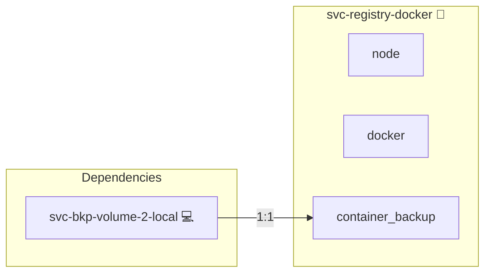

# Docker Registry

## Description

Cluster-local [Docker Registry](https://distribution.github.io/distribution/)
that serves custom-built images to swarm workers.

## Overview

Runs as a manager-pinned stateful service (`service_is_stateful: true`) on the
swarm manager. Custom images built on the manager via `compose build` are
tagged and pushed to this registry; workers pull from it on `docker stack
deploy` and on reschedule, removing the need for out-of-band
`docker save | docker load` distribution.

Storage lives in an NFS-backed volume so the registry contents survive
container restarts and manager reschedules.

## Cosmos

The diagram places Docker Registry in the Infinito.Nexus cosmos: the components it deploys (capabilities), the central services it consumes (dependencies), and its outward reach (federation and bridged external networks).



Solid `1:1` edges are fixed relationships; dashed `0..1` edges are conditional (enabled only in matching deployments). Node markers show the role's deploy modes (💻 host, 🐳 compose, 🐝 swarm); ❌ marks a service that is explicitly turned off, and ⚙️ an Ansible role dependency declared in `meta/main.yml`.

## Features

- **Manager-pinned, stateful:** Single instance per cluster; bypasses swarm
  task lifecycle so its volume cannot end up on a worker.
- **NFS-backed storage:** `docker_registry_data` survives container/manager
  restarts when storage backend is NFS.
- **Insecure HTTP (v1):** No TLS for the initial implementation; the registry
  runs on the manager's host network and binds only the address the manager
  hostname resolves to, so no other interface listens. Each swarm node trusts
  the manager's `<host>:5000` via `daemon.json.insecure-registries`.

## Quick Setup

### Development

Clone, set up the workstation, and deploy Docker Registry onto the local stack:

```bash
git clone https://github.com/infinito-nexus/core.git
cd core
make onboard
make compose-deploy mode=reinstall apps=svc-registry-docker full_cycle=false
```

### Production

Run the published image to provision the inventory and deploy Docker Registry to a managed server (the mounted volume persists the inventory):

```bash
APP=svc-registry-docker
HOST=<your-server>
TLS_MODE=self_signed
SSH_PUBLIC_KEY="<your-ssh-public-key>"

docker run --rm -it \
  -v "$PWD/inventories:/etc/infinito.nexus/inventories" \
  -e APP="$APP" -e HOST="$HOST" -e TLS_MODE="$TLS_MODE" -e SSH_PUBLIC_KEY="$SSH_PUBLIC_KEY" \
  ghcr.io/infinito-nexus/core/debian bash -c '
    INVENTORY=/etc/infinito.nexus/inventories/production
    infinito administration inventory provision "$INVENTORY" \
      --inventory-file "$INVENTORY/devices.yml" \
      --host "$HOST" \
      --include "$APP" \
      --vars "{\"TLS_MODE\": \"$TLS_MODE\", \"users\": {\"administrator\": {\"authorized_keys\": [\"$SSH_PUBLIC_KEY\"]}}}" &&
    infinito administration deploy dedicated "$INVENTORY/devices.yml" \
      --password-file "$INVENTORY/.password" \
      --diff -vv'
```

## Credits

Implemented by **[Kevin Veen-Birkenbach](https://www.veen.world)**.
Part of the [Infinito.Nexus Project](https://s.infinito.nexus/code) and maintained by [Kevin Veen-Birkenbach](https://www.veen.world).
Licensed under the [Infinito.Nexus Community License (Non-Commercial)](https://s.infinito.nexus/license).
